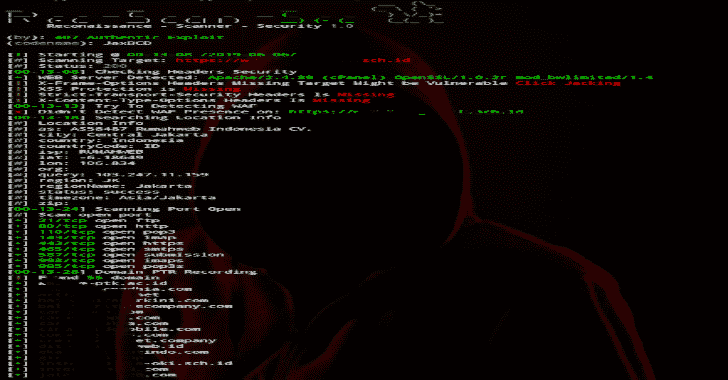

# recscansec 侦察扫描仪安全

> 原文：<https://kalilinuxtutorials.com/recscansec-reconnaisance-scanner-security/>

RecScanSec 专为强调简单性的侦察扫描仪和信息收集而设计。以下是扫描仪的功能:

*   信息安全标题
*   晶片分析仪
*   信息披露
*   抢横幅
*   Url 爬网
*   HTML 表单检测器
*   端口扫描仪
*   获取 SSL 信息
*   子域枚举
*   主机映射器
*   Url 模糊和敏感目录
*   所有扫描结果将保存在输出目录中

**也读作——[ReverseTCPShell:PowerShell ReverseTCP Shell，客户端&服务器](https://kalilinuxtutorials.com/reversetcpshell/)**

**要求**

*   asyncio
*   点击
*   要求
*   色彩日志
*   bs4
*   右旋糖酐

**用途&安装**

**$ apt-get 安装 python 3 nmap**
**$ pip 3 install-r requirements . txt**
**$ python 3 RecScanSec.py http://target.co.li**

**用法:recscansec . py【选项】目标**

**选项:** –版本显示版本并退出。
–超时连接前等待的超时整数秒
–使用代理时的代理文本 ex:0 . 0 . 0 . 0:8888 if with auth
0 . 0 . 0 . 0:8888 @ user:password
–cookie 文本 if 使用 cookie 逗号分隔的 cookie 添加
requestex: PHPSESS:123，kontol:True
–no-URL-fuzzing 请勿模糊 URL
–更新检查更新
–帮助

[**Download**](https://github.com/jaxBCD/RecScanSec)