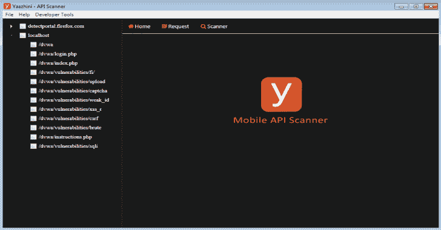

# Yaazhini 免费的 Android APK 和 API 漏洞扫描器

> 原文：<https://kalilinuxtutorials.com/yaazhini-vulnerability-scanner/>

Yaazhini 是一款免费的安卓 APK 和 API 漏洞扫描器。这是一个用户友好的工具，你可以很容易地扫描任何 APK 和 android 应用程序的 API，并找到漏洞。

它包括 API 的漏洞扫描、APK 的漏洞和生成报告的报告部分。

**系统要求**

*   操作系统:Mac OSX(64 位)，Windows(64 位&32 位)
*   **RAM :** 最低使用 4GB 的可用内存。大型 Android 应用程序需要 16GB
*   **存储:** 10GB 的可用磁盘空间
*   **依赖软件:** Java 1.8 以上

**优势**

*   只需一键扫描安卓 APK
*   扫描 Android 应用程序 REST API(仿真器、设备)
*   生成报告
*   免费使用
*   使用方便

**又读-[Zydra:密码恢复工具& Linux 影子文件破解](https://kalilinuxtutorials.com/zydra-password-recovery-shadow-file-cracker/)**

**如何在安卓应用 APK 扫描仪中使用**

https://youtu.be/t87zk2M-keg

**如何使用 Yaazhini 安卓应用 Rest 扫描器**

https://youtu.be/qP7MnPoIkAU

【Yaazhini 的样本报告

**Yaazhini-Android APK 扫描仪**样本报告以快速总结调查结果和风险评级开始。每个发现都有关于风险和漏洞建议的详细解释。漏洞按风险级别排序。
获取此处: [Yaazhini-Android APK 扫描仪样本报告。](https://www.vegabird.com/yaazhini/report_apk.html)

**Yaazhini-Mobile Application Scanner**示例报告示例报告以调查结果和风险评级的快速摘要开始。每个发现都有关于风险和漏洞建议的详细解释。漏洞按风险级别排序。

[**Download**](https://www.vegabird.com/yaazhini/)