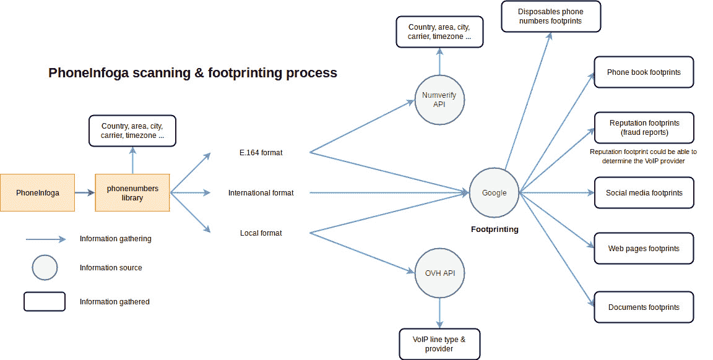

# PhoneInfoga:先进的电话号码信息收集和发布工具

> 原文：<https://kalilinuxtutorials.com/phoneinfoga-information-gathering-osint-tool/>

PhoneInfoga 是仅使用免费资源扫描电话号码的最先进的工具之一。目标是首先收集标准信息，如国家、地区、运营商和任何国际电话号码的线路类型，并具有非常好的准确性。

然后在搜索引擎上搜索足迹，试图找到 VoIP 提供商或确定所有者。

**PhoneInfoga 功能**

*   检查电话号码是否存在以及是否可能
*   收集国家、线路类型和运营商等标准信息
*   使用外部 API，谷歌黑客，电话簿和搜索引擎
*   查看信誉报告、社交媒体、一次性号码等等
*   一次扫描几个号码
*   使用自定义格式进行更有效的侦察
*   几种自定义格式上的自动足迹

**也可解读为-[rec sech-在目标网](https://kalilinuxtutorials.com/recsech-footprinting-reconnaissance-web/)** 上进行足迹&侦察的工具

[**Download**](https://github.com/sundowndev/PhoneInfoga)