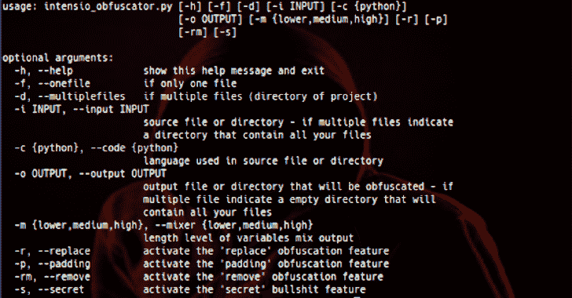

# Intensio 混淆器:混淆 Python 代码 2.x 和 3.x

> 原文：<https://kalilinuxtutorials.com/intensio-obfuscator/>

**Intensio Obfuscator** 是一个对 python 代码 2.x 和 3.x 进行模糊处理的工具。获取 python 源代码并将其转换为模糊的 python 代码，将变量/类/函数的名称替换为随机字符和定义的长度，删除注释、换行符，并为每一行添加一个具有不同值的随机脚本。

**要求**

*   Python >= 3.5

**支持的文件**

*   用 python 2.x 和 3.x 编写的文件

**安装**

**git 克隆 https://github.com/Hnfull/Intensio-Obfuscator.git
CD Intensio-Obfuscator/Intensio/**

**另请阅读-[ShellPhish:18 个社交媒体的网络钓鱼工具](https://kalilinuxtutorials.com/shellphish-phishing-social-media/)**

**特色**

| 特征 | 描述 |
| --- | --- |
| 替换 | 替换所有已定义的变量/类/函数的名称，并删除所有换行符 |
| 填料 | 在每行之后添加随机脚本，并删除所有换行符 |
| 去除 | 删除所有注释和换行符 |
| 混合器下部 | 如果指定了“替换”或“填充”功能，则生成 32 个字符的单词，替换源代码和随机脚本中定义的变量/类/函数 |
| 混合介质 | 如果指定了“替换”或“填充”功能，则生成 64 个字符的单词，替换源代码和随机脚本中定义的变量/类/函数 |
| 混频器高 | 如果指定了“替换”或“填充”功能，则生成 128 个字符的单词来替换源代码和随机脚本中定义的变量/类/函数 |

**用途**

| 因素 | 描述 |
| --- | --- |
| 救命啊 | 显示此帮助消息并退出 |
| -f，–一个文件 | 如果只有一个文件 |
| -d，–多个文件 | 如果有多个文件(项目) |
| -i，-输入 | 源文件或目录–如果多个文件表示一个包含所有文件的目录 |
| -c，–代码 | 输入文件或目录中使用的语言，默认值:[python]，可能值:[python] |
| -o，–输出 | 将被混淆的输出文件或目录–如果多个文件指示一个包含所有文件的空目录 |
| -m，–混音器 | 输出变量/类/函数的字符数的长度级别，默认值:[中]，可能值:[低、中、高] |
| -r，–替换 | 激活“替换”模糊功能 |
| -p，–填充 | 激活“填充”模糊功能 |
| -rm，–移除 | 激活“删除”模糊功能 |

*   如果您想要排除“替换”功能将采用的 python 变量/类/函数，请编辑`intensio/exclude_python_words.txt`
*   如果您想包含启动“替换”功能时未包含的 python 变量/类/函数，请编辑`intensio/include_python_words.txt`

**例子**

**Python 目标文件:**

*   多文件基本:
    *   `**python3.x intensio_obfuscator.py -d -i test/python/multiplefiles/basic/input/basicRAT -c python -o test/python/multiplefiles/basic/output/basicRAT -m lower -r -rm**`
        *   [项目来源目录](https://github.com/Hnfull/Intensio-Obfuscator/tree/master/intensio/test/python/multiplefiles/basic/input/basicRAT)
        *   [项目输出目录](https://github.com/Hnfull/Intensio-Obfuscator/tree/master/intensio/test/python/multiplefiles/basic/output/basicRAT)
*   多文件高级:
    *   `**python3.x intensio_obfuscator.py -d -i test/python/multiplefiles/advanced/input/basicRAT -c python -o test/python/multiplefiles/advanced/output/basicRAT -m high -r -p -rm**`
        *   [项目来源目录](https://github.com/Hnfull/Intensio-Obfuscator/tree/master/intensio/test/python/multiplefiles/advanced/input/basicRAT)
        *   [项目输出目录](https://github.com/Hnfull/Intensio-Obfuscator/tree/master/intensio/test/python/multiplefiles/advanced/output/basicRAT)
*   一个文件基本和高级:
    *   该命令与针对多个文件的命令相同，只是不要为`-i`和`-o`参数直接指向一个目录而是一个 python 文件，然后将`-d`参数改为`-f`参数

**可能的故障**

*   不要将本地变量/类/函数的名称定义为与 python 关键字或导入的 python 库的函数/类的名称相同！
*   如果一个变量/类/函数有一个相同的名字，在`print()`函数中的`' '`或`" "`之间有一个单词，你的文本将有与混合器变量/类/函数相同的值。
*   如果一个变量/类/函数有一个相同的名字，在`#`(注释)后面有一个单词，你的文本将有与混合器变量-类-函数相同的值，但是如果在`"""`或`'''`之间没有变量，不执行替换。
*   如果使用与 python 关键字或导入的 python 库的函数/类名称相同的方式命名变量/类–函数，可能会出现错误。编辑`intensio/excluded_python_words.txt`添加变量不要混淆或改变你的局部变量/类-函数的名称，如果你的变量/类-函数与关键字 it 同名，他将被混淆并出现错误。

**做**

*   版本 1.0.1-x:
    *   代码优化
    *   修复错误和问题
    *   改进的功能已经存在
*   版本 1.1.0:
    *   用 C 编写的支持文件
*   版本 1.2.0:
    *   用 C++编写的支持文件

**拨号**

强化混淆器仅用于教育/研究目的。作者对您如何选择使用所提供的任何工具不承担任何责任。

[**Download**](https://github.com/Hnfull/Intensio-Obfuscator)