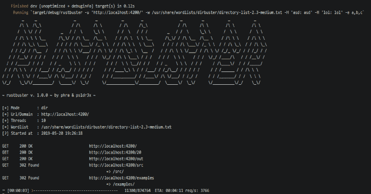

# 除锈剂:除锈剂

> 原文：<https://kalilinuxtutorials.com/rustbuster/>

RustBuster 是一款针对 rust 的 dirbuster 工具，以下是目前正在实现的 4 种模式(Dir 模式、Dns 模式、Vhost 模式、Fuzz 模式)。

**Dir mode**
* * * * * * * * * *
rust buster-m Dir-u http://localhost:3000/-w examples/word list-e PHP
**Dns mod**e
* * * * * * * * * * *
rust buster-m Dns-u google.com-w examples/word list
**Vhost mode**
* * * * * * * * * * * * * *
rust buster-m Vhost-u http://localhost:33

你可以从[这里](https://github.com/phra/rustbuster/releases)下载预构建的二进制文件。

**也可阅读-[TOR 路由器:一个让你将 TOR 设为默认网关的工具](https://kalilinuxtutorials.com/tor-router-a-tool-that-allow-you-to-make-tor-your-default-gateway/)**

**用途**

**用法:**
rustbuster[FLAGS][OPTIONS]–URL–word list…

**FLAGS:**
-f，–append-slash 试图也追加/到基本请求
-K，–exit-on-error Exits on connection errors
-h，–help 打印帮助信息
-k，–ignore-certificate 禁用 TLS 证书验证
–no-banner 跳过初始横幅
–no-progress-bar 禁用进度条
–verbose 设置详细级别

**选项:**–csrf-header…将指定的头添加到 csrf GET 请求中
–csrf-RegEx 获取 CSRF 令牌应用指定的 RegEx
–csrf-url 通过 GET 到 csrf-URL 获取 CSRF 令牌
-d，–domain 使用指定的域
-e，–extensions 设置扩展[default: ]
-b，–http-body 使用指定的 HTTP 方法 –http-method 使用指定的 HTTP 方法[default: GET]
-S，–ignore-status-codes 设置要忽略的状态代码列表[default: 404]
-x，–ignore-string…忽略 HTTP 正文中具有指定字符串的结果
-s，–include-status-codes 设置要包含的状态代码列表[default: ]
-i，–include-string…包含 HTTP 正文中具有指定字符串的结果
-m，–mode 设置的模式 –output 将结果保存在指定的文件中[default: ]
-t，–threads 设置并发请求的数量[default: 10]
-u，–URL 设置目标 URL
-a，–User-Agent 使用指定的 User-Agent[default:rust buster]
-w，–word list…设置单词列表

[**Download**](https://github.com/phra/rustbuster)