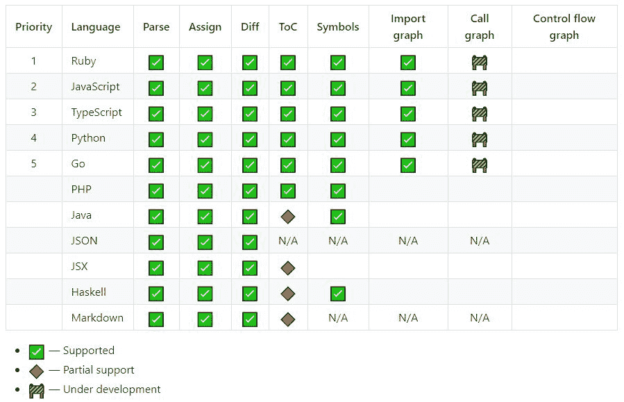

# 语义:跨多种语言解析、分析和比较源代码

> 原文：<https://kalilinuxtutorials.com/semantic-parsing-analysing-comparing-source-code-across-many-languages/>

**Semantic** 是一个 Haskell 库和命令行工具，用于解析、分析和比较源代码。

**用途**

运行`**semantic --help**`获取最新选项的完整列表。

**解析**

**用法:**语义解析([–sexpression]|[–json]|[–json-graph]|[–symbols]|[–DOT]|[–Show]|[–quiet])【FILES…】
生成路径解析树

**可用选项:** –sexpression 输出 s-expression 解析树(默认)
–JSON 输出 JSON 解析树
–JSON-graph 输出 JSON 邻接表【t

**也可阅读-[RapidScan:多工具网络漏洞扫描器](https://kalilinuxtutorials.com/rapidscan-web-vulnerability-scanner/)**

**差异**

**用法:**语义差异([–sexpression]|[–json]|[–json-graph]|[–TOC]|
[–DOT]|[–Show])【FILE _ A】【FILE _ B】
计算路径间的变化

**可用选项:**
–sexpression 输出 s-expression 差异树(默认)
–JSON 输出 JSON 差异树
–JSON-graph 输出 JSON 差异树
–使用

**图形**

**用法:**语义图([–imports]|[–calls])[–packages]([–dot]|[–JSON]|[–show])([–root DIR][–exclude-DIR DIR]
DIR:LANGUAGE | FILE |–LANGUAGE ARG(FILES…|–stdin))
为一个目录或从顶级入口点模块计算一个图

**可用选项:**
–imports 计算一个导入图(默认)【T10 从 it
到每个模块
的边–点图形格式的点输出(默认)
–json 输出 JSON 图形
–使用 show 实例显示输出(仅调试，格式
如有更改，恕不另行通知)
–根目录项目的根目录。 可选，默认为
条目文件/目录。
–Exclude-DIR DIR 排除一个目录(如供应商)
–language ARG 用于分析的语言。
–stdin 从 stdin 中读取一个用换行符分隔的路径列表来分析
。

**语言支持**

**开发**

我们使用 cabal 的 Nix 风格的本地构建进行开发。要快速开始:

**git clone git @ github . com:github/semantic . git
CD semantic
git 子模块同步–递归&git 子模块更新–初始化–递归–强制
cabal new-update
cabal new-build
cabal new-test
cabal new-run semantic——帮助**

它至少需要 GHC 8.6.4 和 Cabal 2.4。我们建议使用 ghcup 对 GHC 版本进行沙盒测试。官方不支持将堆栈作为构建工具；有一个非官方的 stack.yaml 可用，尽管我们不能保证它的稳定性。

## 技术和建筑

在建筑上，`semantic`:

*   阅读 blobs。
*   用 [tree-sitter](https://github.com/tree-sitter/tree-sitter) 为那些 blobs 生成解析树(一个用于编程工具的增量解析系统)。
*   将这些树分配到语法的通用表示中。
*   执行分析，计算差异，或者只返回解析树。
*   以多种支持的格式之一呈现输出。

语义利用了许多有趣的算法和技术:

*   迈尔斯的算法(SES)在论文 [*中描述了一种 O(ND)差分算法及其变种*](http://www.xmailserver.org/diff2.pdf)
*   论文中描述的 RWS[*RWS-Diff:灵活高效的分层数据中的变化检测*](https://db.in.tum.de/~finis/papers/RWS-Diff.pdf) 。
*   开放式联合和[数据类型。](http://www.cs.ru.nl/~W.Swierstra/Publications/DataTypesALaCarte.pdf)
*   抽象定义解释器的实现扩展到语法术语的单点表示。

[**Download**](https://github.com/github/semantic)