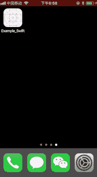

# CocoaDebug : iOS 调试工具

> 原文：<https://kalilinuxtutorials.com/cocoadebug-ios-debugging-tool/>

**CocoaDebug** 是一款 iOS 调试工具，具有以下特点；

*   摇动以隐藏或显示黑色气泡。(支持设备和模拟器)
*   长按黑色泡泡显示`UIDebuggingInformationOverlay`。(苹果私有 API，支持 iOS 10/11/12)
*   应用程序内存使用和 FPS。
*   列出开发者用 Xcode 编写的所有`**print()**` **和** `**NSLog()**`消息。(**可选**)
*   应用程序发送的所有网络请求的列表。(**可选**)
*   列出崩溃错误。(**可选**)
*   当您在网络详细信息页面时，通过电子邮件或复制到剪贴板来共享网络详细信息。
*   复制日志。(长按文本，然后选择全部或选择复制)
*   按关键字搜索日志。
*   列出应用程序和设备信息，包括:版本、内部版本、捆绑包名称、捆绑包 id、屏幕分辨率、设备、iOS 版本
*   列出所有沙盒文件夹和文件，支持预览和编辑。
*   列出 HTML 日志，包括`**console.log()**`**`**console.debug()**`**`**console.warn()**`**`**console.error()**`**`**console. info()**`。(同时支持`**WKWebView**` **和** `**UIWebView**` **)** 。(**可选**)********
*   ****支持`JSON`和谷歌的`**Protocol buffers**`****

 ******又念:[Yaazhini——免费安卓 APK & API 漏洞扫描器](https://kalilinuxtutorials.com/yaazhini-vulnerability-scanner/)**

**安装**

**可可布丁**

**平台:ios，' 8.0'
使用 _ 框架！

目标【你的目标名】做
吊舱【CocoaDebug】，:配置= >【调试】
结束**

**迦太基**

**github“cocoabbe/cocoabbe”**

**警告:**不要提交。ipa 到 AppStore，它已与 CocoaDebug.framework 链接。本集成指南概述了一种使用构建配置来隔离仅将框架链接到调试构建的方法。

**用途**

**雨燕**

**//第一步。(app delegate . swift)
if DEBUG
import CocoaDebug
endif

//第二步。(app delegate . swift)
if DEBUG
cocoadebug . enable()
endif

//Step 3。(app delegate . swift)
public func print(file:String = # file，function: String = #function，line: Int = #line，_ message: T，color: UIColor =。white){
# if DEBUG
swiftLog(文件，函数，行，消息，颜色，false)
#endif
}**

**目标-C**

**//第 1 步。(app delegate . m)
ifdef debug
@ import cocoaddebug；
endif

//Step 2。(app delegate . m)
ifdef debug
【cocoaddebug enable】；
endif

//Step 3。(前缀. PCH)
ifdef debug
# import " _ objclog . h "
/# import**<cocoadebug _objclog.h="">**//如果使用框架** **【endif】

(prefix . PCH)
ifdef debug
# define nslog(fmt…)[_ objclog logwithfile:_ _ file _ _ function _ _ line:_ _ color:[uicolor white color]unicodetocine:no message:(fmt)、# # va _ args _]
else
# define nslog(fmt，…) nil**</cocoadebug> 

请查看 Example_Swift.xcodeproj 和 Example_Objc.xcodeproj 了解更多高级用法。

**注意:**在一个项目中使用 Swift & Objective-C 时，要小心其他 Swift 标志&预处理宏。可以参考这里。

**参数**

初始化 CocoaDebug 时，可以在`CocoaDebug.enable()`之前自定义以下参数值。

*   `**serverURL**`**–如果抓取的 URL 包含服务器 URL，将这些 URL 设置为粗体进行标记。当该值为零时不标记。默认值为**零**。**
*   **`**ignoredURLs**`**–设置不应抓取的 URL，忽略大小写，当值为零时抓取所有 URL。默认值为**零**。****
*   ****`**onlyURLs**`–设置仅被爬网的 URL，忽略大小写，当值为零时爬网所有 URL。默认值为**零**。****
*   ****`**tabBarControllers**`**–设置要添加为 UITabBarController 子控制器的控制器。默认值为**零**。******
*   ****`**logMaxCount**`**–CocoaDebug 显示的最大日志数。默认值为 **1000** 。******
*   ****`**emailToRecipients**`**–设置通过电子邮件共享时要包含在电子邮件“收件人”栏中的初始收件人。默认值为**零**。******
*   ****`**emailCcRecipients**`**–设置通过电子邮件共享时要包含在电子邮件“抄送”栏中的初始收件人。默认值为**零**。******
*   ****`**mainColor**`**–以十六进制格式设置主色。默认值为 **#42d459** 。******

****[**Download**](https://github.com/CocoaDebug/CocoaDebug)********