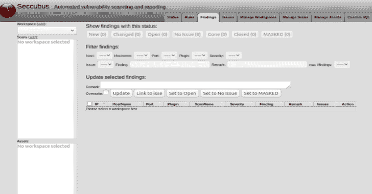

# SeccuBus:简单的自动化漏洞扫描、报告和分析

> 原文：<https://kalilinuxtutorials.com/seccubus-vulnerability-scanning-reporting-analysis/>

**Seccubus** 使用各种工具自动执行常规漏洞扫描，并帮助安全人员快速分析其输出，包括首次扫描和重复扫描。

在重复扫描时，增量报告可确保仅在发现首次出现在扫描结果中或其输出发生变化时，才需要对其进行判断。

它的版本 2.x 是唯一积极开发和维护的分支，对它的所有支持 V1 已经正式停止。

其 V2 版本可与以下扫描仪配合使用:

*   涅索斯
*   OpenVAS
*   鲣鱼
*   美杜莎(本地和远程)
*   Nikto(本地和远程)
*   NMap(本地和远程)
*   OWASP-ZAP(本地和远程)
*   分析
*   水母体
*   哪些 SSL 实验室
*   testssl.sh(本地和远程)

**也读作-[Intensio Obfuscator:混淆一个 Python 代码 2 . x&3 . x](https://kalilinuxtutorials.com/intensio-obfuscator/)**

**码头工人**

可用图像。

| 映像名 | 目的 | 大小 |
| --- | --- | --- |
| 妓女 | 在一个容器中运行一个完整的魅魔堆栈 |  |
| seccubus-front | 仅提供前端 HTML、javascript 和 css |  |
| seccubus-web 网路 | 前台服务，代码和 api 同时服务 |  |
| seccubus-api | 只提供 API。 |  |
| 塞克斯堡 | 运行命令行脚本，例如扫描 |  |
| seccubus-cron(美国橄榄球联盟) | 运行 cron 守护程序来执行扫描 |  |

关于 docker 容器的信息在[README-docker.md]中

**默认密码，修改吧！！！！！**

安装后，它的默认用户名和密码是:

**【管理/给予女性外阴】！**

强烈建议您在安装后进行更改。

**/bin/seccubus _ passwd-u admin**

**更改日志**

本分支相对于[最新/以前版本](https://github.com/schubergphilis/Seccubus/releases/latest)的变化

**x-x-2019–v 2.53 开发发布**

这是正在进行的工作

与 2.52 的区别

[**Download**](https://github.com/seccubus/seccubus)