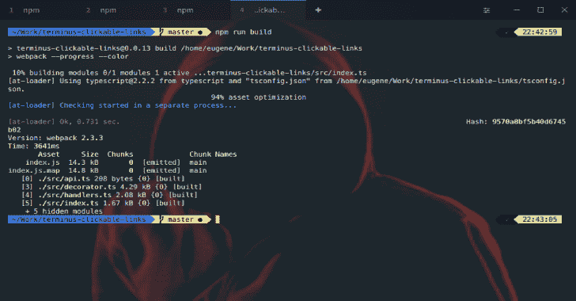

# 终点站:一个更加现代化的时代的终点站

> 原文：<https://kalilinuxtutorials.com/terminus-terminal-modern-age/>

终端是一个高度可配置的终端，适用于更现代的 Windows、macOS 和 Linux 模拟器。

*   主题和配色方案
*   完全可配置的快捷方式
*   拆分窗格
*   记住你的标签
*   PowerShell(和 PS Core)、WSL、Git-Bash、Cygwin、Cmder 和 CMD 支持
*   集成的 SSH 客户端和连接管理器
*   完整的 Unicode 支持，包括双宽度字符
*   不会被快速流动的输出阻塞
*   在 Windows 上有适当的 shell 体验，包括 tab 补全(通过 Clink)

**也可阅读-[Bonesi:DDoS 僵尸网络模拟器](https://kalilinuxtutorials.com/bonesi-ddos-botnet-simulator-2/)的工具 **

1.  它是 Windows 标准终端(conhost)、PowerShell ISE、PuTTY 或 iTerm 的替代产品
2.  这不是一个新的外壳或 MinGW 或 Cygwin 的替代品。它也不是轻量级的——如果 RAM 的使用很重要，考虑一下[科内姆](https://conemu.github.io/)或[阿拉克里蒂](https://github.com/jwilm/alacritty)

**插件**

插件和主题可以直接从 Terminus 的设置视图中安装。

*   [clickable-links](https://github.com/Eugeny/terminus-clickable-links)-使终端中的路径和 URL 可点击
*   [外壳选择器](https://github.com/Eugeny/terminus-shell-selector)–一个快速外壳选择器面板
*   [标题控制](https://github.com/kbjr/terminus-title-control)–允许通过提供前缀、后缀和/或要删除的字符串来修改终端标签的标题
*   [quick-cmds](https://github.com/Domain/terminus-quick-cmds)–快速向一个或所有终端标签发送命令
*   [保存-输出](https://github.com/Eugeny/terminus-save-output)–将终端输出记录到文件中
*   [scroll bar](https://github.com/kbjr/terminus-scrollbar)–向 hterm 选项卡添加滚动条

**主题**

*   [炒作](https://github.com/Eugeny/terminus-theme-hype)——一个超灵感的主题
*   [放松的](https://github.com/Relaxed-Theme/relaxed-terminal-themes#terminus)——终点站的放松主题
*   [采场](https://github.com/porkloin/terminus-theme-gruvbox)
*   [窗口 10](https://www.npmjs.com/package/terminus-theme-windows10)
*   [牛郎星](https://github.com/yxuko/terminus-altair)

该项目遵循[所有贡献者](https://github.com/all-contributors/all-contributors)规范。欢迎任何形式的贡献！