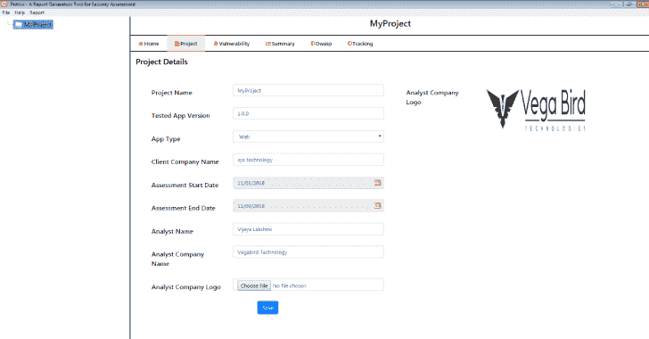

# pri thvi–报告生成工具

> 原文：<https://kalilinuxtutorials.com/prithvi-security-assessment/>

Prithvi 是一款专门为安全评估开发的报告生成工具，免费且易于使用。它将为安全控制生成高质量漏洞评估报告。

它有各种各样的功能，主要用于安全评估。您可以很容易地在报告中找到安全漏洞。

**系统要求**

| 操作系统 | MAC OSX(64 位)，Windows(64 位和 32 位) |
| 随机存取存储 | 最低使用 4GB 可用内存 |
| 储存；储备 | 10GB 的可用磁盘空间 |

**pri thvi 的优势**

Prithvi 用于生成安全评估，可以根据您的要求进行修改。所以也可以用于其他报表的生成。

它包括以下功能

*   我们可以添加多个项目，并在每个项目中添加漏洞。
*   我们可以用概念证明来增加出现的次数。
*   为了跟踪正在进行的项目，我们还可以添加跟踪数据以便更好地理解。
*   我们可以生成项目报告以及跟踪报告。
*   提供 owasp 数据，如漏洞、详细信息和漏洞建议。
*   它同时拥有 OWASP 2017 的 web 和移动版本数据。
*   Prithvi 很好用。
*   Prithvi 可以免费使用。
*   Prithvi 既有 Windows 版本，也有 Mac 版本。

**也读作-[Rust buster:针对铁锈的 dir buster](https://kalilinuxtutorials.com/rustbuster/)**

**如何使用 Prithvi**

*   启动应用程序。
*   添加新项目并填写详细信息。
*   在项目中添加漏洞，并填充细节。
*   在 Prithvi 中右键单击您的项目，单击生成报告。
*   如果您需要跟踪报告，请单击跟踪选项卡。
*   添加跟踪详细信息并保存。
*   现在单击菜单中的报告，并单击子菜单中的生成跟踪报告。
*   单击跟踪报告后，提供必要的详细信息，如项目、日期，然后单击搜索按钮。
*   然后单击右上角的生成报告。

**视频教程**

https://youtu.be/ewAl4H6ri40[**Download**](https://www.vegabird.com/prithvi/)