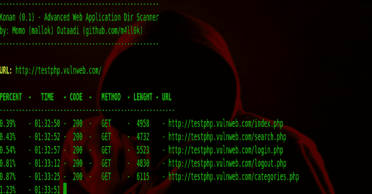
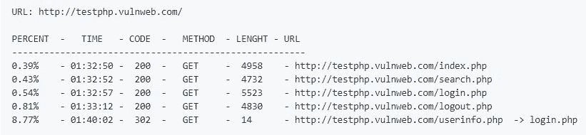
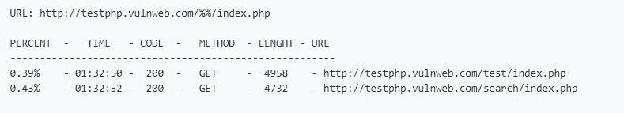
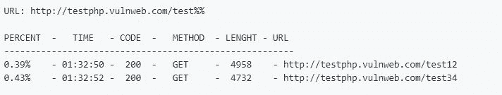
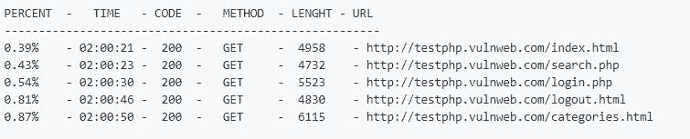
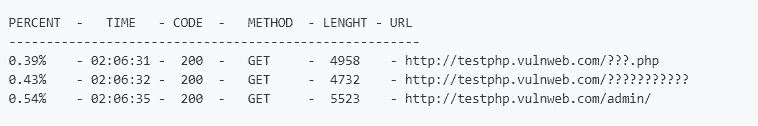
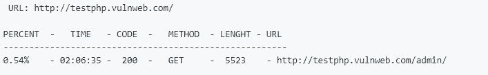

# Konan 高级 Web 应用程序目录扫描仪

> 原文：<https://kalilinuxtutorials.com/konan-web-application-dir-scanner/>

Konan 是一款高级开源工具，旨在暴力破解 web/应用服务器上的目录和文件名。

**安装**

**通过克隆 Git 存储库下载它:**

吉特克隆人 https://github.com/m4ll0k/Konan.git·科南

**安装要求同** `**pip**`

**CD konan&pip install-r requirements . txt**

**运行**

**python konan.py**

**支撑平台**

*   Linux 操作系统
*   Windows 操作系统
*   MacOSX

**也读作-[KaliTorify:通过 Tor 为 Kali Linux OS](https://kalilinuxtutorials.com/kalitorify-transparent-proxy/) 提供透明代理**

**特色**

| 特征 | 工具 | 目录搜索 | dirb | gobuster |
| --- | --- | --- | --- | --- |
| 多线程 | 是 | 是 | 是 | 是 |
| 多重扩展 | 是 | 是 | 不 | 不 |
| HTTP 代理支持 | 是 | 是 | 是 | 是 |
| 报告 | 是(文本和 json) | 是(文本和 json) | 是(文本) | 不 |
| 用户-代理随机化 | 是 | 是 | 不 | 不 |
| 使用`regexp`忽略单词列表中的单词 | 是 | 不 | 不 | 不 |
| 单词列表中的拆分扩展名 | 是 | 不 | 不 | 不 |
| 多种方法 | 是 | 不 | 不 | 不 |
| 响应大小过程 | 是 | 不 | 不 | 不 |
| 提供蛮力的子目录 | 是 | 不 | 不 | 不 |
| 为递归暴力提供目录 | 是 | 不 | 不 | 不 |
| URL 注入点 | 是 | 不 | 不 | 不 |

**用途**

**基本:**

*   **python konan . py-u/–URL http://example.com/**

**注入点:**

*   **python konan . py-u/–URL http://example.com/%%/index.php**

*   **python konan . py-u/–URL http://example.com/test%%-w/root/numbers . txt**

提供单词列表，默认`/db/dict.txt`

*   `**python konan.py -u/--url http://example.com/ -w/--wordlist /root/dict.txt**`

使用`-e/--extension`选项提供扩展，并使用`-f/--force`选项强制扩展每个单词列表条目:

*   `**python konan.py -u/--url http://example.com/ -e/--extension php,html -f/--force**`

提供状态代码排除:

*   `**python konan.py -u/--url http://example.com/ -x/--exclude 400,403,401**`

仅提供输出的状态代码:

*   `**python konan.py -u/--url http://example.com/ -o/--only 200,301,302**`

单词列表小写(isATest -> isatest)和大写(isAtest -> ISATEST):

*   `**python konan.py -u/--url http://example.com/ -w/--wordlist /root/dict.txt [-l/--lowercase OR -p/--uppercase]**`

单词表拆分(test.php-> to-> test):

*   `**python konan.py -u/--url http://example.com/ -w/--wordlist /root/dict.txt -s/--split**`

单词列表忽略单词、字母、数字，..由 regexp ( `\w*.php|\w*.html`，`^[0-9_-]+`)提供的 etc

*   `**python konan.py -u/--url http://example.com/ -w/--wordlist -I/--ignore "\?+"**`

不带`-I/--ignore`选项的输出:

带有`-I/--ignore`(在本例中为`\?+`)选项的输出:

**递归:**

*   `**python konan.py -u/--url http://example.com/ -E/--recursive**`

找到递归目录，目录由`-D/--dir-rec`提供:

*   `**python konan.py -u/--url http://example.com/ -E/--recursive -D/--dir-rec "admin,tests,dev,internal"**`

`-S/--sub-dir`提供的暴力目录:

*   `**python konan.py -u/--url http://example.com/ -S/--sub-dir "admin,test,internal,dev"**`

多种方法(检查单词输入的 GET、POST、PUT 和 DELETE):

**注意:**多 web 应用如果没有用正确的方法发出请求返回 404 代码，这个选项测试所有方法

*   `**python konan.py -u/--url http://example.com/ -m/--methods"**`

内容大小处理(如果响应大小为" >[数字]"、"

*   `**python konan.py -u/--url http://example.com/ -C/--lenght "<1000"**`

[**Download**](https://github.com/m4ll0k/Konan)