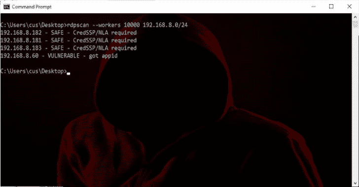

# rdps can:“blue keep”漏洞的快速扫描器

> 原文：<https://kalilinuxtutorials.com/rdpscan-bluekeep-vulnerability/>

**RDPScan** 是针对微软远程桌面中的 CVE-2019-0708 漏洞的快速脏扫描程序。目前，公共互联网上大约有 900，000 台机器易受此漏洞的攻击，因此许多人预计很快会出现类似 WannaCry 和 notPetya 的蠕虫。

因此，扫描您的网络并修补(或至少启用 NLA)易受攻击的系统。这是一个命令行工具。您可以下载源代码并自己编译，也可以从上面的链接下载一个预编译的 Windows 或 macOS 二进制文件。

**主要用途**

要扫描网络，请按如下方式运行:

**rdps can 192 . 168 . 1 . 1-192 . 168 . 1 . 255**

这将为每个地址产生 3 个结果之一:

*   **安全—**如果目标已经确定要被*打补丁*或者至少需要*的信用等级/NLA*
*   **易受攻击–**如果目标已被确认易受攻击
*   **未知—**如果目标没有响应或出现某种协议故障

当目标 IP 地址不存在任何东西时，旧版本会显示消息“*未知–连接超时*”。当扫描大型网络时，这会产生过多的关于您不关心的系统的信息。因此，默认情况下，新版本不会产生这些信息，除非您在命令行上添加了 *-v* (详细说明)。

您可以通过增加工作人员的数量来提高它扫描大型网络的速度:

**rdps can–工人 10000 10.0.0.0/8**

然而，在我的计算机上，由于系统限制，无论我将这个参数配置得多高，它都只能产生大约 1500 个工人。

如下面第二部分所述，结合`**masscan**`，你可以进一步提高速度

**也可阅读-[语义:解析、分析&比较多种语言的源代码](https://kalilinuxtutorials.com/semantic-parsing-analysing-comparing-source-code-across-many-languages/)**

**口译结果**

一般有三种反应:

*   **安全—**这意味着目标很可能已经打了补丁，或者不容易受到 bug 的攻击。
*   **VULNERABLE:** 这意味着我们已经确认目标易受此漏洞攻击，并且当蠕虫攻击时，很可能会被感染。
*   **未知:**表示我们无法确认任何一种方式，通常是因为目标没有响应或者没有运行 RDP，这是绝大多数响应。此外，当目标资源不足或遇到网络问题时，我们会遇到很多这样的问题。最后，协议错误是一个很大的原因。虽然三个主要响应是*安全*、*易受攻击*和*未知*，但它们包含解释诊断的附加文本。本节描述了您将看到的各种字符串。

**安全**

我们认为目标安全主要有三个原因:

*   **安全—***目标出现补丁*当目标没有响应触发请求时会出现这种情况。这意味着这是一个打了补丁的 Windows 系统，或者是一个一开始就不容易受到攻击的系统，比如 Windows 10 或 Unix。
*   **安全–**CredSSP/NLA 必需这意味着目标首先需要网络级身份验证，然后才能建立 RDP 连接。如果没有 leigitimate 凭据，该工具将无法通过这一步，因此无法确定目标是否已被修补。然而，黑客也不能越过这一点继续利用易受攻击的系统，所以您可能是“安全的”。然而，当漏洞出现时，如果系统未打补丁，拥有有效用户名/密码的内部人员将能够利用系统。
*   **安全—**不是 RDP 这意味着系统不是 RDP，但有一些其他服务碰巧使用同一个端口，并产生明显不是 RDP 的响应。常见的例子有 HTTP 和 SSH。然而，注意，代替可识别的协议，服务器可以用 RST 或 FIN 分组来响应。这些被确定为*未知*而不是*安全* /

**不堪一击**

这意味着我们已经确认系统易受该漏洞的攻击。

*   **VULNERABLE—**get appid 当系统易受攻击时，只有一个响应，这一个。

**未知**

未知有数不清的变化

*   **未知–**无连接–超时这是目前最常见的响应，当目标 IP 地址没有任何响应时就会发生。事实上，这是如此普遍，当扫描大范围的地址时，它通常是不允许的。您必须添加 *-v* (详细)标志来启用它。
*   **未知—**无连接—拒绝(RST)这是目前第二常见的响应，发生在目标存在并响应网络流量，但没有运行 RDP，因此拒绝带有 TCP RST 数据包的连接时。
*   **UNKNOWN–**RDP 协议错误–接收超时这是第三种最常见的响应，发生在我们成功建立 RDP 连接，但服务器停止响应我们的时候。这是由于网络错误以及目标系统由于某种原因过载造成的。也可能是这一端的网络错误，例如当您位于 NAT 之后，并且使用太多连接使其过载时。
*   **未知—**无连接—连接关闭这意味着我们已经建立了一个连接(TCP SYN-ACK)，但该连接会立即关闭(通过 RST 或 FIN)。发生这种情况的原因有很多，我们无法区分:
    *   它运行 RDP，但由于某种原因关闭了连接，可能是因为它的资源不足。
    *   它不是 RDP，也不喜欢我们发送的 RDP 请求，所以它没有给我们发送一个好的错误消息(这将触发*SAFE-而不是 RDP* )，而是突然关闭了连接。
    *   一些中间设备(如 IPS、防火墙或 NAT)关闭了连接，因为它们认为这是恶意的，或者耗尽了资源。
    *   还有一些我不知道的原因，当我浏览互联网时，有很多奇怪的事情发生。
*   **未知**–无连接–主机不可达(ICMP *错误)*远程网络报告主机不可达或未运行。如果您认为该主机应该还活着，请稍后再试。
*   **未知-**无连接-网络不可达(ICMP 错误)远端出现(暂时性)网络错误，如果您认为网络应该正在运行，请稍后再试。
*   **未知—**RDP 协议*错误*这意味着 RDP 协议中发生了一些损坏，要么是因为远程端执行错误(不是 Windows 系统)，要么是因为它处理短暂的网络错误很糟糕，或者是其他原因。
*   **未知—**SSL 协议错误自 Windows Vista 以来，RDP 使用 STARTTLS 协议来运行 SSL。这一层也有类似上面的问题，包括处理底层网络错误不当，或者试图与具有某种不兼容性的系统通信。如果你在这里得到一个很长的错误信息(比如 SSL3_GET_RECORD:错误的版本)，那是因为对方的 SSL 有 bug，或者你自己正在使用的 SSL 库有 bug。

**与 Masscan 一起使用**

这个`rdpscan`工具相当慢，每秒只能扫描几百个目标。你可以用 [`masscan`](https://github.com/robertdavidgraham/masscan) 来加快速度。`masscan`工具大约快 1000 倍，但只能提供有限的目标信息。

这些步骤是:

*   首先用 masscan 扫描地址范围，快速找到在端口 3389(或您使用的任何端口)上响应的主机。
*   第二，将`masscan`的输出输入到`rdpscan`，这样它只需要扫描我们知道是活跃的目标。

运行它的简单方法是在命令行上组合它们:

**mass can 10 . 0 . 0 . 0/8-p 3389 | rdps can–文件-**

我的做法是分两步走:

mass can 10 . 0 . 0 . 0/8-p 3389 > IPS . txt
rdps can–file IPS . txt–workers 10000>results . txt

## 建筑

困难的部分是安装好 *OpenSSL* 库，并且不与系统上的其他版本冲突。下面是我测试过的 Linux 版本的一些例子，但是它们在不同的发行版之间不断地改变包名。另外，兼容 OpenSSL 的 API 有很多选择，比如 BoringSSL 和 LibreSSL。

$ sudo apt install libssl-dev
$ sudo yum install OpenSSL-devel

一旦你解决了这个问题，你只需要像这样编译所有的`.c`文件:

$ gcc *。c -lssl -lcrypto -o rdpscan

我在目录中放了一个 Makefile 文件来完成这项工作，所以您可以这样做:

$ make

代码是用 C 写的，所以需要安装一个 C 编译器，比如做如下操作:

$ sudo apt 安装构建-基本

**常见的构建错误**

本节描述更明显的构建错误。

ssl.h:24:25:致命错误:openssl/rc4.h:没有这样的文件或目录

这意味着您要么没有安装 OpensSSL 头文件，要么它们不在某个路径中。请记住，即使您安装了 OpenSSL 二进制文件，也不意味着您已经安装了开发工具。您需要安装头文件和库文件。

要在 Debian 上安装这些东西，需要:

$ sudo apt install libssl-dev-安装 libssl

要解决路径问题，添加一个编译标志`**-I/usr/local/include**`，或者类似的东西。

链接器问题的一个例子如下:

架构 x86_64 的未定义符号:
"_OPENSSL_init_ssl "，引用自:tcp-fac73c.o
中的
_tcp_tls_connect "，" _RSA_get0_key "，引用自:ssl-d5fdf5.o
中的
_rdssl_rkey_get_exp_mod "，引用自:tcp-fac73c.o 中的
_tcp_tls_connect "

我在 macOS 上得到这个，因为 OpenSSL 有多个版本。我通过对路径进行硬编码来解决这个问题:

$ gcc *。c-lssl-lcrypto-I/usr/local/include-L/usr/local/lib-o rdps can

根据其他人的评论，如果你用自制软件安装东西，下面的命令行可能在 macOS 上工作。尽管如此，我仍然得到上面的链接错误，因为我已经安装了其他冲突的 OpenSSL 组件。

gcc $(brew–prefix)/opt/OpenSSL/lib/libssl . a $(brew–prefix)/opt/OpenSSL/lib/lib crypto . a-o rdps can *。c

**跑步**

上一节给出了运行该程序的快速入门提示。本节提供了更深入的帮助。

要扫描单个目标，只需传递目标的地址:

。/rdpscan 192.168.10.101

您可以传入 IPv6 地址和 DNS 名称。可以传入多个目标。这方面的一个例子是:

。exchange.example.com 2001:0db 8:85 a3::1

您还可以使用开始-结束 IPv4 地址或 IPv4 CIDR 规范来扫描地址范围。不支持 IPv6 范围，因为它们太大了。

。/rdps can 192 . 168 . 0 . 0/16

默认情况下，它一次只扫描 100 个目标。您可以使用`--workers`参数增加这个数字。然而，无论您将这个参数设置得多高，实际上您最多可以同时运行 500 到 1500 个工作线程，这取决于您的系统。

。/rdps can–工人 1000 10.0.0.0/24

您可以使用名副其实的`--file`参数从文件中加载目标，而不是在命令行中指定目标:

。/RDP scan–文件 ips.txt

文件的格式是每行一个地址、名称或范围。也可以消费`masscan`生成的文字。多余的空白被删除，空白行被忽略，任何注释行都被忽略。一个*注释*是以`#`字符或者`//`字符开始的一行。

输出被发送到`stdout`，给出易受攻击、安全或未知的状态。每种情况都可能有其他原因。这些原因如上所述。

211.101.37.250–安全–信用 SSP/NLA 要求
185.11.124.79–安全–非 RDP–SSH 响应已见
125.121.137.42–未知–无连接–拒绝(RST)
40.117.191.215–外管局–需要 CredSSP/NLA
121.204.186.182–外管局–需要 CredSSP/NLA
99.8.11.148–外管局–需要 CredSSP/NLA
121.204.186.114–外管局–需要 CredSSP/NLA
49.50.145.236–外管局–需要 CredSSP/NLA
106.12.74.155–易受攻击–获得 appid
222.84.253.26–外管局–需要 CredSSP/NLA
144.35.133.109–未知–RDP 协议错误–接收超时
199.212.226。

您可以使用额外的 unix 命令来处理这个问题，比如`grep`和`cut`。要获得易受攻击机器的列表:

。/rdps can 10 . 0 . 0 . 0/8 | grep ' VULN ' | cut-f1-d '-'

参数`-dddd`表示*诊断*信息，其中添加的`d`越多，打印的细节越多。这被发送到`stderr`而不是`stdout`，这样你就可以分离数据流。使用`bash`这是这样完成的:

。/rdps can–file myips . txt-DDD 2 > diag . txt 1 > results . txt

**诊断信息**

添加`-d`参数将诊断信息转储到`stderr`的连接上。

。/rdps can 62.15.34.157-d

[+][62 . 15 . 34 . 157]:3389–正在连接…
[+][62 . 15 . 34 . 157]:3389–SSL 连接
[+][62 . 15 . 34 . 157]:3389–版本= v 4.8
[+][62 . 15 . 34 . 157]:3389–正在发送 MS_T120 检查

在 macOS/Linux 上，您可以以通常的方式将`stdout`和`stderr`分别重定向到不同的文件:

。/rdps can–file IPS . txt 2 > diag . txt 1 > results . txt

**SOCKS5 和 Tor lulz**

所以它包括 SOCKS5 支持:

。/rdps can–file IPS . txt–socks 5 localhost–socks 5 port 9050

它使连接问题变得更糟，所以你会得到更多“未知”的结果。

**静态链接 OpenSSL**

为了发布 Windows 和 macOS 二进制文件，作为这个项目的*版本*，我静态链接了 OpenSSL，这样就不需要单独包含它，程序*就可以工作*。这一节描述了如何做到这一点的一些注意事项，特别是因为 OpenSSL 自己的页面上的描述似乎已经过时了。

这两个步骤都是从下载 OpenSSL 源代码并将其放在`rdpscan`目录旁边开始的:

git 克隆 https://github.com/openssl/openssl

**视窗**

对于 Windows，您需要首先安装某个版本的 Perl。我用的是来自[活动状态](http://www.activestate.com/ActivePerl)的那个。

接下来，你需要一个特殊的“汇编程序”。我用推荐的一款叫做 [NASM](http://nasm.sourceforge.net/)

接下来，你需要一个编译器。我用的是 VisualStudio 2010。你可以从微软下载最新的“Visual Studio 社区版”(也就是 2019)。

现在您需要构建 makefile。这是通过进入 OpenSSL 目录并运行`Configure` Perl 程序来完成的:

perl 配置 VC-WIN32

我为 Windows 选择了 32 位，因为有很多旧的 Windows，我想让程序尽可能与旧版本兼容。

我想要一个完全静态的构建，包括 C 运行时。为此，我在编辑器中打开生成的 makefile，并将 C 编译标志从`/MD`(意味着使用 dll)更改为`/MT`。当我在那里的时候，我在 CPPFLAGS `-D_WIN32_WINNT=0x501`中添加了以下内容，它将 OpenSSL 限制在可以在 Windows XP 和 Server 2003 上工作的特性上。否则，如果您在那些旧系统上运行，您会得到没有找到`bcrypt.dll`的错误。

现在你需要确保一切都在你的道路上。我把`nasm.exe`复制到了路径中的 a 目录下。对于 Visual Studio 2010，我运行程序`vcvars32.bat`为编译器设置路径变量。

此时，在命令行上，我键入了:

我的天

这使得图书馆。静态的是`**libssl_static.lib**`和`**libcrypto_static.lib**`，我在`**rdpscan**`里用来链接的。

**macOS**

首先，你需要安装一个编译器。我用苹果的开发者工具，安装 XCode 和编译器。我觉得你可以用自制软件安装`gcc`来代替。

然后进入 OpenSSL 的源目录并创建一个 makefile:

perl 配置 darwin64-x86_64-cc

现在简单地制作它:

使依赖
使

此时，它创建了动态(`.dylib`)和静态(`.lib`)库。我删除了动态库，这样默认情况下它会捕捉静态库。

现在在`rdpscan`中，只需构建 macOS makefile:

make -f Makefile.macos

这将编译所有的`rdpscan`源文件，然后链接到您刚刚构建的目录`../openssl`中的 OpenSSL 库。

这将产生 3mb 的可执行文件。如果你只得到一个 200 千字节的可执行文件，那么你就犯了一个错误，链接到了动态库。

[**Download**](https://github.com/robertdavidgraham/rdpscan)