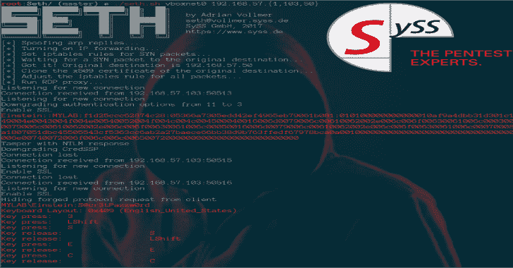

# 赛斯:执行一次 MitM 攻击&从 RDP 连接中提取明文凭证

> 原文：<https://kalilinuxtutorials.com/seth-mitm-attack-rdp-connections/>

Seth 是一个用 Python 和 Bash 编写的工具，它试图通过降级连接来提取明文凭证，从而破坏 RDP 连接。

它旨在提高人们的认识，并在五旬节、研讨会或会谈中宣传正确配置 RDP 连接的重要性。作者是阿德里安·沃尔默(SySS GmbH)。

**用途**

像这样运行:

**$。/seth.sh <接口> <攻击者 IP > <受害者 IP > <网关 IP |主机 IP><命令>**

除非 RDP 主机与受害机器位于同一子网，否则最后一个 IP 地址必须是网关的 IP 地址。

最后一个参数是可选的。它可以包含通过按键事件注入模拟 WIN+R 在 RDP 主机上执行的命令。击键注入取决于受害者使用的键盘布局——目前，只有英语和美国布局才是可靠的。

我建议使用`powershell -enc <STRING>`来避免特殊字符，这里 STRING 是你的 UTF-16le 和 Base64 编码的命令。然而，`calc`应该是相当通用的，并且能够完成任务。

外壳脚本执行 ARP 欺骗以获得中间人位置，并重定向流量，使其通过 RDP 代理运行。代理可以单独调用。

**也读作-[KaliTorify:通过 Tor 为 Kali Linux OS](https://kalilinuxtutorials.com/kalitorify-transparent-proxy/) 提供透明代理**

如果您想将 Seth 与 Responder 结合使用，这将非常有用。使用 Responder 获得一个中间人位置，同时运行 Seth。运行`seth.py -h`获取更多信息:

用法:Seth . py[-h][-d][-f][-p LISTEN _ PORT][-b BIND _ IP][-g { 0，1，3，11 }]
[-j INJECT]-c CERTFILE-k KEYFILE
target _ host【target _ PORT】

RDP 凭据嗅探器— Adrian Vollmer，SySS GmbH 2017

位置参数:
target _ host RDP 服务的目标主机
target_port TCP 端口的 –假冒服务器执行“假冒服务器”攻击
-p LISTEN_PORT，–LISTEN-PORT LISTEN _ PORT
要监听的 TCP 端口(默认为 3389)
-b BIND_IP，–BIND-IP BIND _ IP
将假冒服务绑定到的 IP 地址(默认为 all)
-g {0，1，3，11}，–degrade { 0，1，3，11}
将认证协议降级为此(默认为
3)

**视频教程**

[https://www.youtube.com/embed/wdPkY7gykf4?feature=oembed&enablejsapi=1](https://www.youtube.com/embed/wdPkY7gykf4?feature=oembed&enablejsapi=1)

**要求**

*   `python3`
*   `tcpdump`
*   `arpspoof` `arpspoof`是`dsniff`的一部分
*   `openssl`

**免责声明**

使用风险自担。未经所有相关人员的完全同意，请勿使用。仅用于教育目的。

[**Download**](https://github.com/SySS-Research/Seth)