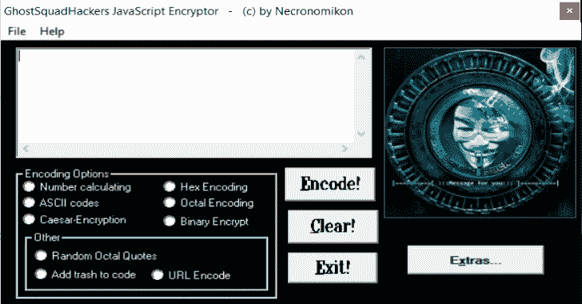

# GhostSquadHackers–加密/编码您的 Javascript 代码

> 原文：<https://kalilinuxtutorials.com/ghostsquadhackers/>

**GhostSquadHackers** 是一个用于在 Windows 脚本中加密/编码您的 Javascript 有效负载/代码的工具。以下是这段代码的几个特性:

*   数字计算
*   ASCII 代码
*   凯撒-加密
*   十六进制编码
*   八进制编码
*   二进制加密
*   随机八进制引号
*   向代码中添加垃圾
*   urlencode

**也可阅读-[sec cubus:简易自动漏洞扫描、报告&分析](https://kalilinuxtutorials.com/seccubus-vulnerability-scanning-reporting-analysis/)**

**信用:**neconomikon

[**Download**](https://github.com/s1egesystems/GhostSquadHackers-Javascript-Encrypter-Encoder)