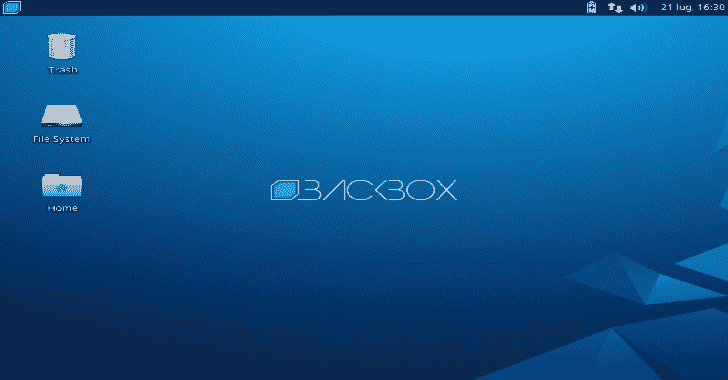

# BackBox:执行渗透测试和安全评估的工具

> 原文：<https://kalilinuxtutorials.com/backbox-penetration-tests-security-assessments/>

**BackBox** 是基于 Ubuntu 的 Linux 发行版。它被开发用于执行渗透测试和安全评估。

设计快速，易于使用，并提供一个最小但完整的桌面环境，由于其自己的软件仓库，总是更新到最常用和最知名的道德黑客工具的最新稳定版本。

像往常一样，这个主要版本包括许多更新。其中包括新的内核、更新的工具和一些结构上的变化，重点是保持稳定性和与 Ubuntu 18.04 LTS 的兼容性。

它包括一些最常见的安全和分析工具，旨在实现广泛的目标，从 web 应用程序分析到网络分析、压力测试、嗅探、漏洞评估、计算机取证分析、自动化和利用。

它已经建立在 Ubuntu 核心系统上，但完全定制，旨在成为最好的渗透测试和安全发行版之一。

**也可理解为-[终点站:一个更现代的终点](https://kalilinuxtutorials.com/terminus-terminal-modern-age/)**

**back box 的新功能**

*   更新的 Linux 内核 4.18
*   更新的桌面环境
*   更新的黑客工具
*   更新了支持 UEFI 的 ISO 混合

**系统要求**

*   32 位或 64 位处理器
*   1024 MB 系统内存(RAM)
*   用于安装的 10 GB 磁盘空间
*   支持 800×600 分辨率的显卡
*   DVD-ROM 驱动器或 USB 端口(3 GB)

32 位和 64 位的 ISO 映像都可以从官方网站下载部分下载:

[**Click Here To Download**](https://www.backbox.org/download/)