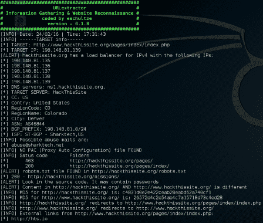

# URLextractor:信息收集和网站侦察

> 原文：<https://kalilinuxtutorials.com/urlextractor/>

**URLextractor** 是**信息收集** & W **网站侦察**的工具。以下是该工具的一些功能；

*   IP 和主机信息，如城市和国家(使用 [FreegeoIP](http://freegeoip.net/)
*   DNS 服务器(使用 [dig](http://packages.ubuntu.com/precise/dnsutils)
*   ASN、网络范围、ISP 名称(使用 [RISwhois](https://www.ripe.net/analyse/archived-projects/ris-tools-web-interfaces/riswhois)
*   负载平衡器测试
*   滥用邮件的 Whois(使用 [Spamcop](https://www.spamcop.net/)
*   PAC(代理自动配置)文件
*   将哈希与 diff 代码进行比较
*   robots.txt(递归查找隐藏内容)
*   源代码(寻找密码和用户)
*   外部链接(来自其他网站的框架)
*   目录模糊(像 Dirbuster 和 Wfuzz——使用 [Dirbuster](https://www.owasp.org/index.php/Category:OWASP_DirBuster_Project) 目录列表)
*   URL void API–检查谷歌页面排名、Alexa 排名和可能的黑名单
*   在其他网站上提供有用的链接，以便与 IP/ASN 相关联
*   最后在浏览器中打开所有结果的选项

**亦读-[Quarantyne 现代网络防火墙](https://kalilinuxtutorials.com/quarantyne-modern-web-firewall/)**

**用途**

**。/提取器 http://www.hackthissite.org/**

**提示**

*   Colorex:将颜色放入输出`**pip install colorex**`并像`**./extractor http://www.hackthissite.org/ | colorex -g "INFO" -r "ALERT"**`一样使用它
*   Tldextract:由 dnsenumeration 函数`**pip install tldextract**`使用

**版本 0.2.0 的变更日志:**

*   [修复]已将 GeoIP 从 freegeoip 更改为 ip-api
*   [修复/改进]从 robots.txt 中删除重复项
*   [改进]更好的 whois 滥用联系人(abuse)
*   [改进]添加到源代码检查的顶级密码集合
*   [新功能]如果需要，首先运行验证以安装依赖项
*   [新功能]日志文件
*   [新功能]检查日志文件中的主机名
*   [新功能]检查主机名是否在 Spamaus 域黑名单中
*   [新功能]使用通用服务器名称运行快速 dnsenumeration

**0 . 1 . 9 版本变更日志:**

*   使用 lynx 代替 ~~curl~~ 滥用邮件
*   目标服务器名称解析已修复
*   关于 HTTP 代码和目录发现的更多详细信息
*   IP 固定的 MD5 集合
*   找到的链接现在显示来自数组的唯一 URL
*   【新功能】**谷歌**结果
*   [新功能] **Bing** 对其他主机/虚拟主机进行 IP 检查
*   【新功能】从 **Shodan** 开放端口
*   [新功能] **病毒总数**关于 IP 的信息
*   【新功能】 **Alexa 排名**关于$TARGET_HOST 的信息

**要求:**

在 Kali light mini 和 OSX 10.11.3 上使用 brew 进行了测试

**sudo apt-get 安装 BC curl dnsutils libxml 2-utils whois m D5 sha 1 sum lynx OpenSSL-y**

**配置文件:**

**CURL _ TIME out = 15 # TIME out in–connect-TIME out
CURL _ UA = Mozilla # user-agent(保持简单)
INTERNAL=NO #YES 或 NO(显示内部网络信息)
URL void _ KEY = your _ API _ KEY #使用来自 http://www.urlvoid.com/的 API
FUZZ _ LIMIT = 10 #它将从 FUZZ 文件中读取多少行
OPEN _ TARGET _ URLS = NO #打开在脚本末尾找到的 URL
OPEN _ EXTERNAL _ LINKS = NO #打开外部链接(框架)at**

[**Download**](https://github.com/eschultze/URLextractor)