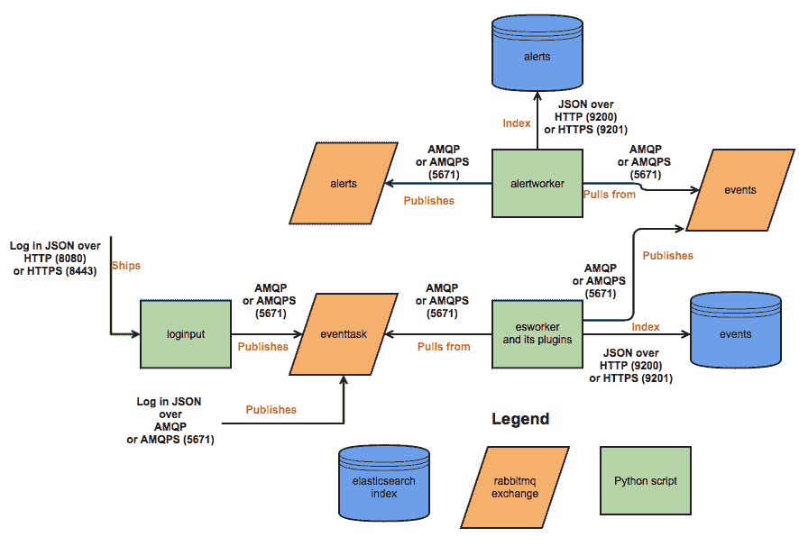

# MozDef: Mozilla 企业防御平台

> 原文：<https://kalilinuxtutorials.com/mozdef-mozilla-enterprise-defense-platform/>

MozDef 的灵感来自攻击者可以获得的大量工具。像 metasploit、armitage、lair、dradis 和其他这样的套件随时可以帮助攻击者协调、共享情报并实时微调他们的攻击。

防御者通常局限于维基百科、票务系统和附加在安全信息事件管理(SIEM)系统末端的手动跟踪数据库。

Mozilla Enterprise def Platform(moz def)旨在实现安全事件处理流程的自动化，并促进事件处理者的实时活动。

**也可阅读-[rdps can:一个针对“BlueKeep”漏洞的快速扫描器](https://kalilinuxtutorials.com/rdpscan-bluekeep-vulnerability/)**

**在 AWS 中给 MozDef 一个尝试**

以下按钮将在您的 AWS 帐户中启动 Mozilla 企业防御平台。

警告:按下“启动堆栈”按钮并完成部署将向您的 AWS 帐户收取费用。

[**Launch Now**](https://console.aws.amazon.com/cloudformation/home?region=us-west-2#/stacks/new?stackName=mozdef-for-aws&templateURL=https://s3-us-west-2.amazonaws.com/public.us-west-2.infosec.mozilla.org/mozdef/cf/v1.38.5/mozdef-parent.yml)

**目标**

**高电平**

*   为维权者提供一个平台，用于快速发现和响应安全事件。
*   自动化与其他系统的接口，如防火墙、云保护和任何具有 API 的系统。
*   提供安全事件和事故的指标。
*   促进事件处理者之间的实时协作。
*   促进可重复、可预测的事件处理流程，在自动化事件处理、信息共享、工作流、指标和响应自动化方面超越传统 SIEM 系统。

**技术**

*   提供构成开源安全信息和事件管理(SIEM)的微服务。
*   可扩展，应该能够每秒处理数千个事件，提供快速搜索、警报、关联，并处理事件处理者团队之间的交互。

**MozDef 旨在提供传统的 SIEM 功能，包括:**

*   接受来自各种系统的事件/日志
*   存储事件/日志
*   方便搜索
*   促进警报
*   促进日志管理(归档、恢复)

**它的非传统之处在于它:**

*   只接受 JSON 输入。为您提供对数据的开放式访问。
*   与各种日志发送器集成，包括 logstash、beaver、nxlog、syslog-ng 和任何可以将 JSON 发送到 rabbit-mq 或 HTTP(s)端点的发送器。
*   轻松集成到基于云的数据源，如 cloudtrail 或 guard duty。
*   提供简单的 python 插件来处理传输中的数据。
*   提供广泛的插件机会来定制您的事件丰富流、警报工作流等。
*   提供对事件响应团队的实时访问，允许彼此同时查看他们的工作。

**架构**

**MozDef 基于开源技术，包括:**

*   Nginx(基于 http 的日志输入)
*   RabbitMQ(基于消息队列和 amqp 的日志输入)
*   uWSGI(基于 python 的工人的监督控制)
*   py(用于 web 请求处理的简单 python 接口)
*   elastic search(JSON 文档的可伸缩索引和搜索)
*   Meteor(支持实时数据共享的 Node.js 响应框架)MongoDB(可扩展的数据存储，与 Meteor 紧密集成)
*   verizon 的 VERIS(安全事件分类的开源分类法)
*   d3(数据驱动文档的 javascript 库)
*   DC . js(D3 的 javascript 包装器，提供通用图表、图形)
*   three.js(用于 3d 可视化的 javascript 库)
*   Firefox(一个简洁的网络浏览器)

**前端处理**

MozDef 的前端处理包括通过 HTTP(S)、AMQP(S)或 SQS 接收事件/日志(json 格式),进行数据转换，包括规范化、添加元数据等。并将数据推送到 elasticsearch。

在内部，MozDef 使用 RabbitMQ 对仍待处理的事件进行排队。下图显示了 python 脚本(由 uWSGI 控制)、RabbitMQ 交换和 elasticsearch 索引之间的交互。

[**Download**](https://github.com/mozilla/MozDef)