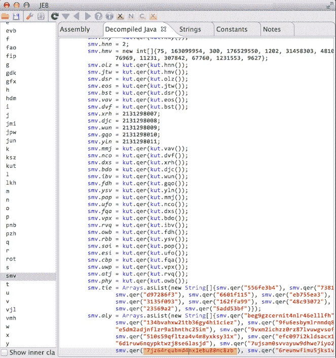

# Simplify:通用 Android Deobfuscator

> 原文：<https://kalilinuxtutorials.com/simplify-android-deobfuscator/>

**Simplify** 虚拟地执行一个应用程序，以理解它的行为，然后试图优化代码，使其行为相同，但更易于人类理解。每种优化类型都是简单而通用的，所以使用哪种特定类型的模糊处理并不重要。

**前后**

 **左边的代码是一个模糊应用的反编译，右边的代码已经去模糊。

**概述**

这个项目有三个部分:smalivm、simplify 和演示应用程序。

1.  **smalivm** :为执行 Dalvik 方法提供虚拟机沙箱。在执行一个方法之后，它返回一个图，包含每个执行路径的所有可能的寄存器和类值。即使某些值未知，如文件和网络 I/O，它也能工作。例如，任何带有未知值的`if`或`switch`条件都会导致两个分支都被采用。
2.  **简化**:分析来自 **smalivm** 的执行图，并应用优化，如常量传播、死代码移除、取消反射和一些窥视孔优化。这些都相当简单，但是当重复应用时，它们将解密字符串，消除反射，并极大地简化代码。它不*重命名方法和类。*
3.  包含在你自己的项目中使用 **smalivm** 的简单的、被大量评论的例子。如果您正在构建需要执行 Dalvik 代码的东西，请查看一下。

**也可阅读:[ghostsquadheckers——加密/编码你的 Javascript 代码](https://kalilinuxtutorials.com/ghostsquadhackers/)**

**用法**

**用法:Java-jar simplify . jar[options]
deobfuscate 一个 dalvik 可执行文件**
**-et，–Exclude-types**排除包含 REGEX 的类和方法，例如:“com/android”，应用在 include-types
**-h，–help**显示此消息
**-ie，–Ignore-errors**在执行和优化方法时忽略错误。这可能会导致意外的行为。
**–include-support**尝试执行和优化 Android 支持库包中的类，默认:false
**-it，–include-types**限制执行包含 REGEX 的类和方法，例如:"；->target method("
**–max-address-visits**访问同一个地址 N 次后放弃执行一个方法，限制循环，缺省:10000
**–max-call-depth**达到调用深度 N 后不调用方法，限制递归和长方法链，缺省:50
**–max-execution-time**N 秒后放弃执行一个方法，缺省:300
**–t 缺省值:1000000
**–max-passes**不在一个方法上运行优化器超过 N 次，缺省值:100
**-o，–Output**输出简化的输入到文件
**–Output-api-level**将输出索引 API 兼容性设置为 LEVEL，缺省值:15
**-q，–quiet**Be quiet
**–Remove-weak**Remove**

**大楼**

构建需要安装 [Java 开发工具包 8 (JDK)](http://www.oracle.com/technetwork/java/javase/downloads/jdk8-downloads-2133151.html) 。

因为这个项目包含 Android 框架的子模块，要么用`**--recursive**`克隆:

**git 克隆–递归 https://github.com/CalebFenton/simplify.git**

或者使用以下工具随时更新子模块:

**git 子模块更新–初始化–递归**

然后，构建一个包含所有依赖项的 jar:

**。/gradlew fatjar**

简化的 jar 将在`simplify/build/libs/`中。你可以通过简化提供的[混淆示例应用](https://github.com/CalebFenton/simplify/blob/master/simplify/ObfuscatedApp)来测试它的工作。以下是您运行它的方式(您可能需要更改`simplify.jar`):

**Java-jar simplify/build/libs/simplify . jar-it ' org/cf/obfuscated '-et ' main activity ' simplify/obfuscated-app . apk**

要了解什么变得模糊，请查看[模糊应用的自述文件](https://github.com/CalebFenton/simplify/blob/master/simplify/ObfuscatedApp/README.md)。

**故障排除**

如果简化失败，请按顺序尝试这些建议:

1.  通过使用`**-it**`选项，只将少数方法或类作为目标。
2.  如果失败是因为超过了最大访问次数，请尝试使用更高的`**--max-address-visits**` **、** `**--max-call-depth**` **和** `**--max-method-visits**` **。**
3.  尝试使用`**-v**`或`**-v 2**`并通过日志和 DEX 或 APK 的散列来报告问题。
4.  再试一次，但不要中断眼神交流。简化能感觉到恐惧。

如果在 Windows 上构建，并且构建失败，并出现类似以下的错误:

找不到 tools.jar。请检查 C:\ Program Files \ Java \ JRE 1 . 8 . 0 _ 151 是否包含有效的 JDK 安装。

这意味着格雷尔无法找到一个合适的 JDK 路径。确保安装了 JDK，将`JAVA_HOME`环境变量设置为您的 JDK 路径，并确保关闭并重新打开用于构建的命令提示符。

**特约**

不要害羞。我认为虚拟执行和去泡沫化是很吸引人的问题。任何感兴趣的人都很酷，欢迎投稿，即使只是为了纠正一个错别字。请随意在问题中提问，并提交拉动请求。

**汇报问题**

请附上 APK 或 DEX 的链接以及您正在使用的完整命令。这使得重现(从而*修复*)您的问题变得更加容易。

如果你不能分享样本，*请*包括文件哈希(SHA1，SHA256 等)。

**优化策略**

**常数传播**

如果一个 op 放置了一个可以转换为常量的类型的值，比如字符串、数字或布尔值，那么这个优化将用常量替换那个 op。例如:

const-string v0，" vgvsbcbtzsbvzib 5b 3 vyighvbwv 3 B3 jszcwgvxn1 BC 4 = " invoke-static { v 0 }，Lmy/string/Decryptor；->解密(Ljava/lang/String；)Ljava/lang/String；解密到:“告诉我你的家乡，通常是。”
移动结果 v0

在这个例子中，一个加密的字符串被解密并放入`v0`。因为字符串是“可持续的”，所以`**move-result v0**`可以用一个`**const-string**`代替:

const-string v0，" vgvsbcbtzsbvzib 5b 3 vyighvbwv 3 B3 jszcwgvxn1 BC 4 = " invoke-static { v 0 }，Lmy/string/Decryptor；->解密(Ljava/lang/String；)Ljava/lang/String；告诉我你的家乡，通常是

**死代码清除**

如果删除代码不可能改变应用程序的行为，那么代码就是死的。最明显的情况是代码不可达，例如`if (false) { // dead }`)。

如果代码是可达的，如果它不影响方法之外的任何状态，也就是说，它没有副作用，那么它可以被认为是死的。例如，代码可能不会影响方法的返回值、更改任何类变量或执行任何 IO。这在静态分析中很难确定。幸运的是，smalivm 不一定要聪明。

它只是愚蠢地执行它能做的一切，并假设如果不能确定会有副作用。考虑恒定传播的例子:

const-string v0，" vgvsbcbtzsbvzib 5b 3 vyighvbwv 3 B3 jszcwgvxn1 BC 4 = " invoke-static { v 0 }，Lmy/string/Decryptor；->解密(Ljava/lang/String；)Ljava/lang/String；告诉我你的家乡，通常是

在这段代码中，`invoke-static`不再影响方法的返回值，我们假设它不会做任何奇怪的事情，比如向文件系统或网络套接字写入字节，所以它没有副作用。它可以被简单地移除。

const-string v0，" vgvsbcbtzsbvzib 5b 3 vyighvbwv 3 b 3 jszcwgvxn1 BC 4 = "
const-string v 0，"告诉我你的母星，通常是 ul。"

最后，第一个`const-string`将一个值分配给寄存器，但该值从未使用过，即分配无效。也可以去掉。

告诉我你的家乡，通常是

**不反思**

Java 静态分析的一个主要挑战是反射。不进行仔细的数据流分析，就不可能知道参数是反射方法的参数。有很多聪明的方法可以做到这一点，但是 smalivm 只是通过执行代码来做到这一点。当它找到反射的方法调用时，例如:

invoke-virtual {v0，v1，v2}，Ljava/lang/reflect/Method；-> invoke(Ljava/lang/Object；【Ljava/lang/Object；)Ljava/lang/Object；

它可以知道`v0`、`v1`、`v2`的值。如果确定了值是什么，它可以用实际的非反射方法调用替换对`Method.invoke()`的调用。这同样适用于反射字段和类查找。

**窥视孔**

对于所有不能完全归入特定类别的东西，都有窥视孔优化。这包括删除无用的`check-cast`操作，用`const-string`替换`Ljava/lang/String;-><init>`呼叫，等等。

**去泡沫例子**

**优化前**

。方法公共静态 test1()I
。locals 2

new-instance v0，Ljava/lang/Integer；
const/4 v1，0x1
invoke-direct {v0，v1}，Ljava/lang/Integer；->(I)V

invoke-virtual { V 0 }，Ljava/lang/Integer；->int value()I
move-result v 0
return v 0
。结束方法

这一切做的就是`v0 = 1`。

**经过不断的传播**

。方法公共静态 test1()I
。locals 2

new-instance v0，Ljava/lang/Integer；
const/4 v1，0x1
invoke-direct {v0，v1}，Ljava/lang/Integer；-><init>(I)V

invoke-virtual { V 0 }，Ljava/lang/Integer；- > intValue()I
const/4 v0，0x 1
return v 0

。结束方法

将`move-result v0`替换为`const/4 v0, 0x1`。这是因为`intValue()I`只有一个可能的返回值，并且返回类型可以是常量。论点`v0`和`v1`是明确的，不会改变。也就是说，在`intValue()I`每个可能的执行路径都有一致的值。可以转换为常量的其他类型的值:

*   数字-`**const/4**`**、** `**const/16**` **等**。
*   字符串—`**const-string**`
*   类别—`**const-class**`

**去除死代码后**

。方法公共静态 test1()I
。本地人 2

const/4 v0，0x1

返回 v0

。结束方法

因为`**const/4 v0, 0x1**`上面的代码不会影响方法之外的状态(没有副作用)，所以可以在不改变行为的情况下删除它。

如果有一个方法调用向文件系统或网络写了东西，它不能被删除，因为它影响方法之外的状态。或者如果`test()I`采用可变参数，比如`**LinkedList**`，任何访问它的指令都不能被认为是死的。

死代码的其他示例:

*   未引用的分配–分配寄存器但不使用它们
*   未到达/无法到达的指令-`**if (false) { dead_code(); }**`

[**Download**](https://github.com/CalebFenton/simplify)**