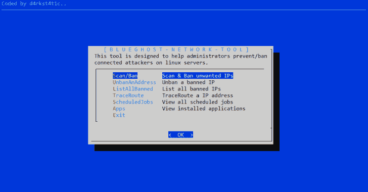
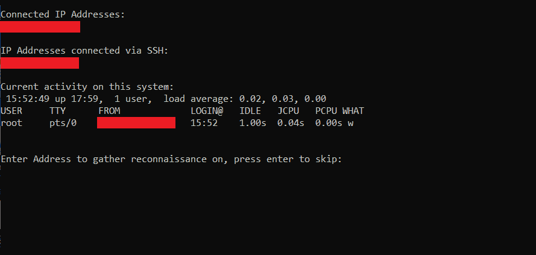
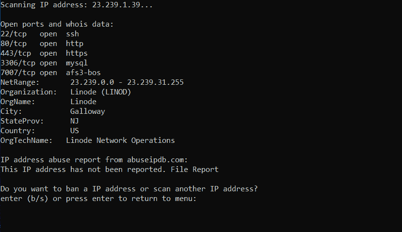

# BlueGhost:网络工具，用于帮助 Blue 团队禁止攻击者进入 Linux 服务器

> 原文：<https://kalilinuxtutorials.com/blueghost-banning-attackers-linux-servers/>

BlueGhost 工具利用各种 Linux 网络工具和 bash 脚本来帮助 blue 团队保护基于 Debian 和 Ubuntu 的服务器免受恶意攻击者的攻击。

扫描/禁止显示连接的 IP，使用 nmap 和 whois 搜索扫描开放端口的 IP 地址以收集对连接的 IP 的侦察，显示系统上的活动，检查 abuseipdb.com 的报告，并提供禁止功能以使用 iptables 禁止不需要的 IP。

*   ubananaddress 城市 ips 的一个功能。
*   一个列出所有被禁止的 IP 的函数。
*   TraceRoute 在 IP 上执行跟踪路由的功能。
*   ScheduledJobs 一个函数，用于列出所有计划的作业(cronjobs)
*   Apps 一个查看系统中所有已安装应用程序的功能

**也读作-[back box:执行渗透测试的工具&安全评估](https://kalilinuxtutorials.com/backbox-penetration-tests-security-assessments/)**

**安装**

**sudo git clone**[**https://github . com/d4rk 007/blue ghost** **CD blue ghost
源安装. sh
cd**](https://github.com/d4rk007/BlueGhost)

[**Download**](https://github.com/d4rk007/BlueGhost)