# Windows Hacks:可以用 Windows API 完成的创造性和不寻常的事情

> 原文：<https://kalilinuxtutorials.com/windows-hacks/>

[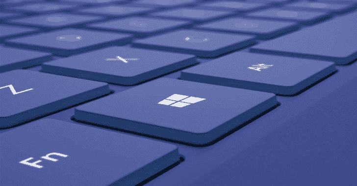](https://1.bp.blogspot.com/-tBVGUKdsdpg/XRJZI-T4guI/AAAAAAAABBY/UB4GTGq_XHYNbLDo9xtZirS6zr_6cyl2QCLcBGAs/s1600/Windows.png)

**Windows Hacks** 是一个创造性的和不寻常的事情，可以用 Windows API 来完成。

**缩小窗口**

任何窗口都可以缩小。

缩小计算器:

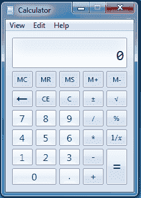

缩小谷歌浏览器:

即使是 Microsoft Word 也不能幸免于收缩:

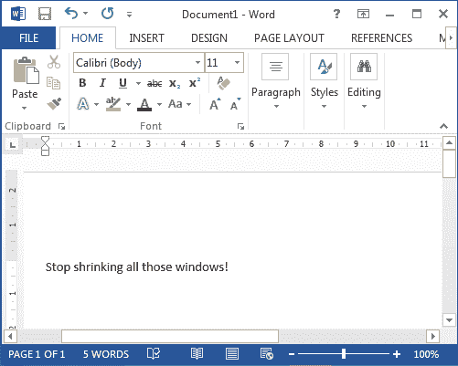

**也读作-[Simplify:Generic Android Deobfuscator](https://kalilinuxtutorials.com/simplify-android-deobfuscator/)**

**色调移位器**

可以选择任何窗口来改变其颜色。

色调转换 Microsoft Paint:

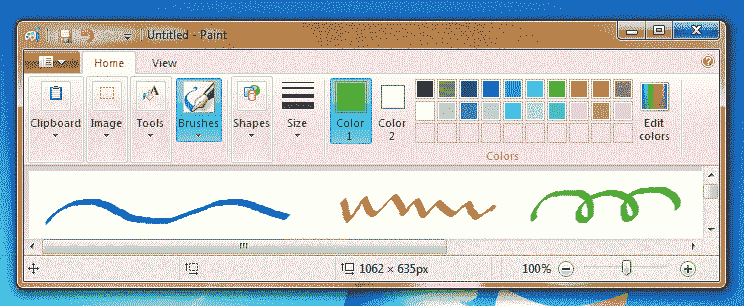

色调转换 Microsoft Word:

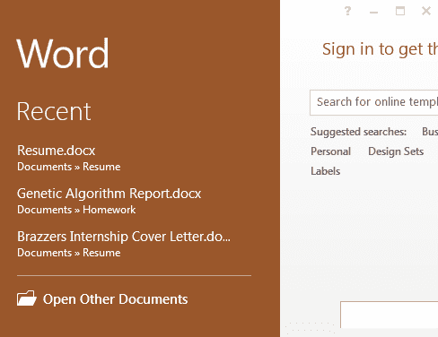

**直接写入桌面**

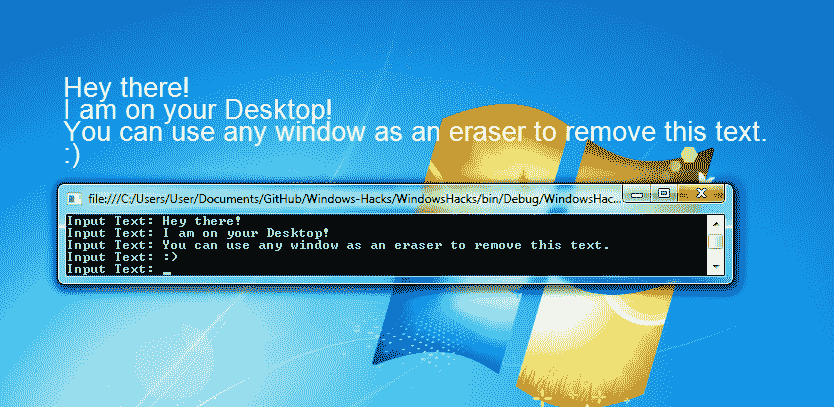

**桌面旋转**

放大桌面，然后不断旋转。

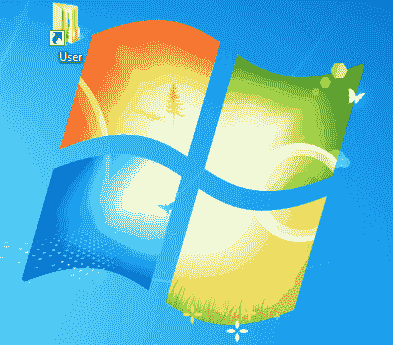

**摇窗器**

不使用鼠标随机摇动指定的窗口。

这里你可以看到微软画图自己在晃动。很诡异吧？

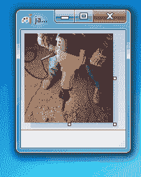

如果你是一个大师级的艺术家(比如我)，你可能会发现在静止的画布上画画太容易了。在这种情况下，这是最适合你的工具。

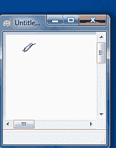

**波浪形窗口**

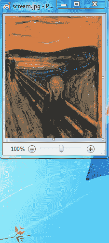

**运动检测**

检测指定窗口中的运动。玩这个很有趣，尤其是用在视频上的时候，但是我只能包含这么多的 gifs

在 Microsoft Paint 中检测运动:

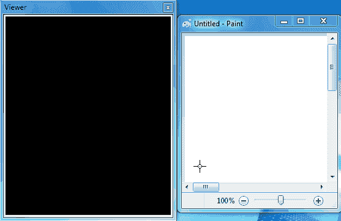

在命令提示符下检测运动:

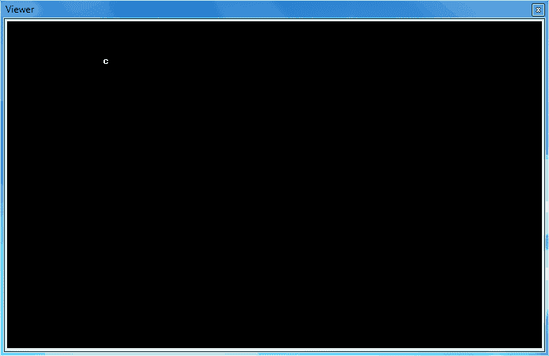

**自动喷漆**

在 Microsoft Paint 中自动绘制带有阈值的蒙娜丽莎:

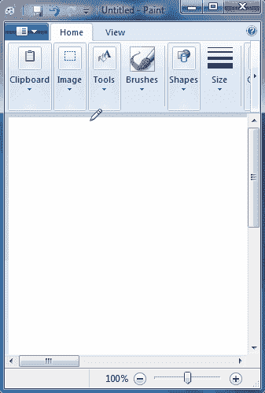

**扰窗器**

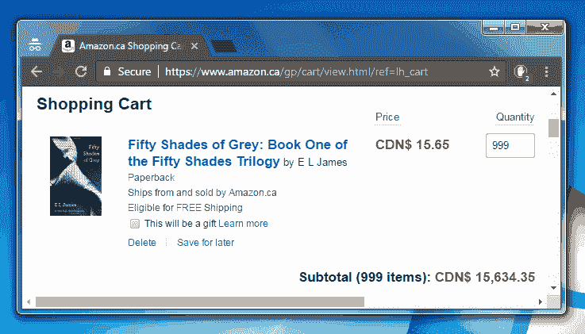

**窗口阈值**

这使得浅色透明，深色黑色。

阈值设定前:

阈值处理后:

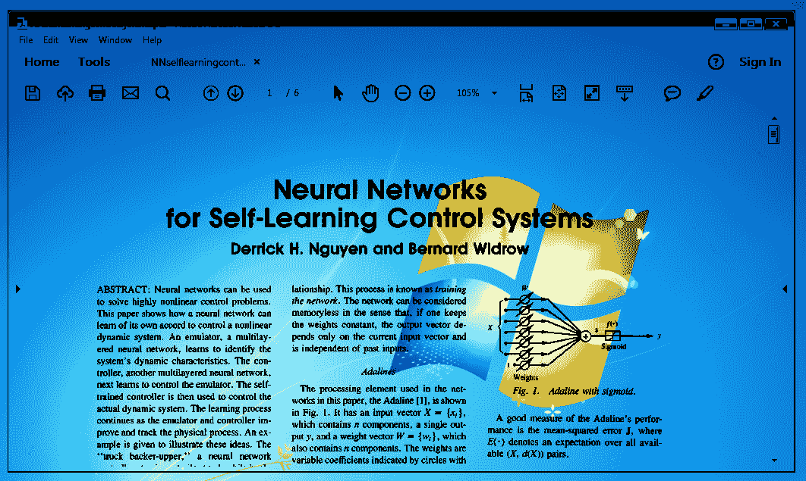

**强制改变窗口属性**

窗口的许多属性可以被强制更改。在下图中，我在 Windows 计算器中更改了以下属性:

*   禁用关闭、最大化和最小化按钮
*   删除了下拉菜单(查看、编辑、帮助)
*   更改了窗口边框的宽度和高度
*   改了标题

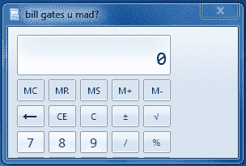

**鼠标垃圾邮件**

产生数百只老鼠，每只老鼠在屏幕上独立移动。

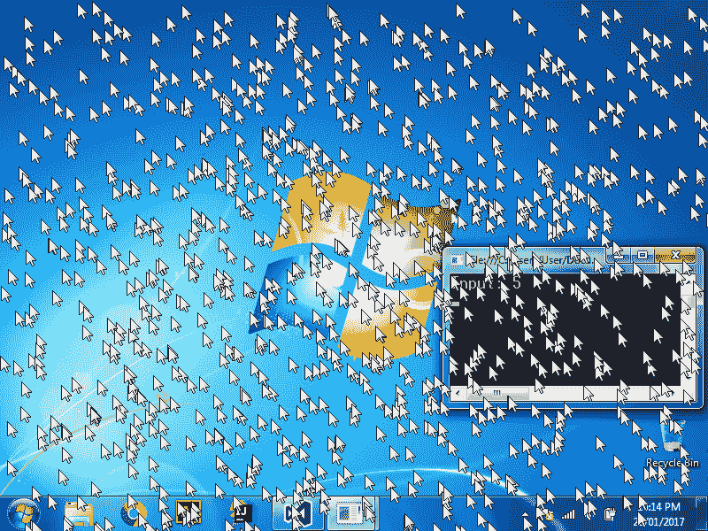

**隐藏窗口**

任何窗口都可以隐藏。在下图中，我隐藏了 Windows 计算器。正如你所看到的，它在桌面上找不到。但是，如果您打开 Windows 任务管理器，它实际上仍在后台运行:

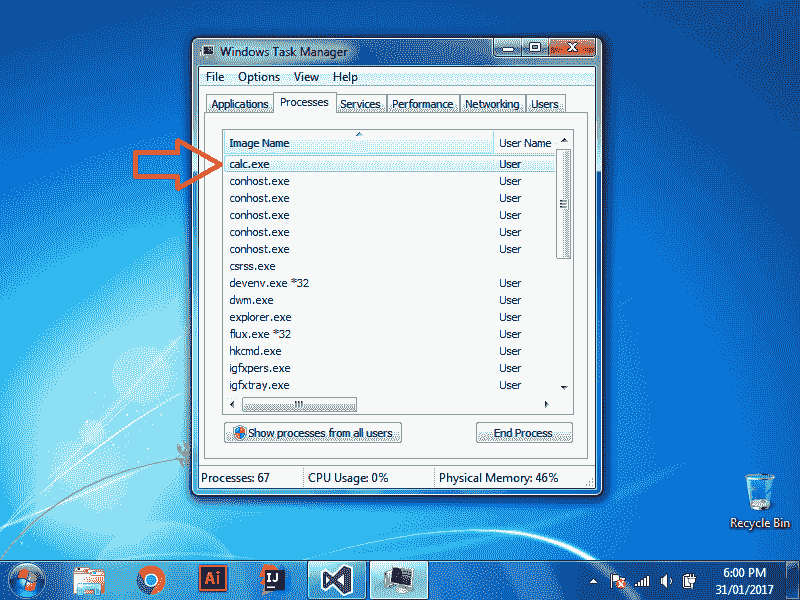

**更多…**

这是菜单。它列出了所有功能:

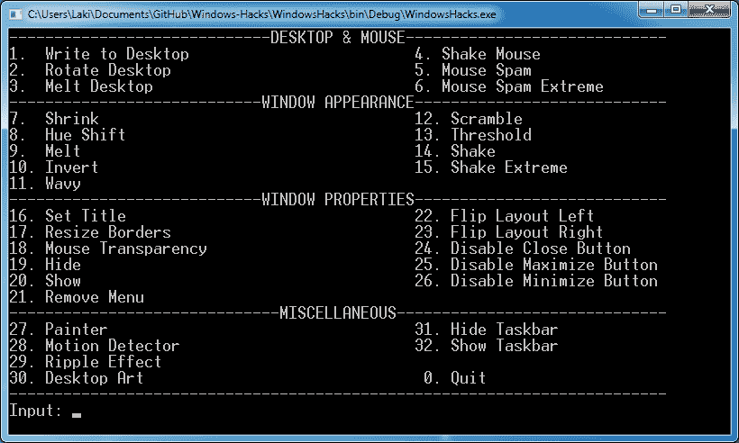

**如何运行**

编译后的二进制文件位于文件夹*可执行文件*中。

如果你想自己编译，推荐的方法如下:

*   确保您有 Visual Studio 和。NET 框架 4.5.2。
*   下载压缩文件。
*   拉开拉链。
*   在 Visual Studio 中打开 WindowsHacks.sln。
*   按 F5 运行它。

**备注**

*   将所有函数集合在一起的主类是 *Program.cs* 。
*   待办事项列表可以在顶层目录中找到。这包括要修复的错误和要实现的新功能。
*   外部文件夹包含两个基本的。代码运行时必须引用的 dll 文件。这两个文件是 WindowsAPI.dll 和 ImageProcessing.dll，它们的代码可以分别在我的 [WinAPI-Wrapper](https://github.com/LazoCoder/WinAPI-Wrapper) 和[图像处理库](https://github.com/LazoCoder/Image-Processing-Library)库中看到。
*   这仅在 Windows 7 上进行了测试。

[**Download**](https://github.com/LazoCoder/Windows-Hacks)