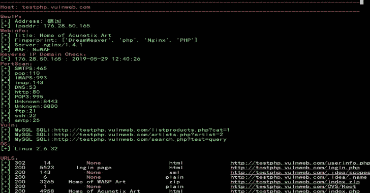
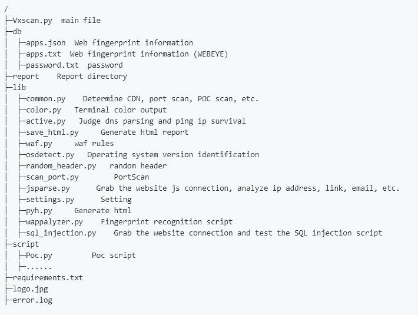
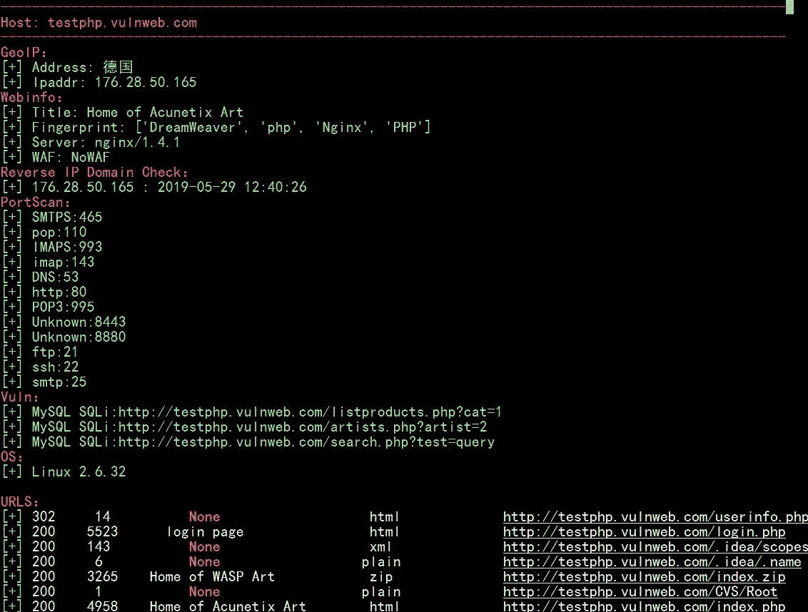
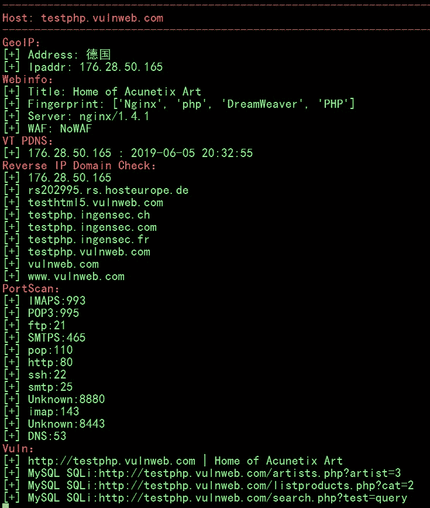

# VXScan : Python3 综合扫描工具

> 原文：<https://kalilinuxtutorials.com/vxscan-scanning-tool/>

**VXScan** 是 Python3 综合扫描工具，主要用于敏感文件检测(目录扫描和 js 泄露接口)、WAF/CDN 识别、端口扫描、指纹/服务识别、操作系统识别、弱密码检测、POC 扫描、SQL 注入、绕过 CDN、检查下一站。

**1.0 版本更新**

*   2019.6.18
*   修复了指纹识别 iis 网站错误的问题，修改了 apps.json
*   删除了一些容易出错的第三方库和脚本
*   如果闪烁，说明扫描完成，这是因为程序首先检测到 dns 解析和 ping 操作。
*   第一次使用 Vxscan，fake_useragent 会在这里加载[https://fake-useragent.herokuapp.com/browsers/0.1.11](https://fake-useragent.herokuapp.com/browsers/0.1.11)的 ua 列表，可能会出现加载超时错误。

**也可阅读-[what breach:o Sint 工具查找被攻破的电子邮件&数据库](https://kalilinuxtutorials.com/whatbreach-breached-emails-databases/)**

**要求**

*   Python 版本> 3.6
*   要求
*   tqdm
*   皮菲莱
*   fake-useragent
*   beautifulsoup4
*   geoip2
*   右旋糖酐
*   python-nmap
*   geoip2
*   右旋糖酐
*   lxml
*   pymongo
*   virustotal_python
*   apt 安装 libpq-dev nmap
*   wget[https://geolite . maxmind . com/download/GeoIP/database/geolite 2-city . tar . gz](https://geolite.maxmind.com/download/geoip/database/GeoLite2-City.tar.gz)
*   解压缩后，将 GeoLite2-City.mmdb 放入 vxscan/db/GeoLite2-City.mmdb 中
*   wget[https://geolite . maxmind . com/download/GeoIP/database/geolite 2-ASN . tar . gz](https://geolite.maxmind.com/download/geoip/database/GeoLite2-ASN.tar.gz)
*   解压缩后，将 GeoLite2-ASN.mmdb 放入 vxscan/db/GeoLite2-ASN.mmdb 中
*   pip3 install -r requirements.txt

**特性**

*   使用笛卡尔积方法生成字典列表，支持自定义字典列表
*   随机用户代理
*   自定义 404 页面识别，访问随机页面，然后通过 difflib 比较相似性，以识别自定义 302 跳转
*   扫描目录时，先检测 http 端口，将一台主机的多个 http 端口添加到扫描目标中。
*   过滤无效的内容类型，无效的状态？
*   晶圆/CDN 检测
*   使用套接字发送数据包以检测公共端口，并发送不同的有效负载检测端口服务指纹。
*   遇到完全端口开放(端口欺骗)的主机会自动跳过
*   调用 wappalyzer.json 和 WebEye 确定网站指纹
*   检测到 CDN 或 WAF 网站自动跳转
*   调用 nmap 来识别操作系统指纹
*   调用基于开放端口的弱密码检测脚本(FTP/SSH/TELNET/Mysql/MSSQL…)
*   调用基于指纹识别或端口的 POC 扫描，或点击打开 IP 的 WEB 端口
*   分析敏感资产信息(域名、邮箱、apikey、密码等)。)在 js 文件中
*   抓取网站连接，测试 SQL 注入，LFI 等。
*   调用一些网上接口获取 VT、等网站信息，通过 VT pdns 确定真实 IP，通过 www.yougetsignal.com 和 api.hackertarget.com[查询网站。](http://www.yougetsignal.com/)

**用途**

**python3 Vxscan.py -h**

**可选参数:** -h，–help 显示此帮助信息并退出
-u URL，–URL URL 开始扫描此 URL-u xxx.com
-I INET，–INET INET CIDR 例如 1.1.1.1 或 1.1.1.0/24
-f 文件，–FILE 从文件中读取 URL
-t THREADS，–THREADS
设置扫描线程，默认 150
-e EXT，–EXT 设置扫描后缀，-e php，asp【中

*   **扫描网站**

**python 3 vxscan . py-u http://www.xxx.com/**

*   **从文件列表中扫描网站**

**python 3 vxs can . py-f hosts . txt**

*   **cidr 如 1.1.1.1 或 1.1.1.0/24**

**python 3 vxs can . py-I 127 . 0 . 0 . 0/24**

*   **设置线程 100，仅组合 php 后缀，使用自定义词典**

**python 3 vxs can . py-u http://www.xxx.com-e PHP-t 100-w../dict.txt**

**结构**

**Waf/CDN 列表**

*   Three hundred and sixty
*   360wzws
*   安全堡
*   装甲
*   百度云加速
*   AWS 晶圆
*   阿德诺乌姆
*   Airee CDN
*   防卫艺术
*   阿凡克劳德
*   梭鱼
*   白鲸 CDN
*   双星系统
*   BlockDoS
*   布鲁登·IST
*   CacheFly CDN
*   ChinaCache CDN
*   思科 ACE XML 网关
*   CloudFlare CDN
*   云锋 CDN
*   科莫多
*   CompState
*   DenyALL WAF
*   DenyAll
*   蒸馏防火墙
*   dos 逮捕网络安全
*   F5 BIG-IP APM
*   F5 BIG-IP ASM
*   F5-交通盾
*   快速 CDN
*   FortiWeb
*   FortiWeb 防火墙
*   GoDaddy
*   GreyWizard 防火墙
*   华为云 WAF
*   超级防护防火墙
*   IBM DataPower
*   isa 服务器
*   免疫 360
*   Imperva SecureSphere
*   包裹 CDN
*   贾苏勒
*   KONA
*   KeyCDN
*   ModSecurity
*   NGENIX CDN
*   绿盟科技
*   纳克西
*   网络连续体
*   网络连续体晶片
*   东软 SEnginx
*   新防卫
*   帕洛阿尔托防火墙
*   PerimeterX 防火墙
*   PowerCDN
*   专业人士
*   七牛 CDN
*   重新启用防火墙
*   SDWAF
*   安全 3
*   安全狗
*   SiteLock TrueShield
*   声波墙
*   声波墙
*   索福思 UTM 防火墙
*   斯艇威
*   苏库里
*   你有华夫饼
*   Usp-Sec
*   光泽面
*   墙臂
*   守卫
*   网络骑士
*   西部 263CDN
*   云盾
*   云索
*   ZenEdge 防火墙
*   aesecure
*   阿里云
*   CDN 作业
*   cloudflare CDN
*   网络卫士
*   风头 CDN
*   maxcdn CDN
*   mod _ 安全
*   云索

**输出**

以下是 AWVS 扫描仪测试网站结果

[**Download**](https://github.com/al0ne/Vxscan)