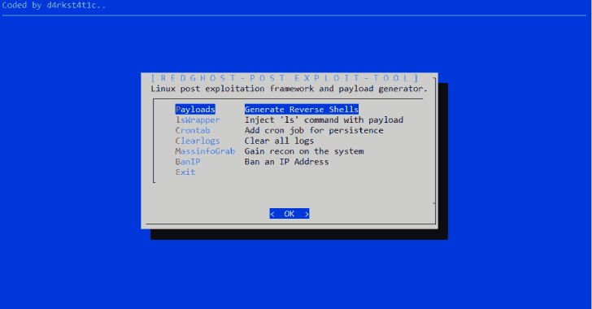

# RedGhost : Linux 后期开发框架，旨在帮助 Red 团队

> 原文：<https://kalilinuxtutorials.com/redghost-linux-post-exploitation/>

RedGhost 是一个 Linux 后期开发框架，旨在帮助红队获得持久性、侦察性和不留痕迹。

**也可阅读-[Blue ghost:网络工具，旨在帮助蓝队禁止攻击者进入 Linux 服务器](https://kalilinuxtutorials.com/blueghost-banning-attackers-linux-servers/)**

**特性**

*   有效负载的功能是在 netcat、bash、python、php、ruby、perl 中生成各种编码的反向 shells
*   lsWrapper 函数，用于将“ls”命令与有效负载包装在一起，以便在每次为持久性运行“ls”时运行有效负载
*   用于创建 cron 作业的 Crontab 函数，该作业每分钟都下载并运行有效负载以实现持久性
*   Clearlogs 的功能是清除日志，使取证调查变得困难
*   MassInfoGrab 函数获取系统的大量信息
*   BanIp 函数到 BanIp

[**Download**](https://github.com/d4rk007/RedGhost)