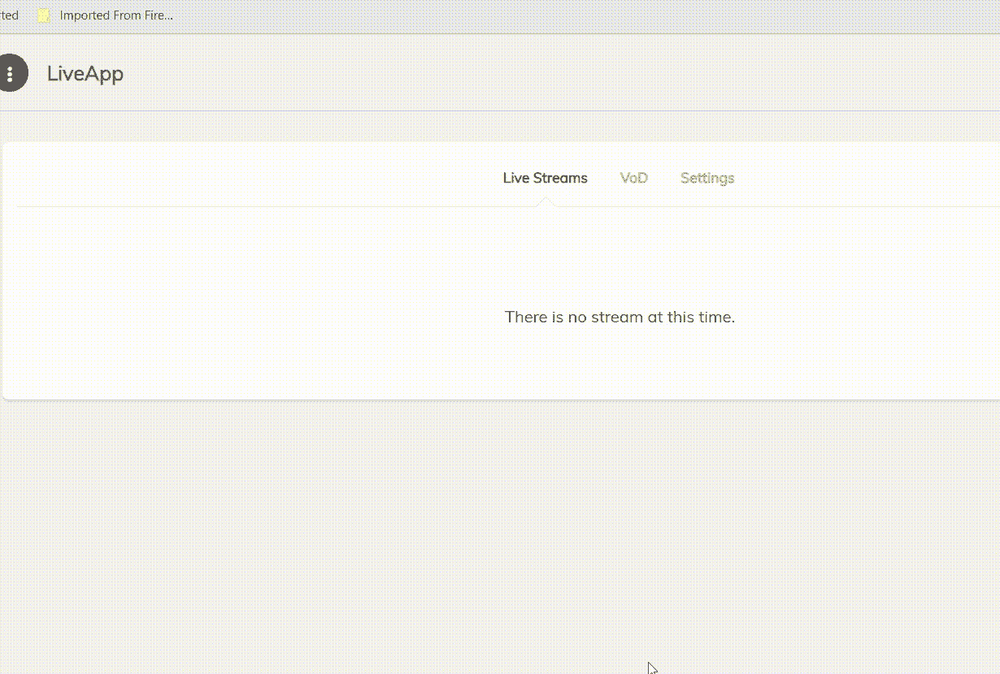
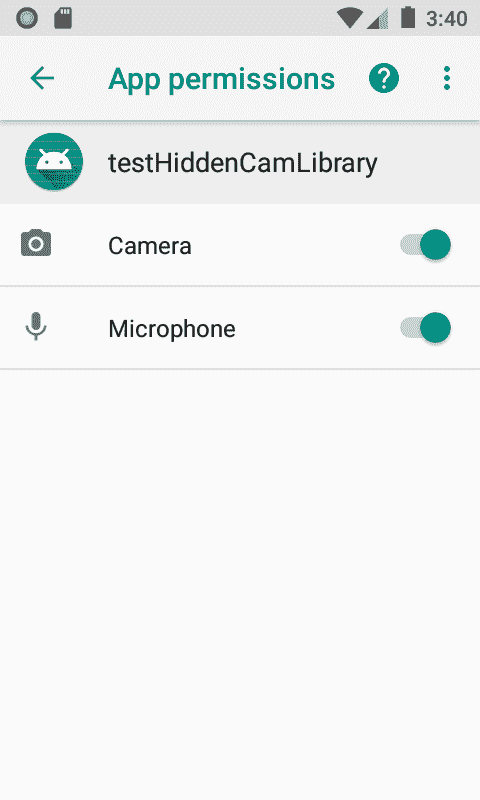
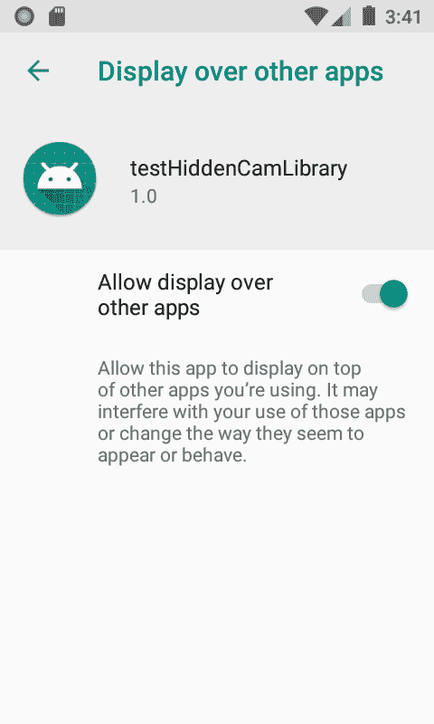
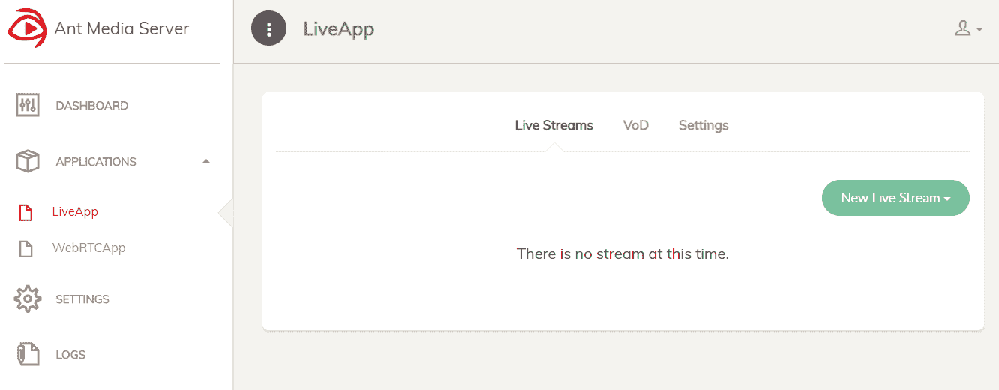

# LiveHiddenCamera:这个库可以记录来自 Android 设备的实时视频和音频，但不显示预览

> 原文：<https://kalilinuxtutorials.com/livehiddencamera/>

LiveHiddenCamera 是一个从 Android 设备录制实时视频和音频而不显示预览库。

**如何使用？**

我创建了一个库让它更有用。唯一的要求是将库添加到您的项目中，并将 Rtmp URL 传递给它。

**也可以阅读-[Windows Hacks:Creative&可以用 Windows API 完成的不寻常的事情](https://kalilinuxtutorials.com/windows-hacks/)**

此外，您还应该关心:

*   您的应用程序在`**Manifest.xml**`中应具有以下权限:

 <uses-permission android:name="”android.permission.INTERNET”"><用途-权限 Android:name = " Android . permission . camera "/>
<用途-权限 Android:name = " Android . permission . record _ AUDIO "/>
<用途-权限 Android:name = " Android . permission . system _ ALERT _ WINDOW "/></uses-permission>

*   您应该将声明的权限授予您的应用程序

**添加库**

图书馆的使用是直截了当的。只需将下面的库添加到项目的`gradle.build`文件中。

`**compile 'ir.mstajbakhsh.android:LiveHiddenCamera:0.1.2'**`

*   更新:在以前的版本中，启动过滤器的主要活动在库中，这使得应用程序(使用库)有两个图标。**在此版本中，过滤器在`Manifest`** 中被注释。

**创建 RTMP 服务器**

在使用这个库之前，您应该已经部署了一个 Rtmp 服务器。我用过[蚂蚁媒体服务器](https://github.com/ant-media/Ant-Media-Server)。在[这个链接](https://github.com/ant-media/Ant-Media-Server/wiki/Getting-Started)里有一个很好的关于蚂蚁媒体服务器安装的指南。

启动 Ant Media Rtmp 服务器后，您应该会看到类似这样的内容:

**样本代码**

将库添加到项目后，请执行以下步骤:

*   创建一个实现`**RtmpHandler.RtmpListener, SrsRecordHandler.SrsRecordListener, SrsEncodeHandler.SrsEncodeListener**`的类
*   创建两个字段(一个用于发布，一个用于预览):private SrsPublisher mPublisher
    private srscameraveview mCameraView；
*   实现启动实时隐藏摄像机的功能:

private void initHiddenCam(String RTM purl){
HiddenCameraLayout l = new HiddenCameraLayout(getApplicationContext()，new HiddenCameraLayout。permission handler(){
@ Override
public void onpermission notgrantedexception(Exception ex){
log . d(" HCL "，"要求用户授予权限。");
Log.e("HCL "，ex . getmessage())；
}
})；

//开始配置
camera config camera config = new camera config()
。get builder(main activity . this . getapplicationcontext())
。setCameraFacing(CameraFacing。后置 _ 摄像头)
。build()；
mCameraView = l . inithiddenlayout(cameraConfig)；

mPublisher = new SRS publisher(mCameraView)；mPublisher.setEncodeHandler(新 SrsEncodeHandler(this))；mpublisher . setrtmphandler(new RtmpHandler(this))；mpublisher . setrecordhandler(new SrsRecordHandler(this))；mpublisher . setpreviewresolution(640，360)；mpublisher . setoutputresolution(640，360)；mpublisher . setvideohdmode()；mpublisher . start publish(RTM purl)；mpublisher . start camera()；
}

[**Download**](https://github.com/mirsamantajbakhsh/LiveHiddenCamera/#sample-code)