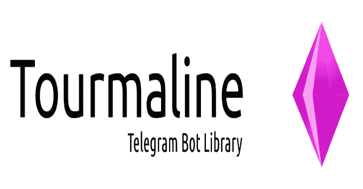

# 电气石:水晶的电报机器人框架

> 原文：<https://kalilinuxtutorials.com/tourmaline-telegram-bot/>

电气石是一个用于水晶的电报机器人(希望很快成为客户端)API 框架。这个水晶的实现在很大程度上基于 [Telegraf](http://telegraf.js.org/) ，它允许你的电报机器人用一种既漂亮又快速的语言编写。基准测试即将推出。

**安装**

将此添加到您的应用程序的`shard.yml`:

**依赖:
碧玺:
github:watzon/碧玺
版本:~ > 0.7.0**

**也可阅读-[swift monkey:对 iOS 应用进行随机 UI 测试的框架](https://kalilinuxtutorials.com/swiftmonkey-testing-ios-apps/)**

**用途**

**基本用法**

**require "电气石/bot"

别名 TGbot =电气石::Bot

Bot = TGBot::client . new(ENV[" API _ KEY "])

Bot . command([" start "，" help "])do | message |
text = " Echo Bot 是用电气石 Bot 框架创建的示例 Bot。"
bot . send _ message(message . chat . id，text)
end

bot . command(" echo ")do | message，params |
text = params . join(" "
bot . send _ message(message . chat . id，text)
end

bot . poll**

**监听事件**

碧玺有许多你可以收听的活动(实际上与 Telegraf 相同的活动)。事件的完整列表可在文档中找到[。](https://watzon.github.io/tourmaline/Tourmaline/Bot/UpdateAction.html)

**bot . on(:text)do | update |
text = update . message . not _ nil！. text.not_nil！
所言“正文:# {正文}”
结尾**

### 添加中间件

可以通过扩展`**Tourmaline::Bot::Middleware**` **类来创建中间件。**所有的中间件类都需要有一个`**call(update : Update)**`方法。每次更新时都会调用中间件。

类 my Middleware<TGBot::Middleware

#所有 Middleware 都包含对父 Bot 的引用。
# @bot:电气石::Bot::Client
def call(Update:Update)
if message = Update . message
if user = message . from _ user
if text = message . text
put“# { user . first _ name }:# { text }”
end
end
end
end
end
Bot . use my middleware

**Webhooks**

使用 webhooks 很容易，即使在本地使用 ngrok.cr 包。

**bot . command(" buy ")do | message，params |
bot . send _ Invoice(
message . chat . id，
"样本发票"，
"这是测试…"，
"123344232323 "，
"YOUR_PROVIDER_TOKEN "，
"test1 "，
"USD "，
bot . labeled _ prices([{ label:" Sample "，amount: 299}，{ label:" anor "，amountto_json
)
结束**

**游戏**

用你的碧玺机器人创建和运行游戏的能力是一项尚未测试的新功能。如果您遇到问题，请使用[问题跟踪器](https://github.com/watzon/tourmaline/issues)。

**凯末尔中间件**

托玛琳为凯末尔提供中间件，以防万一你想用凯末尔做服务器。

**要求“凯末尔”
要求“托玛琳/凯末尔/托玛琳 _ 汉德勒”

要求”。/your _ bot "

add _ handler Kemal::tourmaline handler . new(
bot:your bot . new，
url: "https://something.com "，
path:"/bot-web hook/# { ENV[" TGBOT _ API _ KEY "]} "
)

Kemal . run**

**注意:** Telegram 不会向非 ssl 域发送 webhook 请求。这意味着您需要在启用 ssl 的情况下运行 kemal 服务器。对于本地开发来说，这可能很痛苦，但是有了 [ngrok.cr](https://github.com/watzon/ngrok.cr) 就容易多了。

## 发展

它目前支持以下功能:

*   Bot API
    *   实施示例
    *   简单的命令语法
    *   健壮的中间件系统
    *   标准 API 查询
    *   贴纸
    *   内嵌模式
    *   长轮询
    *   Webhooks
    *   支付
    *   比赛
*   客户端 API(开发中)

如果您想要一项新功能，请随时提交问题或提出请求。

[**Download**](https://github.com/watzon/tourmaline)