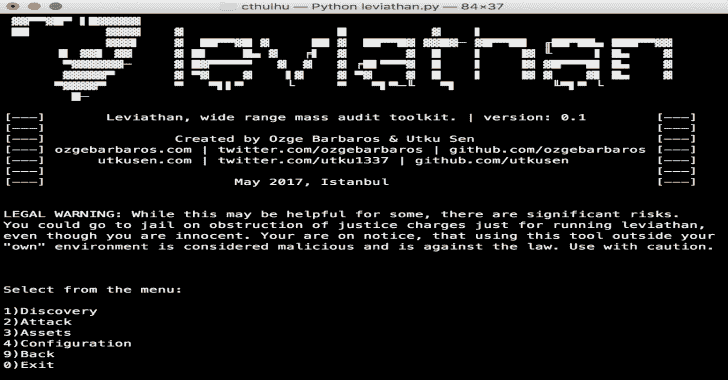
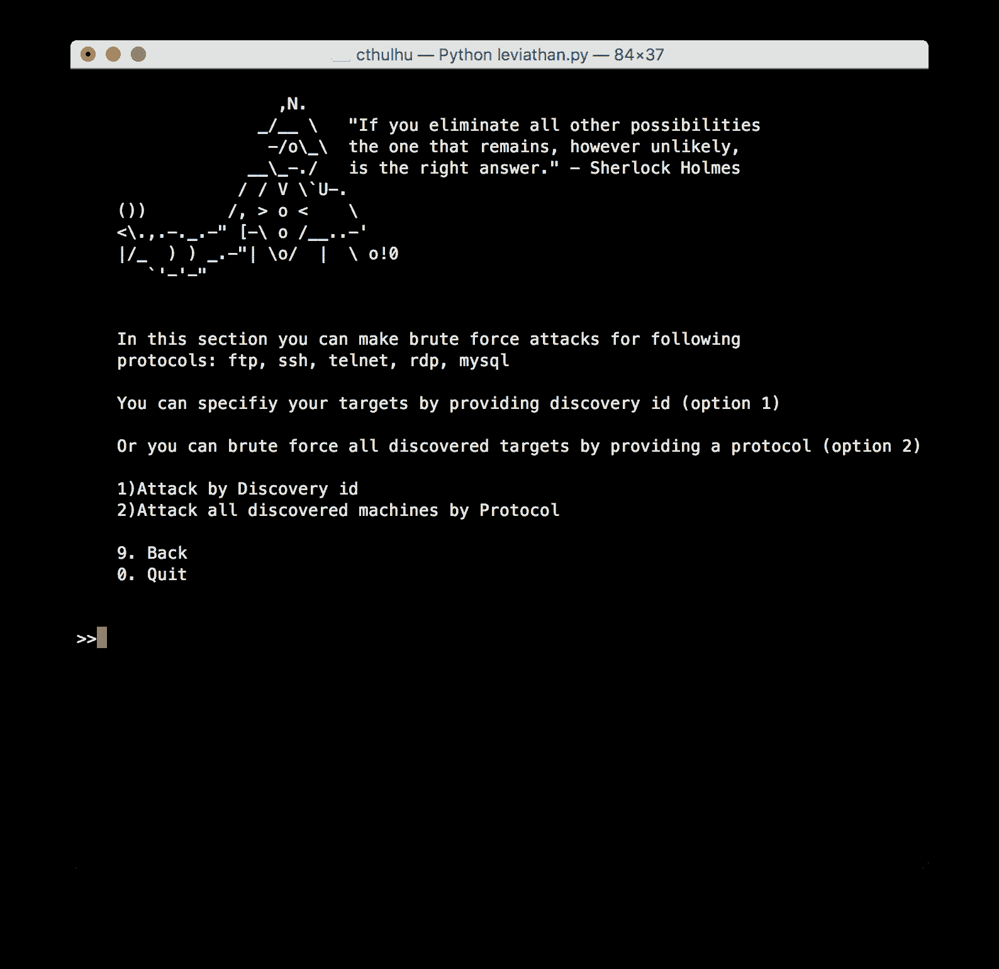
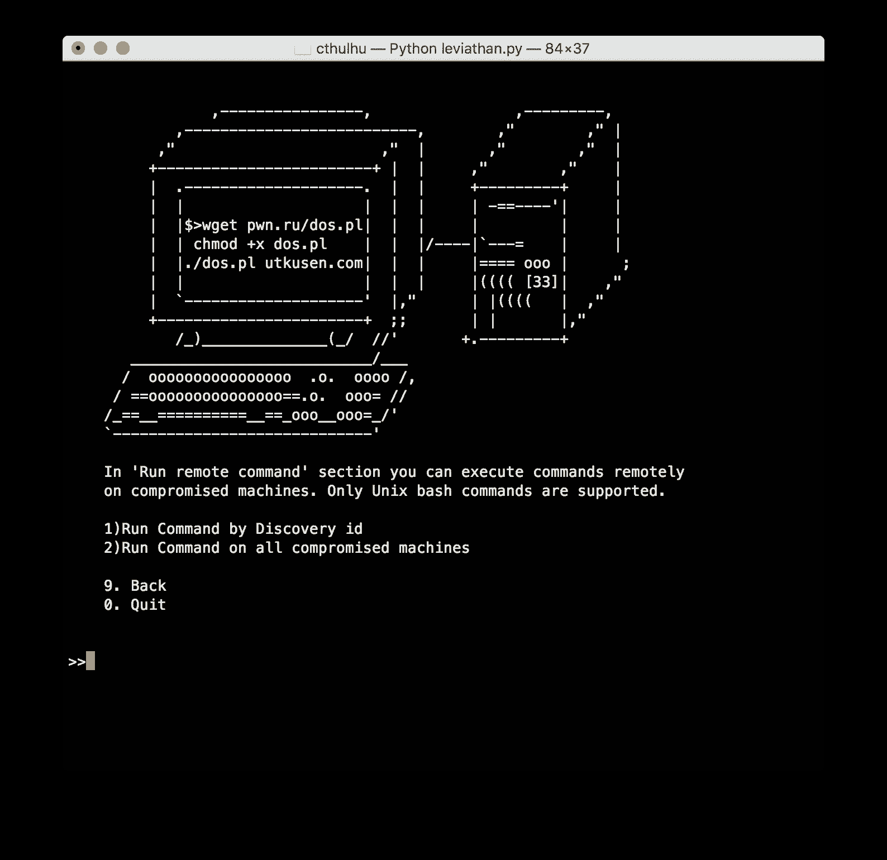

# 利维坦:大范围大规模审计工具包

> 原文：<https://kalilinuxtutorials.com/leviathan/>

Leviathan 是一个大规模审计工具包，具有广泛的服务发现、暴力破解、SQL 注入检测和运行自定义漏洞利用功能。它包括开源工具，如 masscan、ncrack、dsss，并为您提供组合使用它们的灵活性。

该项目的主要目标是审计尽可能多的全国范围或广泛的 IP 范围内的系统。

**主要特点**

*   **发现**:通过 Shodan、Censys 发现特定国家或 IP 范围内运行的 FTP、SSH、Telnet、RDP、MYSQL 服务。还可以通过集成的“masscan”工具手动发现 IP 范围内正在运行的服务。

**短片演示:**【https://asciinema.org/a/617bsxl1y84bav9f5bcwllx7r 

*   **暴力破解**:您可以使用集成的“ncrack”工具暴力破解发现的服务。它有词表，包括最流行的组合和特定服务的默认密码。

**短片演示:**【https://asciinema.org/a/43y2j38zu7hbnuahrj233d5r0 

*   **远程命令执行**:你可以在被入侵的设备上远程运行系统命令。

**短片演示:**【https://asciinema.org/a/0xcrhd12f2lpkbktjldwtab16 

*   **SQL 注入扫描器**:发现带有特定国家扩展名的网站或您自定义的 Google Dork 上的 SQL 注入漏洞。

**短片演示:**【https://asciinema.org/a/2mwfmd9afsuyg5p0vzcq5e6si 

*   **利用特定漏洞**:使用 Shodan、Censys 或 masscan 发现易受攻击的目标，并通过提供您自己的漏洞或使用预先包含的漏洞来大规模利用它们。

**短片演示:**【https://asciinema.org/a/9uqsjvnru780h0ue6ok9j9ktb 

**也可阅读-[Vulnx:一个智能 Bot 自动外壳注入器，可检测多种类型的 CMS 中的漏洞](https://kalilinuxtutorials.com/vulnx-vulnerabilities-cms/)**

**安装**

关于详细的安装，请访问我们的 [wiki](https://github.com/leviathan-framework/leviathan/wiki) 页面。

**卡利 Linux:**

通过克隆 Git 存储库下载该工具:

**git 克隆 https://github.com/leviathan-framework/leviathan.git**

进入文件夹内部

**cd 利维坦**

安装 Python 库:

**pip install-r requirements . txt**

搞定了！

**Debian/Ubuntu:**

通过克隆 Git 存储库下载该工具:

git 克隆 https://github.com/leviathan-framework/leviathan.git

进入文件夹内部

cd 利维坦

运行安装脚本。它将设置所需的工具(ncrack、masscan)和 python 库。

bash 脚本/debian_install.sh

搞定了！

**macOS:**

如果您的系统上没有安装 homebrew，请首先安装它:

/usr/bin/ruby-e " $(curl-fsSL https://raw . githubusercontent . com/home brew/install/master/install)"

通过克隆 Git 存储库下载该工具:

git 克隆 https://github.com/leviathan-framework/leviathan.git

进入文件夹内部

cd 利维坦

运行安装脚本。它将设置所需的工具(ncrack、masscan)和 python 库。

bash 脚本/macos_install.sh

搞定了！

**要求**

运行该程序需要 python 2.7 . x 版。

**支持的平台** : Linux (Kali Linux，Debian，Ubuntu)，macOS

**用法**

使用以下命令运行程序:

python 利维坦. py

**截图**

**功劳:**乌特库森和奥兹格巴巴罗斯