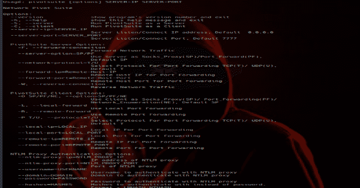

# PivotSuite:攻击隐藏网络的网络旋转工具包

> 原文：<https://kalilinuxtutorials.com/pivotsuite-hidden-network/>

PivotSuite 是一个可移植的、独立于平台的、强大的网络中枢工具包，它帮助 Red Teamers /渗透测试人员使用一个被入侵的系统在网络内移动。它是一个独立的实用程序，可以用作服务器或客户机。

##### **作为服务器的 pivot suite:**

如果可以从我们的 pentest 机器上直接访问(正向连接)受损主机，那么我们可以在受损机器上运行 pivotsuite 作为服务器，并从我们的 pentest 机器上访问不同的子网主机，这只能从受损机器上访问。

##### **作为客户端的 pivot suite:**

如果受损主机位于防火墙/ NAT 之后，并且无法从我们的 pentest 机器直接访问，那么我们可以在 pentest 机器上运行 pivotsuite 作为服务器，在受损机器上运行 pivotsuite 作为客户端，以创建反向隧道(反向连接)。使用它，我们可以从 pentest 机器访问不同的子网主机，而 pentest 机器只能从被入侵的机器访问。

**也可阅读:[iKy 项目——从电子邮件中收集信息的工具](https://kalilinuxtutorials.com/project-iky-collects-information-email/)**

**主要特征**

*   支持正向和反向 TCP 隧道
*   支持正向和反向 socks5 代理服务器
*   支持 TCP 上的 UDP 和 TCP 上的 TCP 协议
*   支持公司代理认证(NTLM)
*   内置网络枚举功能，例如主机发现、端口扫描、操作系统命令执行
*   PivotSuite 允许同时访问不同的受损主机及其网络(充当 C&C 服务器)
*   单旋转、双旋转和多级旋转可以在 PivotSuite 的帮助下执行。
*   PivotSuite 也可以用作 SSH 动态端口转发，但方向相反。

**优于其他工具**

*   不需要对受损主机的管理员/超级用户访问权限
*   当被入侵的主机位于防火墙/ NAT 之后，并且只允许反向连接时，PivotSuite 也可以工作。
*   除了 python 标准库之外没有其他依赖。
*   不需要安装
*   udp 端口可以通过 tcp 访问

**安装**

*   您可以通过克隆 Git 存储库或 PyPI 包来下载 pivotsuite 的最新版本。

**git 克隆 https://github.com/RedTeamOperations/PivotSuite.git
或
pip 安装 PivotSuite**

PivotSuite 可以在任何平台上与 Python 版本 2.7.x 和 3.6.x 一起开箱即用。

PivotSuite 独立可执行文件，可从 Github 发布部分下载

[https://github.com/RedTeamOperations/PivotSuite/releases](https://github.com/RedTeamOperations/PivotSuite/releases)

不需要安装，不需要 python 解释器

**要求**

*   只需要 Python 标准库
*   兼容 Python 2.7.x 和 Python 3.6.x
*   在 Windows 和 Linux 上测试。

用途

**$ pivotsuite.py【选项】服务器-IP 服务器-端口**

**选项:**

–version 显示程序的版本号并退出
-h，–help 显示此帮助消息并退出
-S，–Server 作为服务器运行 pivot suite
-C，–Client 作为客户端运行 pivot suite
-server-ip = Server _ IP
服务器监听/连接 IP 地址，默认为 0 . 0 . 0 . 0
–Server-PORT = Server _ PORT
服务器监听/连接端口，默认为 7777

**数据透视套件服务器选项:**

-F，–Forward-connection
转发网络流量
–Server-option = SP/PF
使用服务器作为 Socks _ Proxy(SP)/Port _ Forward(PF)
默认 SP
–Network-Protocol = T/U
选择端口转发协议 TCP(T)/UDP(U)
默认 T
–Forward-ip = Remote-Host-IP
远程主机 IP 用于端口转发
–Forward-Port = Remote-Host-Port
远程主机端口用于

**数据透视套件客户端选项:**

-O SP/PF/NE，–option = SP/PF/NE
使用客户端作为 Socks _ Proxy(SP)/Port _ Forwarding(PF)/
Network _ Enumeration(NE)，默认 SP
-L，–Local-forward
使用本地端口转发
-R，–Remote-forward
使用远程端口转发
-P T/U，–Protocol = T/U
选择端口转发的协议 TCP(T)/ UDP(U)，
默认 T
–Local-Local

**NTLM 代理认证选项:**

–ntlm-PROXY-ip = NTLM _ 代理 _ IP
NTLM 代理的 IP 地址
–NTLM-PROXY-PORT = NTLM _ 代理 _ PORT
NTLM 代理的端口
–用户名=用户名
向 NTLM 代理进行身份验证的用户名
–域=域向 NTLM 代理进行身份验证的域
–密码=密码
向 NTLM 代理进行身份验证的密码
–哈希=替代密码进行身份验证的哈希。
格式–lm hash:n hash

**文档**

**情况 1:(正向 TCP 隧道传输)**

如果被入侵的主机可以直接从我们的 pentest 机器进入。

然后按照我们的要求，在受损的机器上运行 PivotSuite 作为服务器:

*   受损机器上的动态端口转发(Socks5 代理服务器):

**$ python pivot suite . py-S-F–服务器选项 SP–服务器 IP IP–服务器端口 PORT**

受损机器上的单端口转发(TCP/UDP 中继):

**$ python pivot suite . py-S-F–服务器选项 PF–网络协议 T/U–远程 ip IP–远程端口 port
–服务器 IP IP(本地 IP)–服务器端口 PORT(本地端口)**

**情况 2:(反向 TCP 隧道)**

如果被入侵的主机位于防火墙/ NAT 之后，并且无法从我们的 pentest 机器直接访问。

然后在 pentest 机器上作为服务器运行 PivotSuite，在受损机器上作为客户端运行 PivotSuite。

*   在 Pentest 机器上运行 PivotSuite 作为服务器:

**$ python pivotsute.py -S -W**

*   根据我们的要求，在受损计算机上作为客户端运行 PivotSuite:

Pentest 机器上的动态端口转发(Socks5 代理服务器):

**$ python pivot suite . py-C-O SP–server-IP IP–server-PORT PORT**

Pentest 机器上的本地/远程端口转发:

**$ python pivot suite . py-C-O PF–L/-R(本地或远程端口转发)-P T/U–local-IP IP
–local-PORT PORT PORT–remote-IP IP–remote-PORT PORT PORT–server-IP IP–server-PORT PORT**

受损机器的网络枚举:

**$ python pivot suite . py-C-O NE–server-IP IP–server-PORT PORT**

如果受损主机上的反向连接需要公司代理身份验证(NTLM ):

**$ python pivot suite . py-C-O SP–NTLM-proxy-IP IP–NTLM-proxy-PORT PORT–USERNAME 用户名–PASSWORD 密码
–server-IP IP–server-PORT 端口**

[**Download**](https://github.com/RedTeamOperations/PivotSuite)