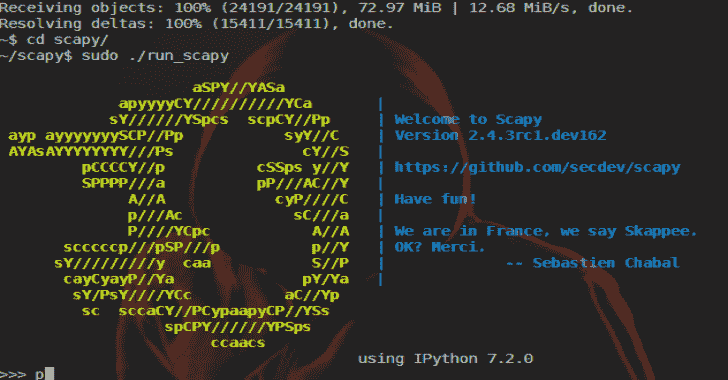

# Scapy:基于 Python 的交互式包操作程序和库

> 原文：<https://kalilinuxtutorials.com/scapy-interactive-packet-manipulation/>

Scapy 是一个强大的基于 Python 的交互式包操作程序和库。

它能够伪造或解码大量协议的数据包，通过网络发送它们，捕获它们，使用 pcap 文件存储或读取它们，匹配请求和回复，等等。

它被设计成通过使用有效的缺省值来允许快速的分组原型。

它可以轻松处理大多数经典任务，如扫描、跟踪路由、探测、单元测试、攻击或网络发现(它可以取代`**hping**`、`**nmap**`、**、**、`**arpspoof**`、、`**arp-sk**`、、`**arping**`、**、**、`**tcpdump**`、**、**、`**wireshark**`、**、**、`**p0f**`、**等**。).

它还在许多其他工具无法处理的其他特定任务中表现非常好，如发送无效帧、注入您自己的 802.11 帧、组合技术(VLAN 跳跃+ARP 缓存中毒、WEP 保护通道上的 VoIP 解码等等)。

Scapy 支持 Python 2.7 和 Python 3 (3.4 到 3.7)。它是跨平台的，可以在许多不同的平台上运行(Linux，OSX，*BSD 和 Windows)。

**也可阅读-[Blisqy:利用 HTTP-Headers 中基于时间的盲 SQL 注入](https://kalilinuxtutorials.com/blisqy-sql-injection-http-headers/)**

**演示**

它可以很容易地作为一个交互式外壳来与网络进行交互。以下示例显示了如何向`github.com`发送 ICMP 回应请求消息，然后显示回复源 IP 地址:

**须藤。/run_scapy
欢迎来到 Scapy
p = IP(dst = " github . com ")/ICMP()
r = sr1(p)
开始发射:
。发送完 1 个数据包。
*
收到 2 包，得到 1 个答案，剩余 0 包
r【IP】。src
'192.30.253.113'**

**安装**

Scapy 在 Linux 和 BSD 等操作系统上不需要任何外部 Python 模块。在 Windows 上，您需要安装文档中描述的一些强制依赖项。

在大多数系统上，使用 Scapy 就像运行以下命令一样简单:

**git 克隆 https://github . com/sec dev/scapy
CD scapy
。/run_scapy**

为了从所有 Scapy 特性(比如绘图)中获益，您可能需要安装 Python 模块，比如 matplotlib 或 cryptography。参见 **[文档](https://scapy.readthedocs.io/en/latest/introduction.html)** 并按照说明进行安装。

[**Download**](https://github.com/secdev/scapy)