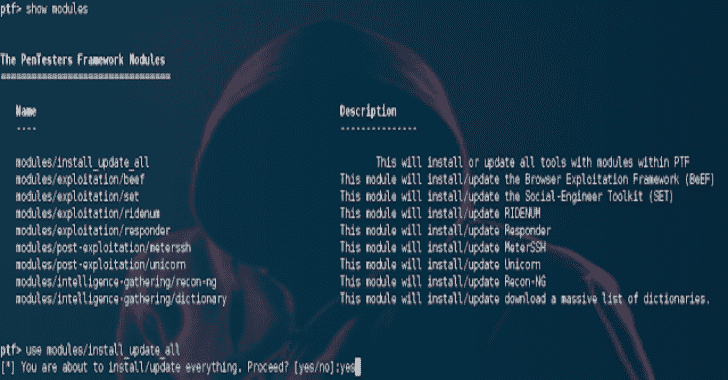

# PTF:模块化支持最新工具的一种方式

> 原文：<https://kalilinuxtutorials.com/ptf-pentesters-framework/>

[](https://1.bp.blogspot.com/-eUowfvXbkr0/XRlcML88R4I/AAAAAAAABKc/HvRDUtVtzhkFU8o3PXNu6KQijQ7JAY0KgCLcBGAs/s1600/PTF%25281%2529.png)

**PTF( PenTesters 框架)**是一个 Python 脚本，为基于 Debian/Ubuntu/ArchLinux 的发行版设计，为渗透测试创建一个类似的和熟悉的发行版。

作为 pentesters，我们已经习惯了/pentest/目录或我们自己的工具集，我们希望随时保持更新。我们有那些经常使用的“常用”工具，使用最新最好的工具很重要。

PTF 试图安装你所有的渗透测试工具(最新的和最好的)，编译它们，构建它们，并使你可以在任何机器上安装/更新你的发行版。

一切都按照渗透测试执行标准(PTES)的方式进行组织，并消除了许多很少使用的东西。PTF 简化了安装和打包，并为您创建了一个完整的 pentest 框架。

由于这是一个框架，您可以根据需要进行配置和添加。我们通常看到内部开发的回购协议，你可以使用，也是这个框架的一部分。一切都取决于你。

最终目标是获得社区对这个项目的支持。我们希望在 github 库中添加新的工具。提交您的模块。配置和添加它们非常简单，只需要几分钟。

**也可阅读-[Lynis:Unix/Linux 系统的安全审计工具](https://kalilinuxtutorials.com/lynis-security-auditing-tool-2/)**

**指令**

首先检查 config/ptf.config 文件，该文件包含安装所有内容的基本位置。默认情况下，它将安装在/pentest 目录中。配置好之后，输入`./ptf`(或者 python ptf)进入运行 PTF。

这将把您放在一个 Metasploitesque 类型的 shell 中，该 shell 具有相似的外观和一致性。显示模块，使用`<modules>`等。都是被接受的命令。首先，总是键入 help 或`?`来查看完整的命令列表。

**视频教程**

[https://player.vimeo.com/video/137133837?dnt=1&app_id=122963](https://player.vimeo.com/video/137133837?dnt=1&app_id=122963)

**更新一切！**

如果您想安装和/或更新所有内容，只需执行以下操作:

**。/ptf
使用模块/install_update_all
是**

这将在 PTF 内部安装所有的工具。如果已经安装了它们，这将自动迭代并更新所有内容。

您也可以单独安装每个模块，然后使用 use modules/update_installed，这将只更新您以前安装的模块。

例如:

**。/ptf
使用模块/update_installed**

这只会更新您以前安装的版本。

您还可以显示更改模块信息的选项。

如果您只想安装例如利用工具，您可以运行:

**。/ptf
使用模块/exploitation/install _ update _ all**

这将只安装开发模块。您可以对任何模块类别执行此操作。

**定制你自己安装的工具**

您只能通过转到 modules/custom_list/list.py 部分来安装您想要的工具。修改 list.py 文件并添加您只想安装或更新的工具。

然后在 PTF 的时候:

**。/ptf
使用模块/custom_list/list
是**

这允许您继续使用您的模块配置，只安装您想要的工具并保持它们的更新。

**模块**

首先，转到模块/目录，里面有基于渗透测试执行标准(PTES)阶段的子目录。进入这些阶段，看看不同的模块。一旦您添加了一个新的文件，例如 testing.py，它将在您下次启动 PTF 时自动导入。查看必须完成的模块时，有几个关键部分。

下面是一个示例模块

AUTHOR = " David Kennedy(ReL1K)"
DESCRIPTION = "此模块将安装/更新浏览器开发框架(BeEF)"
INSTALL _ TYPE = " GIT "
REPOSITORY _ LOCATION = " https://github . com/BeEF project/BeEF "
X64 _ LOCATION = " https://github . com/something _ thas _ X64 _ instead _ of _ x86
INSTALL _ LOCATION = " BeEF "
DEBIAN = " ruby 1 . 9 . 3，sqlite3，ruby-sqlite3 "

**模块开发**

所有的字段都很简单，在存储库位置，你可以使用 GIT、SVN 或 FILE。填写依赖项，以及您希望安装的位置。PTF 将获取 python 文件所在的位置(例如 exploitation)并将其移动到您在 PTF 配置中指定的位置(位于 config 下)。默认情况下，它会将所有工具安装到`**/pentest/PTES_PHASE/TOOL_FOLDER**`

注意在模块中，你可以在命令之后指定`**{INSTALL_LOCATION}**`。当使用 after 命令时，这将附加到您希望安装的位置。

您还可以指定`**{PTF_LOCATION}**`，它将为您的 PTF 安装提取基本路径。

您还可以为存储库位置指定 32 位和 64 位位置。存储库位置应该始终是 x86 下载路径。要为工具添加 64 位路径，请指定 X64_LOCATION 并为其提供一个 URL。当 PTF 启动时，它将自动检测体系结构，并尝试使用 x64 链接而不是 x86。

请注意，ArchLinux 包也是受支持的，需要为 DEBIAN 和 ARCH 指定它，以便它可以正确地安装在模块中的任一平台上

**GITLAB 支持**

可以创建自己的模块，也支持 gitlab 访问。而不是指定 git、wget 等。，只需指定 gitlab，指向自己内部的 gitlab 工具进行模块。

**旁路更新**

当使用传统的 git 或 svn 作为主要方法时，在安装一个模块后会发生的事情是，它会获取该工具的最新版本。使用 after 命令，通常在安装时，您可能需要在每次更新后运行 after 命令。

如果将 bypass updates 指定为 YES **(** `**BYPASS_UPDATE="YES"**` **)** ，则每次运行该工具时，它都会检查最新版本，并且在执行命令后仍然运行。如果标记为否，它将只获取系统的最新版本。对于`**FILE**`选项，建议总是使用`**BYPASS_UPDATE="YES"**`，这样它每次都会覆盖文件。

**后命令**

After 命令是可以在安装后插入的命令。这可能是切换到一个目录并启动附加命令来完成安装。

例如，在 BEEF 场景中，您需要运行 ruby install-beef。下面是一个使用`**{INSTALL_LOCATION}**`标志的 after 命令的例子。

AFTER _ COMMANDS = " CP config/dict/rock you . txt {安装位置} "

对于自行安装的`AFTER_COMMANDS`(不需要用户交互)。

**自动发射器**

模块中的 LAUNCHER=标志是可选的。例如，如果你添加了`**LAUNCHER="setoolkit"**`，PTF 将自动为`**/usr/local/bin/**`下的工具创建一个启动器。在 setoolkit 的例子中，当运行时——PTF 会自动在`**/usr/local/bin/setoolkit**`下创建一个文件，这样你就可以从任何地方通过简单地输入 setoolkit 来启动 SET。所有文件仍将安装在适当的类别下，例如`**/pentest/exploitation/setoolkit**`，但是将创建一个自动启动器。

一个应用程序可以有多个启动器。例如，对于 Metasploit，您可能需要 msfconsole、msfvenom 等。为了添加多个启动器，只需在它们之间放置一个`,`。比如`**LAUNCHER="msfconsole,msfvenom"**`。这将为两者创造发射器。

**自动命令行**

你也可以只运行`./ptf --update-all`，它会自动为你更新一切，而不必进入框架。

**无人值守运行**

如果你在自动构建中运行`ptf`,你可以使用 [heredoc](http://tldp.org/LDP/abs/html/here-docs.html) ,这样你就不必交互地输入你想要安装的模块。示例:

```
。/ptf <<eof>使用模块/开发/metasploit
运行
使用模块/密码恢复/johntheripper
运行
EOF
```

**工具依赖**

一些工具如面纱、套装等。需要 Metasploit 框架之类的工具。在安装工具之前，如果需要安装工具，可以添加模块`**TOOL_DEPEND="modules/exploitation/metasploit,module/exploitation/set"**`和多个其他工具。这将迫使 PTF 首先安装所需的工具，然后安装需要它的模块。示例:

**TOOL _ DEPEND = " modules/exploitation/metasploit "**

这将首先安装 Metasploit，或者确保在安装应用程序之前先安装它。

**忽略模块或类别**

在 ptf 根目录的 config/ptf.config 下可以找到`**IGNORE_THESE_MODULES=**` config 选项。

这将忽略模块并且不安装它们——一切都用逗号分隔并且基于名称——例如:`**modules/exploitation/metasploit,modules/exploitation/set**` 或整个模块类别，如`**/modules/code-audit/*,/modules/reporting/***`

**忽略更新/安装所有模块**

在 ptf 根目录的 config/ptf.config 下可以找到`**IGNORE_UPDATE_ALL_MODULES=**` config 选项。这将仅在执行 install_update_all 时忽略模块，当您希望安装所有工具时会用到这些模块。

这可能适用于需要大量时间的大型应用程序、需要用户交互的应用程序，或者在系统上开放大量端口和协议的应用程序。这与 IGNORE_THESE_MODULES 中的工作方式非常相似，只是它们可以通过 modules/update_installed 手动安装和更新。

这些工具以逗号分隔，因此，例如，当运行 install_update_all 时，不会安装这些工具，除非您使用 modules/exploation/tool 1 并通过该方法安装。

**包含 _ONLY_THESE_MODULES**

**config/ptf.config** 下的配置选项中的`**INCLUDE_ONLY_THESE_MODULES**`将只安装和包含这里指定的特定模块。这有利于为您想要的工具建立基线，并且只安装它们。

[**Download**](https://github.com/trustedsec/ptf)