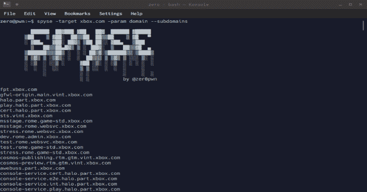

# Spyse : Python API 包装器&托管在 Spyse.com 上的工具的命令行客户端

> 原文：<https://kalilinuxtutorials.com/spyse/>

**Spyse** 是一家面向互联网安全专业人士、企业和远程系统管理员、SSL / TLS 加密证书提供商、数据中心和业务分析师的完整 DAAS(数据即服务)解决方案开发商。所有 Spyse 在线解决方案都由主题服务代表，这些服务拥有一个收集、处理和汇总信息的单一平台。

支持以下 API:

*   [DNStable](https://dnstable.com/)
*   [查找子域](https://findsubdomains.com/)
*   [certaindb](https://certdb.com/)
*   [ASlookup](https://aslookup.com/)
*   [端口映射图](https://portmap.com/)
*   [域名数据库](https://domainsdb.org/)

托管在 spyse.com 上的工具的 Python API 包装器和命令行客户端。

**也可阅读-[pivot suite:黑客攻击隐藏网络的网络旋转工具包](https://kalilinuxtutorials.com/pivotsuite-hidden-network/)**

**安装**

pip3 install spyse.py

**使用客户端**

**所需参数**

*   `**-target**`
*   `**-param**`

**可选参数**

*   `**-page**`
*   `**-apikey**`
*   `**--raw**`

**什么是 param 实参？**

它允许你搜索他们的 IP 数据库，IP 范围，域名，网址等。参数 argument 用于指定输入的类型。

**参数列表**

*   `**cidr**`
*   `**domain**`
*   `**ip**`
*   `**page**`
*   `**url**`
*   `**hash**`
*   `**q**`

**使用搜索查询**

与 Shodan 非常相似，它允许您使用搜索查询。为此，您必须提供“q”参数。从这里开始，只需提供“org: Microsoft”作为目标即可。

**spyse-target " org:Microsoft "-param q-SSL-certificates**

**搜索子域**

**spyse-目标 xbox.com-参数域-子域**

**反向 IP 查找**

**spyse-target 52.14.144.171-param IP–domains-on-IP**

**搜索 SSL 证书**

**spyse-目标 hotmail.com-参数域-SSL-证书**

**spyse-target " org:Microsoft "-param q-SSL-certificates**

**获取所有 DNS 记录**

**spyse-目标 xbox.com-参数域-DNS-全部**

**使用 API 键导航多个页面**

**导出 SPYSEKEY = " yourkeyhere "
spyse-目标 xbox.com-参数域-API key $ SPYSEKEY-第 2 页-SSL-证书**

**连接至 jq 和 aquatone**

最初当我决定编写这个客户端时，我真的希望它关注命令行中的灵活性，这就是为什么有`--raw`选项。从那里，您可以使用 API 返回的原始 JSON。

**spyse-目标 hackerone.com-参数域-DNS-SOA-raw | jq**

**spyse-目标 hackerone.com-参数域-子域-raw | aquatone**

**使用库**

**没有 API 键**

**从 spyse 导入 spyse

s = spyse()
subdomains = s . subdomains(" Xbox . com "，param="domain")**

**带 API 键**

**从 spyse 导入 spyse

#使用 API 键可以让我们遍历多页结果
s = spyse(' API _ TOKEN _ GOES _ HERE))
subdomains = s . subdomains _ aggregate(" Xbox . com "，param="domain "，page=2)**

**使用 CIDR 搜索**

**从 spyse 导入 spyse

s = spyse()
results = s . domains _ on _ IP(" 172 . 217 . 1 . 0/24 ", param = " CIDR ")**

**使用现有文件**

**从 spyse 导入 spyse

s = spyse()
results =[]

with open(" domains . txt ")as d:
for line in d:
#默认值为 param="domain "，所以我们不
#需要在这里指定
r = s . subdomains _ aggregate(line)
results . append(r)
print(results)**

[**Download**](https://github.com/zeropwn/spyse.py)