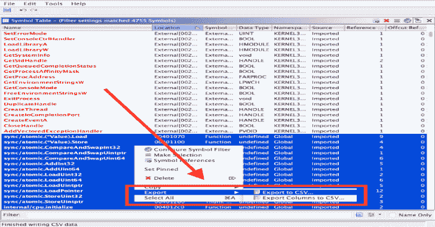
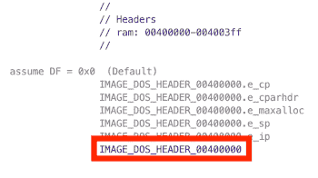

# Lst2x64dbg:从 IDA 中提取标签。lst 或 Ghidra。csv 文件&导出 x64dbg 数据库

> 原文：<https://kalilinuxtutorials.com/lst2x64dbg-extract-labels/>

lst2x64dbg 脚本提取在 lst 文件中找到的所有标签，该文件作为脚本的单个参数给出。基于提取的标签，在当前目录中创建一个 x64dbg 数据库。

LST 文件可以在 IDA 的文件菜单中生成:生成文件->创建 LST 文件…

**例子**

**$ python 3 lst 2 x 64 dbg . py sample . lst**

**ghidra2x64dbg**

该脚本提取在 CSV 文件中找到的所有标签，该文件作为脚本的单个参数给出。基于提取的标签，在当前目录中创建一个 x64dbg 数据库。必须提供 imagebase 值。

通过选择**符号表**，可以从**窗口**菜单在 Ghidra 中生成 CSV 文件

在打开的符号表窗口中，按**位置**列对数据进行排序。然后选择所有属于*而非*外部位置的符号。选中想要的符号，点击右键，选择:**导出- >导出到 CSV…**

**注意:如果您碰巧选择了外部位置，它们将被忽略。**

将该文件命名为`**<module_name>.csv**`

**另请阅读-[如果你厌倦了书本和导师，在线学习编程的最佳方式](https://kalilinuxtutorials.com/learn-programming-online/)**

**例子**

**$ python 3 ghidra 2 x 64 dbg . py-I 400000 sample . CSV**

imagebase 值可以在 CodeBrowser 窗口的反汇编面板的最顶端找到。这是 DOS 头的一部分。

[**Download**](https://github.com/utkonos/lst2x64dbg)