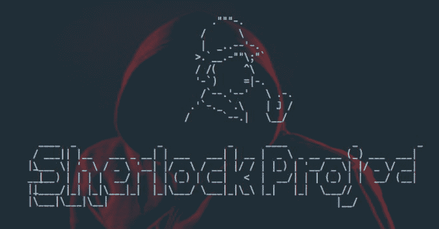

# 夏洛克:在社交网络中查找用户名

> 原文：<https://kalilinuxtutorials.com/sherlock-usernames-social-networks/>

夏洛克项目提供了一个非常强大的命令行工具，叫做夏洛克，可以在许多 T2 社交网络中查找用户名。它需要 Python 3.6 或更高版本，可以在 MacOS、Linux 和 Windows 上工作。

**安装**

**注意:**需要 Python 3.6 或更高版本。

**#克隆回购
$ git 克隆 https://github.com/sherlock-project/sherlock.git

#将工作目录改为夏洛克
$ cd 夏洛克

#安装 python3 和 python3-pip 如果不存在

#安装需求
$ pip3 安装-r 需求. txt**

**也可阅读-[PTF:模块化支持最新工具的方法](https://kalilinuxtutorials.com/ptf-pentesters-framework/)**

**用途**

$ python 3 Sherlock . py–help
用法:Sherlock . py[-h][–Version][–verbose][–rank]
[–folder OUTPUT folder OUTPUT][–OUTPUT][–tor]
[–unique-tor][–SITE SITE _ NAME]
[–PROXY _ URL][–JSON JSON _ FILE]
用户名[用户名…]

夏洛克:跨社交网络查找用户名(版本 0.6.4) 【T7
可选参数:
-h，–help 显示此帮助信息并退出
–version 显示版本信息和依赖关系。
–详细，-v，-d，–调试
显示额外的调试信息和指标。
-rank，-r 呈现按其 Alexa.com 全球网站排序的网站
受欢迎程度排名。
–folder output folder output，-fo FOLDEROUTPUT
如果使用多个用户名，结果
的输出将保存在这个文件夹中。
–OUTPUT OUTPUT，-o OUTPUT
如果使用单一用户名，结果
的输出将保存在该文件中。
–tor，-t 通过 TOR 提出请求；增加运行时间；需要在系统路径中安装
TOR。
–unique-tor，-u 在每次
请求后，使用新 TOR 电路通过 TOR 发出请求；增加运行时间；要求 TOR 安装在系统路径中。
–csv 创建逗号分隔值(CSV)文件。
–SITE SITE _ NAME 仅分析列出的站点。添加多个
选项来指定多个站点。
–PROXY PROXY _ URL，-p PROXY_URL
通过代理发出请求。例如
socks 5://127 . 0 . 0 . 1:1080
–json JSON _ FILE，-j JSON_FILE
从 JSON 文件或在线有效的 JSON
文件加载数据。
–打印找到的信息
仅打印找到的信息。错误和无效的
用户名错误不会出现。

例如，运行`**python3 sherlock.py user123**`，所有找到的账户将被保存在一个带有用户名的文本文件中(例如`**user123.txt**`)。

**码头工人笔记**

如果你安装了 docker，你可以构建一个镜像，并把它作为一个容器来运行。

docker build -t mysherlock-image。

构建映像后，可以通过运行以下命令来调用夏洛克:

**docker run–RM mysherlock-image user 123**

可选的`--rm`标志在完成时删除容器文件系统，以防止 cruft 累积。参见[https://docs.docker.com/engine/reference/run/#clean-up—rm](https://docs.docker.com/engine/reference/run/#clean-up---rm)

一个警告是，创建的文本文件将只存在于容器中，所以你将无法得到它。

或者您可以简单地使用“Docker Hub”来运行`sherlock`:

**码头运行 theyahya/夏洛克用户 123**

**测试**

如果你对这个工具有所贡献，那么谢谢你！

在创建新开发的拉取请求之前，请运行测试以确保一切正常。在开始开发之前运行测试来区分您的环境和夏洛克软件之间的问题也是一个好主意。

以下是为夏洛克运行所有测试的命令行示例。这个调用隐藏了夏洛克通常输出的进度文本，而是显示测试的详细输出。

**$ python 3-m unittest tests . all–buffer–verbose**

请注意，我们目前有 100%的测试覆盖率。不幸的是，夏洛克检查的一些网站并不总是可靠的，所以得到响应错误并不罕见。

[**Download**](https://github.com/sherlock-project/sherlock)