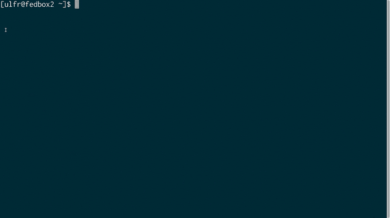

# MIG:以云的速度进行分布式实时数字取证

> 原文：<https://kalilinuxtutorials.com/mig-digital-forensics-cloud/>

**MIG** 是 Mozilla 的远程终端研究手术平台。您可以使用 docker 启动本地专用 MIG 设置。

该容器不适合生产使用，但可以让您快速试验 MIG，提供一个包含大多数可用 MIG 组件的单一容器环境。

要从 Docker Hub 中提取:

**$ dock pull Mozilla/MIG
$ docker run-it Mozilla/MIG**

或者，如果您在 GOPATH 中签出了源代码，您可以构建自己的映像:

**CD $ go path/src/github . com/Mozilla/MIG
$ docker build-t Mozilla/MIG:latest。
$ dock run-it Mozilla/MIG**

进入容器后，您可以使用 MIG 工具查询本地代理，如下所示:

**MIG @ 5345268590 c8:~ $/go/bin/MIG file-t all-path/usr/bin-sha 2 5c 1956 EBA 492 b 3c 3 fffd 8d 3 e 43324 b 5 c 477 c 22727385 be 226119 f 7 ffc 24 aad 3 f
1 代理将被针对。ctrl+c 取消。在 5 4 3 2 1 开始
后发射行动 ID 7978299359234。
1/1[= = = = = = = = = = = = = = = = = = = = = = = = = = = = = = = = = = = = = = = = = = = = = = = = = = 100.00% 0/s4s
100.0%完成 3.029105958s
1 发送，1 完成，1 成功
ed 11 f 485244 a/usr/bin/wget[last modified:2016-07-05 15:32:42+1**

**也可阅读-[夏洛克:在社交网络中寻找用户名](https://kalilinuxtutorials.com/sherlock-usernames-social-networks/)**

**这是什么？**

MIG 由安装在基础架构的所有系统上的代理组成，这些代理被实时查询以调查文件系统、网络状态、内存或端点配置。

想象一下，周六早上 7 点，有人刚刚发布了您最喜欢的 PHP 应用程序的一个关键漏洞。

该漏洞已经被利用，安全组织正在发布危害指示器(IOCs)。你的周末开始得并不好，手动检查数千个系统的想法并没有让它变得更好。

米格可以帮忙。使用`file`模块可以在您的所有系统中搜索易受攻击的 PHP 应用程序的签名(文件的 md5、正则表达式或只是文件名)。

同样，可以使用 MIG 来调查 IOC，例如特定日志条目、带有 md5 和 sha1/2/3 哈希的后门文件、僵尸网络的 IP 地址或进程内存中的字节字符串。突然间，你的周末看起来好多了。

只需几个命令，数以千计的系统将被远程调查，以验证您没有风险。

MIG 代理设计为轻量级、安全且易于部署，因此您可以要求您喜欢的系统管理员将其添加到基本部署中，而不必担心破坏整个生产网络。

所有参数都在编译时内置到代理中，包括授权调查者的列表和 ACL。使用 PGP 密钥来加强安全性，即使 MIG 的服务器遭到破坏，只要我们的密钥在您的调查员的笔记本电脑上是安全的，就没有人会闯入代理。

MIG 被设计为快速和异步的。它使用 AMQP 将动作分发到端点，并依靠 Go 通道来防止组件阻塞。

运行的动作和命令存储在 Postgresql 数据库和磁盘缓存中，这样平台的可靠性就不依赖于长时间运行的进程。

速度是一个很强的要求。大多数操作在代理上运行只需要几百毫秒。较大的程序，例如在大目录中查找散列时，应该在一两分钟内运行。总之，调查通常在 10 到 300 秒内完成。

隐私和安全是最重要的。代理从不将原始数据发送回平台，而是只回复问题。所有动作都由不存储在平台中的 GPG 密钥签名，从而防止危害接管整个基础设施。

**技术**

MIG 内置于 Go 中，使用 REST API 接收通过 RabbitMQ 分发给代理的签名 JSON 消息，并存储在 Postgres 数据库中。

它是:

*   大规模分布式意味着快速。
*   易于部署和跨平台。
*   使用 OpenPGP 保护。
*   尊重隐私，从不从终端检索原始数据。

请观看这段 10 分钟的视频，了解更全面的演示和控制台界面演示。

[https://www.youtube.com/embed/wJwj5YB6FFA?feature=oembed&enablejsapi=1](https://www.youtube.com/embed/wJwj5YB6FFA?feature=oembed&enablejsapi=1)

米格最近在德克萨斯州奥斯汀的 SANS DFIR 峰会上亮相。你可以看下面的录音:

[https://www.youtube.com/embed/pLyKPf3VsxM?feature=oembed&enablejsapi=1](https://www.youtube.com/embed/pLyKPf3VsxM?feature=oembed&enablejsapi=1)

[**Download**](https://github.com/mozilla/mig)