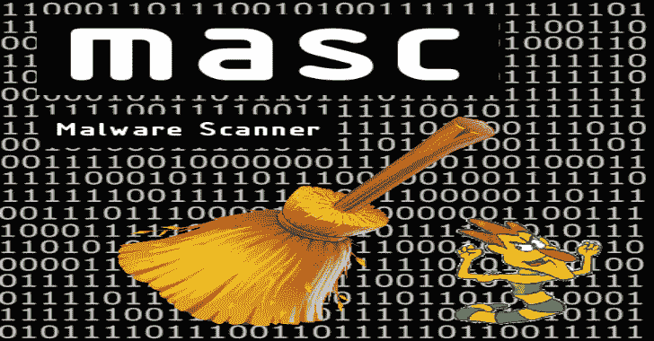

# MASC:网络恶意软件扫描器

> 原文：<https://kalilinuxtutorials.com/masc/>

**MASC** 是在 CyperCamp Hackathon 2017 期间开发的恶意软件(网络)扫描器。目前，有些功能适用于任何类型的网站(自定义或 CMS ),有些功能仅适用于特定平台:

*   使用 OWASP WebMalwareScanner 校验和、YARA 规则数据库和 ClamAV 引擎(如果可用)扫描任何网站的恶意软件
*   执行一些清理操作，以提高网站保护
*   监控网站的变化。详细信息写在日志文件中
*   扫描您的站点，了解它是否感染了某些恶意软件
*   列出您的本地备份
*   日志支持
*   备份您的网站
*   恢复网站
*   扫描可疑文件并与全新安装进行比较(适用于 WordPress 和 Drupal)
*   清理你的网站以避免给攻击者提供额外的信息(仅适用于 WordPress)

**亦读-[米格:分布式&云端速度实时数字取证](https://kalilinuxtutorials.com/mig-digital-forensics-cloud/)**

**要求**

首先，注意这个工具是在 Linux 下开发的，目前，它只在这个操作系统下测试过

*   Python >= 3
*   一些 Python 库
    *   python-magic
    *   亚拉蟒
    *   看门狗
    *   术语颜色
    *   派潘多克
    *   进步

**santi@zenbook:$ pip3 安装 python-magic yara-python 看门狗 termcolor pypandoc 进度**

*   ClamAV 与其发动机集成(可选，但推荐)

**通知**

在我的笔记本上，升级到 Debian 测试后，masc 开始显示一个与 Yara 相关的错误

**OSError: /usr/lib/libyara.so:无法打开共享对象文件:没有这样的文件或目录**

在尝试了很多我在网上找到的解决方案后，我意识到这个文件位于我电脑的**/usr/local/lib/python 3.5/dist-packages/usr/lib**中，于是我创建了一个从之前的路径到 **/usr/lib** 的符号链接

**santi @ Zen book:$ ln-s/usr/local/lib/python 3.5/dist-packages/usr/lib/libyara . so/usr/lib/libyara . so**

现在，masc 和 Yara library 运行正常。

**通知**

masc 是在 Linux 下开发的，还没有在任何其他操作系统下测试过。

无论如何，它在任何 Unix 友好的操作系统下运行都不会有问题。特别是在 Mac OSX，我注意到有必要安装 [Homebrew](https://brew.sh/) 来使用 python-magic library property 作为 libmagic。首先检查 brew 主页的前一个链接，然后您将能够按照我下面的说明进行安装:

**santi@zenbook:$ brew 安装 libmagic**

另外，在我的电脑上，我必须修改 masc.py 脚本的第一行。Python3 安装在 **/usr/local/bin** 中，不允许从 **/usr/bin** 创建符号链接

**更改 masc.py 中的第一行**

**#！/usr/bin/python3**

**对于这一行**

**#！/usr/local/bin/python3**

无论如何，您总是可以使用 Python 解释器运行 masc，而不是直接运行脚本:

**santi@zenbook:$ python3 masc.py**

**安装**

要在你的电脑上安装 masc，你可以下载一个[版本](https://github.com/sfaci/masc/releases)，解压后试试。您也可以使用 sign pip ('pip3 install masc ')进行安装

如果你使用的是 Mac OSX，请提前查看此通知。

**用法**

**masc 0 . 2 . 2(http://github.com/sfaci/masc)
用法:masc . py[-h][–Add-file FILENAME][–Clean-cache]
[–Clean-site][–list-backups][–make-backup][–monitor]
[–NAME][–PATH PATH PATH][–roll back][–scan]
[–site-type { WordPress，drupal，custom}]**

**可选参数:【T9 没有备份)
–清理站点清理站点(并应用一些额外的操作以对攻击者隐藏信息)
–列表-备份列出本地备份
–生成-备份创建当前安装的本地备份
–监视监视站点以检测更改
–名称名称分配给被扫描的安装的名称
–路径网站安装路径
–回滚恢复本地备份
–扫描恶意软件网站
–站点类型{wordpress，drupal，custom }** 

您可以通过 web 安装执行的操作有:

*   –扫描(带或不带选项–清理现场)
*   –回滚
*   –监视器
*   –制作备份

您必须考虑到，如果您想在某种 web 安装上执行某些操作，必须指定类型(-t 或–type)和路径(-o 或–path)。

例如，如果您在/var/www/html 中安装了一个 WordPress，并且您想对它进行全面扫描:

**santi@zenbook:$。/masc . py–scan–type WordPress–path/var/www/html**

如果您想要执行清理操作(例如，删除一些恶意软件):

**santi@zenbook:$。/masc . py–scan–type WordPress–path/var/www/html–clean-site**

**信贷:圣地亚哥 Faci**

[**Download**](https://github.com/sfaci/masc)