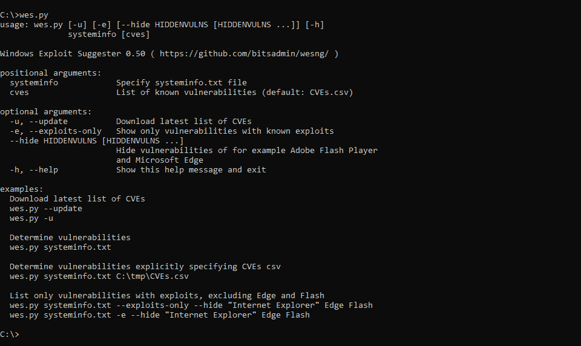

# WESNG:下一代 Windows 漏洞利用建议者

> 原文：<https://kalilinuxtutorials.com/wesng-windows-exploit-suggester/>

**WESNG** 是一个基于 Windows`systeminfo`实用程序输出的工具，它提供了操作系统易受攻击的漏洞列表，包括对这些漏洞的任何利用。

支持 Windows XP 和 Windows 10 之间的所有 Windows 操作系统，包括其 Windows Server 对应物。

**用途**

*   通过执行命令`**wes.py --update**`获得最新的漏洞数据库。
*   使用 Windows 内置的`**systeminfo.exe**` 工具获取本地系统的系统信息，或者使用`**systeminfo.exe /S MyRemoteHost**`从远程系统获取系统信息，并将其重定向到一个文件:`**systeminfo > systeminfo.txt**`
*   以 systeminfo.txt 输出文件为参数执行 WES-NG:`**wes.py systeminfo.txt**`。然后，WES-NG 使用数据库来确定哪些补丁适用于系统，以及当前暴露了哪些漏洞，包括漏洞利用(如果有)。
*   由于微软提供的数据经常不完整，并且 wes.py 报告了假阳性，请确保查看 Wiki 上的[消除假阳性](https://github.com/bitsadmin/wesng/wiki/Eliminating-false-positives)页面，了解如何处理这一问题。有关所有可用参数的概述，请查看 [CMDLINE.md](https://github.com/bitsadmin/wesng/blob/master/CMDLINE.md) 。

**也可阅读-[你以前没听过的搞笑成长秘籍](https://kalilinuxtutorials.com/ig-growth-hacks/)**

**收集器**

这个 GitHub 库定期更新漏洞数据库，所以用`--update`参数运行`wes.py`会得到最新版本。如果手动生成。需要包含补丁信息的 csv 文件，使用[/收集器](https://github.com/bitsadmin/wesng/blob/master/collector)文件夹中的脚本来编译数据库。阅读每个脚本顶部的注释，并按照下面列出的顺序执行它们。执行这些脚本将生成 cves . CSV。WES-NG 收集器从各种来源提取信息:

*   Microsoft 安全公告数据:用于旧系统的 KBs[1]
*   MSRC:微软安全响应中心(MSRC)的微软安全更新 API:现代微软更新的标准信息源[2]
*   NIST 国家漏洞数据库(NVD):补充漏洞利用数据库链接[3]这些被合并成一个单一的。csv 文件，它被压缩并存放在这个 GitHub 存储库中。

**基本原理**

我开发 WES-NG 是因为虽然 [GDSSecurity 的 Windows-exploy-暗示器](https://github.com/GDSSecurity/Windows-Exploit-Suggester/)在 Windows XP 和 Windows Vista 时代对操作系统非常有效，但是 GDSSecurity 的 Windows-exploy-暗示器不适用于 Windows 10 这样的操作系统和近年来发布的漏洞。这是因为 Microsoft 用 MSRC API [2]替换了 GDSSecurity 的 Windows-exploy-暗示程序完全依赖的 Microsoft 安全公告数据 Excel 文件[1]。自 Q1 2017 年以来，Microsoft 安全公告数据 Excel 文件一直未更新，因此无法检测到以后的操作系统和漏洞。感谢[@ gdssesecurity](https://twitter.com/gdssecurity)，这个伟大的工具已经为我们许多人服务了这么多年！

**bug**

*   bug 可以通过[问题](https://github.com/bitsadmin/wesng/issues)页面提交
*   对于结果中的假阳性，请先阅读 Wiki 上的[消除假阳性](https://github.com/bitsadmin/wesng/wiki/Eliminating-false-positives)页面。如果这并没有显著减少误报的数量，请遵循[维基](https://github.com/bitsadmin/wesng/wiki)上[报告误报](https://github.com/bitsadmin/wesng/wiki/Reporting-false-positives)页面的步骤

**信用:**棱惠根

[**Download**](https://github.com/bitsadmin/wesng)