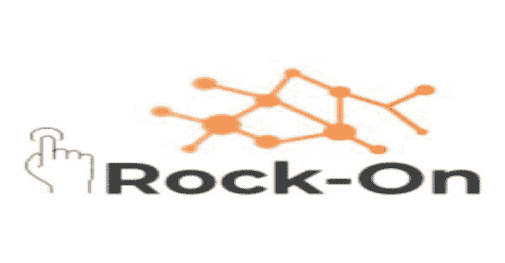
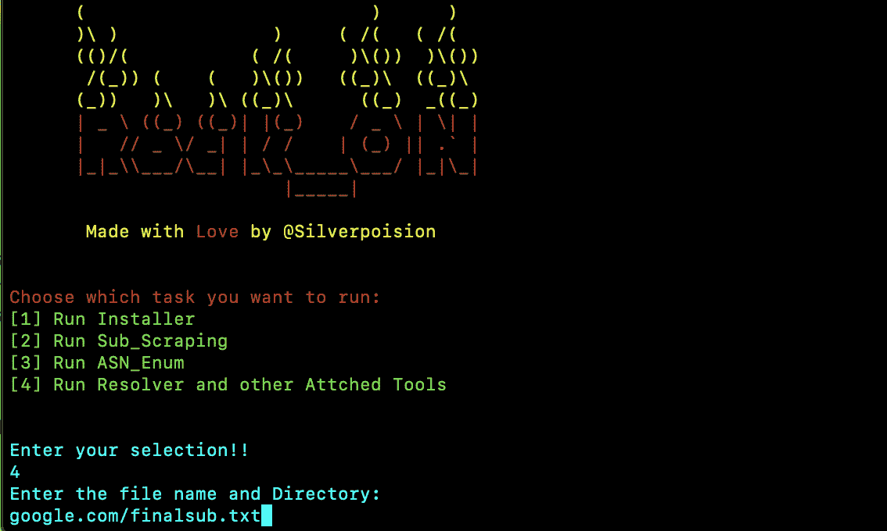

# 摇滚:所有在一个侦察工具，将只获得一个域名的单一条目，并独自做所有的工作

> 原文：<https://kalilinuxtutorials.com/rock-on/>

**Rock-On** 是一款多功能侦察工具，可以帮助你的侦察过程取得进展。它的主要目的是自动化整个侦察过程，节省时间，这是浪费在所有这些东西的手动操作。一个完整的博客会在某个时候出现。请继续关注带有用户界面的稳定版本。

**特性**

1.  子域抓取
2.  查找序列号->网络块-> IP
3.  解决
4.  查找端口
5.  正在查找 VHost
6.  查找目录
7.  寻找次级收购
8.  具有实时监控功能的资产跟踪器
9.  将通知推送到宽限时间
10.  找到 JS 链接，然后在其中找到相关链接和一些敏感文件
11.  主动和被动爬行

**也可阅读-[你以前没听过的搞笑成长秘籍](https://kalilinuxtutorials.com/ig-growth-hacks/)**

**推荐**

机器配置 DigitalOcean 上的 Debian- 9.4，4 GB 内存，在新的 VPS 上运行这个工具会很好。

**对于 Censys:**

在 sub.sh 中设置 API 和密钥，除非你想反复设置。

用于移除:

1.  删除第 13-18 行
2.  然后在第 47 和 48 行设置 API 和 SECRET KEY，如下所示:在此导出 CENSYS_API_ID=your_key

**获取时差通知:**

在 sub.sh、ASN.sh 和 Sublert.py-> config.py 中更改 webhook 地址，以便在您执行其他工作时获得通知。

**用于更改:**

1.  替换 sub.sh 第 113 行和 ASN.sh 第 15 行的 Webhook 地址
2.  替换 Tools/sublert/config.py 中的 Webhook 地址

**要求**

**Go-language**

通过以下方法安装:

**wget https://dl.google.com/go/go1.12.5.linux-amd64.
tar.gz tar-C/usr/local-xzf go1.12.5.linux-amd64.tar.gz
RM-f go1.12.5.linux-amd64.tar.gz
nano ~/。简介**

添加这一行

**导出路径=$PATH:/usr/local/go/bin
导出 GOROOT=/usr/local/go**

**安装**

**注意:对于新的 VPS，首先运行以下命令:**

**sudo 升级&sudo 升级&sudo 安装 git**

**git 克隆 https://github.com/SilverPoision/Rock-ON.git
CD Rock-ON
chmod+x Rock ON . sh
。/rockon.sh
1**

另外，不要忘记通过运行以下命令来配置您的 AWS 凭证

**aws 配置**

**用途**

**。/rockon.sh**

输入您的选择，然后输入所需的信息。

**截图**

**注意:第一次运行第 4 个选项时，运行以下命令。**

**宝石安装上色**

[**Download**](https://github.com/SilverPoision/Rock-ON)