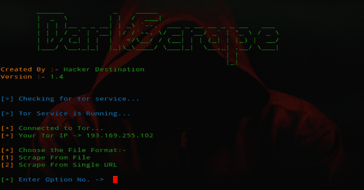

# DarkScrape:一个抓取黑暗网站的工具

> 原文：<https://kalilinuxtutorials.com/darkscrape/>

**DarkScrape** 是一款抓取黑暗网站的 OSINT 工具。一个用于抓取黑暗网站的工具正在以下操作系统上测试。

*   卡利 Linux 2019.2
*   Ubuntu 18.04
*   网络猎人
*   archlinux

**又读-[黄金眼:黄金眼第七层(KeepAlive+NoCache) DoS 测试工具](https://kalilinuxtutorials.com/goldeneye-dos-test-tool-2/)**

**安装**

**git 克隆 https://github.com/itsmehacker/DarkScrape.git
pip 3 install-r requirements . txt**

**特性**

*   下载媒体
*   从单个 Url 抓取
*   从文件中抓取
    *   文本文件（textfile）
    *   战斗支援车
    *   擅长

**信用:**杰克·可丽饼

[**Download**](https://github.com/itsmehacker/DarkScrape)