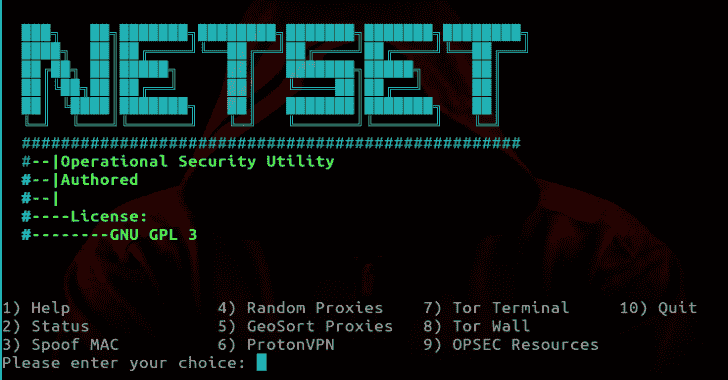

# NetSet:操作安全实用程序和自动机

> 原文：<https://kalilinuxtutorials.com/netset-operational-security-utility-automator/>

操作安全实用程序和自动机。NetSet 旨在自动执行一些操作，帮助用户保护其网络流量。它还提供了一种通过 Tor 收集代理和运行实用程序的简单方法。

NetSet 安装和使用的所有实用程序也将被自动配置。当然，工具本身并不是运营安全的全部。相反，这是一种让你具备基本知识的便捷方式。你也可以学习[收集代理和运行工具](https://limeproxies.com/blog/what-is-proxy-server-and-how-it-works/) **。**

除其他外，网络设置有助于:

一种按需终端多路复用器，其话路通过 Tor 路由。通过自动安装和配置 DNSCrypt-proxy 来保护 DNS 流量。Tor 墙功能，强制所有流量通过 Tor 网络。轻松访问在线 OPSEC 资源，有问题的网络资源可以在脚本中打开。

**也可阅读-[MASC:网络恶意软件扫描器](https://kalilinuxtutorials.com/masc/)**

**用途**

克隆存储库后，导航到`NetSet`目录并运行以下命令:

**chmod +x *。sh
。/netset-main . sh–安装# sudo
T3。/netset-main . sh–安装**

这将安装和配置 NetSet 正常工作所需的一切。

**更新**

使用`sudo`启动脚本会以 root 用户身份执行脚本中的每个操作，这意味着当操作需要提升权限时，不会提示您输入`sudo`密码。但是，由网络集写入的所有项目也将归 root 所有，包括备份目录。最后但同样重要的是；当考虑安全问题时，不建议使用超级用户权限运行所有内容。

从现在开始，用`sudo`启动主脚本将是可选的，以反映上述考虑。

**选项**

请参见下面的选项概述。

CLI 参数
'-t '或'–terminal '启动
终端多路复用器，所有
连接通过 Tor

'-s '或'–status '打印状态
NetSet 相关网络的概述
实用程序及其当前状态。

'-i '或'–install '运行一个脚本
，该脚本用于安装所有 NetSet 的
依赖项并对其进行配置

菜单选项

‘用法’–打印选项概述
‘状态’–打印状态概述
‘欺骗 MAC’–欺骗 MAC 地址
‘随机代理’–抓取随机代理
‘地理排序代理’–抓取地理排序代理
‘质子 VPN’–启动质子 VPN 【T2
‘op sec Resources’——显示网络集包含的
网络资源列表。选择一个条目，在默认浏览器中打开它

[**Download**](https://github.com/NullArray/NetSet)