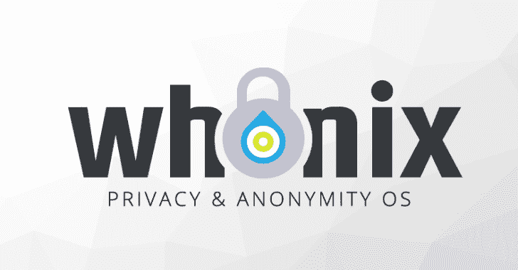

# 隐私保护，在线匿名，匿名操作系统

> 原文：<https://kalilinuxtutorials.com/whonix-privacy-protection/>

Whonix 是一款免费的开源桌面操作系统(OS ),专为高级安全和隐私而设计。基于 Tor、Debian GNU/Linux 和隔离安全原则，Whonix 在保持可用性的同时，切实解决了常见的攻击媒介。

在线匿名和审查规避可以通过故障安全，自动和桌面范围内使用 Tor 网络来实现，这意味着所有连接都必须通过 Tor 或被阻止。

Tor 网络通过在由全球志愿者运行的分布式中继网络中来回传递通信来帮助防止流量分析。

如果没有高级的端到端网络流关联攻击，监视互联网连接的对手就无法轻易确定所访问的站点，这些站点也无法发现用户的物理位置。^([【1】](https://www.whonix.org/wiki/Main_Page#cite_note-1))

Whonix 使用广泛重新配置的 Debian 基础，它运行在主机操作系统之上的多个虚拟机(VM)中。这种体系结构提供了针对恶意软件和 IP 泄漏的实质性防护层。

应用程序是预安装的，并配置有安全的默认值，以使它们在最少的用户输入下即可使用。用户可以安装自定义应用程序或个性化他们的桌面，而不用担心会导致去匿名化的信息泄漏。

Whonix 是唯一一个积极开发的操作系统，设计用于在 VM 中运行并与 Tor 配对。虽然从技术上来说，它是一个“桌面”操作系统，但 Whonix 提供的安全和匿名工具也使它非常适合托管安全和匿名的洋葱服务。

**也可阅读-[韦森:下一代 Windows 漏洞利用建议者](https://kalilinuxtutorials.com/wp-admin/post.php?post=5695&action=edit)**

**特性**

*   只允许通过 Tor 连接。
*   服务器可以在互联网上匿名运行，应用程序可以匿名使用。
*   DNS 泄露是不可能的。
*   具有 root 权限的恶意软件无法发现用户的真实 IP 地址。
*   不当应用程序和用户错误造成的威胁被最小化。

**用户组**

全世界范围内日益增长的大规模监控和镇压的威胁意味着我们的自由和隐私正在被迅速侵蚀。在没有防范措施的情况下，互联网服务提供商(ISP)和全球监控系统可以记录所有在线操作，因为与网络活动相关的 IP 地址很容易与用户计算机的物理位置联系起来。Whonix 是这个问题的一个解决方案。

任何重视隐私或在桌面或网上进行敏感工作的人都可以从使用 Whonix 中受益。这包括但不限于:

*   调查者和告密者，他们的工作威胁着权贵。
    *   在一个隔离的环境中，研究和证据可以在没有意外暴露的情况下收集。
*   可能成为间谍活动目标的研究人员、政府官员或商人。
    *   反恶意软件和反利用修改降低了特洛伊木马和后门的威胁。
*   因报道有组织犯罪而危及自身和家人的记者。
    *   分隔的匿名互联网使用防止了社交媒体和其他登录之间的身份关联。
*   政治活动家受到有针对性的监视和攻击。
    *   为了分析目标的互联网使用情况而威胁 ISP 的效用是非常有限的。锁定 Whonix 用户的成本大大增加。
*   压抑或审查环境中的普通计算机用户。
    *   轻松的 Tor 设置和高级配置选项意味着专制国家的用户可以在桌面范围内完全访问互联网，而不仅仅是在浏览器中。
*   普通的电脑用户，他们只是不希望他们的私人生活的全部或某些方面被上传、保存和分析。
    *   Whonix 不会在后台静默上传识别信息。

[**Download**](https://www.whonix.org/wiki/Main_Page#Download_Whonix)