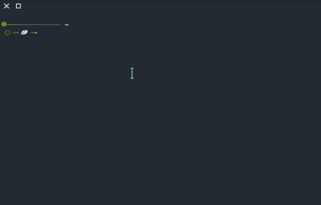
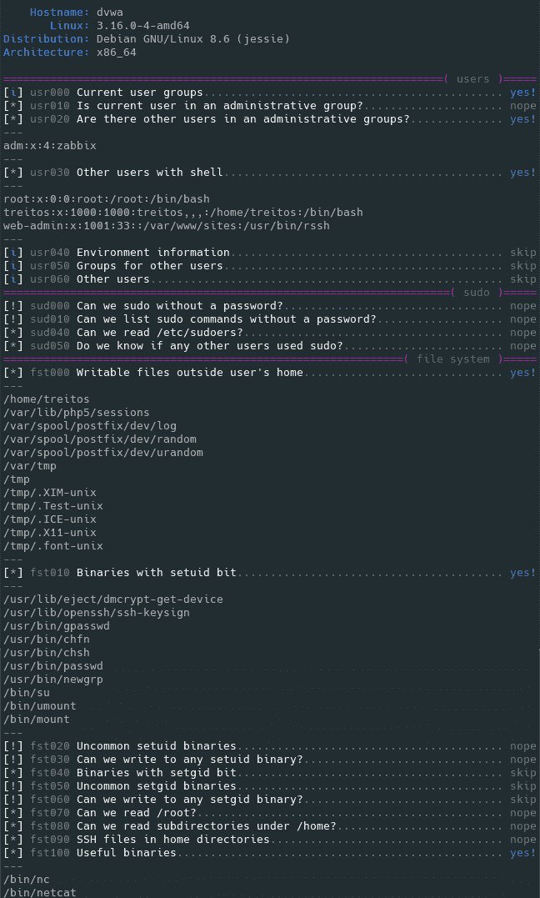
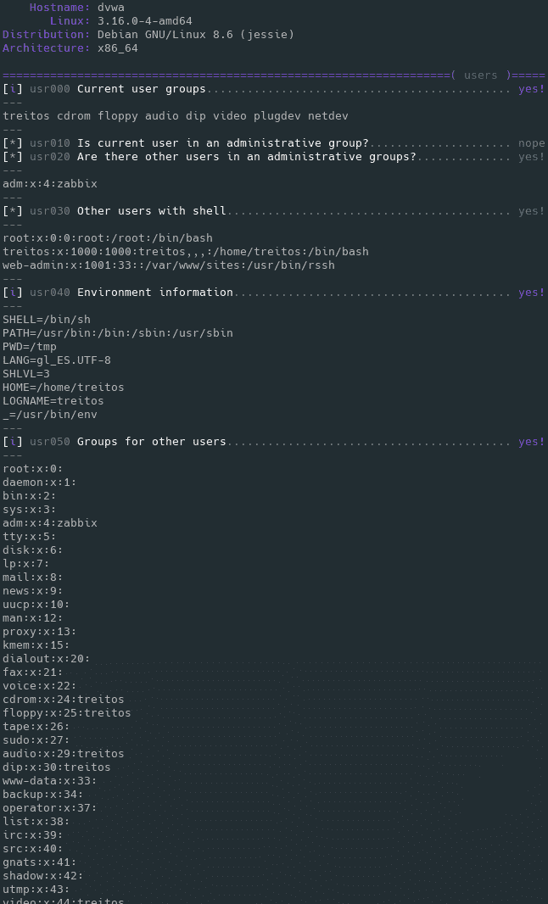

# Linux 智能枚举:测试工具&带有详细级别的 CTFs

> 原文：<https://kalilinuxtutorials.com/linux-smart-enumeration/>

Linux 智能枚举是一个用于 pentesting 和具有详细级别的 CTF 的工具。这个脚本将显示本地 Linux 系统安全性的相关信息。

它有 3 个级别的详细程度，所以你可以控制你看到多少信息。

在默认级别，您应该可以看到系统中非常重要的安全缺陷。关卡`**1**` **(** `**./lse.sh -l1**` **)** 显示有趣的信息，应该可以帮助你获得特权。级别`**2**` **(** `**./lse.sh -l2**`)将只转储它收集的关于系统的所有信息。

默认情况下，它会问你一些问题:主要是当前用户密码(如果你知道的话😉所以它可以做一些额外的测试。

**怎么用？**

想法是逐渐获得信息。

首先你应该像`**./lse.sh**`一样执行它。如果你看到一些绿色的`**yes!**`，你可能已经有了一些好东西可以使用。

如果没有，你应该用`**./lse.sh -l1**`试试`**level 1**`的详细程度，你会看到更多有趣的信息。

如果这没有帮助，`**level 2**`将使用`**./lse.sh -l2**`转储您可以收集到的关于服务的所有信息。在这种情况下，你可能会发现使用`**./lse.sh -l2 | less -r**`很有用。

您还可以通过传递`**-s**`参数来选择要执行的测试。通过它，您可以选择要执行的特定测试或部分。例如`**./lse.sh -l2 -s usr010,net,pro**`将执行`**usr010**`测试以及`**net**`和`**pro**`部分的所有测试。

**也读作-[FB Checker:脸书批量账户检查人](https://kalilinuxtutorials.com/fbchecker-facebook-mass-account-checker/)**

**用途:。/lse.sh【选项】** 
**选项**
-c 禁用颜色
-i 非交互模式
-h 本帮助
-l 级输出详细级别
0:显示高度重要的结果。(默认)
1:显示有趣的结果。
2:显示所有收集的信息。
-s 选择要运行的部分或测试的逗号分隔列表。可用的
部分:
usr:用户相关测试。
sud: Sudo 相关测试。fst:文件系统相关测试。
sys:系统相关测试。
sec:安全措施相关测试。
ret:递归任务(cron，timers)相关测试。
网:网络相关测试。服务相关测试。
pro:流程相关测试。sof:软件相关测试。
ctn:容器(docker，lxc)相关测试。
特定测试可以使用其 id(即:usr020，sud)

**演示**

**0 级(默认)输出样本**

**1 级详细度输出样本**

**二级详细度输出样本**

[**Download**](https://github.com/diego-treitos/linux-smart-enumeration)