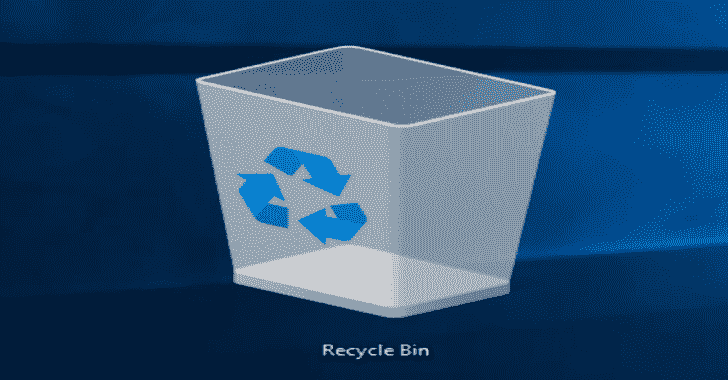

# Rifiuti2 : Windows 回收站分析器

> 原文：<https://kalilinuxtutorials.com/rifiuti2/>

**Rifiuti2** 是一个用于分析 Windows 回收站 INFO2 的文件。对 Windows 回收站的分析通常在 Windows 计算机取证时进行。

Rifiuti2 可以提取文件删除时间，原始路径和已删除文件的大小，以及垃圾文件是否已被永久删除。

**0 . 7 . 0 的特别说明**

*   Windows 二进制文件将从 [Appveyor](https://www.appveyor.com/) 自动构建并发布到 Github。
*   支持 UTF 8 编码的系统是强制性的，除了在 Windows 控制台上(文件输出也是 UTF 8)。这应该不成问题，因为 UTF-8 语言环境已经成为 Linux 和 macOS 的标准。在 Windows front 上，已经有许多功能强大的文本编辑器能够打开 UTF 8 unicode 文本文件。
*   因此，`-8`选项被废弃，不再以任何方式影响输出。

**也可阅读-[Rock-ON:All In One Recon Tool，该工具将只获取一个域名条目&独自完成所有工作](https://kalilinuxtutorials.com/rock-on/)**

**用法**

它被设计成可移植的，并且在命令行环境下运行。根据相关的 Windows 回收站格式，有 2 个二进制文件可供选择(大多数用户希望选择第一个):

| 程序 | 操作系统的回收站 | 目的 |
| --- | --- | --- |
| `**rifiuti-vista**` | vista–win 10 | 扫描`**\$Recycle.bin**` **样式的文件夹** |
| `**rifiuti**` | win 95–XP/2003 | 读取 `**\RECYCLED**` **或** `**\RECYCLER**`文件夹中的`**INFO**` **或**或`**INFO2**` **文件** |

运行不带任何选项的程序以获得更多详细信息。以下是一些更常用的选项:

| [计]选项 | 目的 |
| --- | --- |
| `**-o <FILE>**` | 输出到文件 |
| `**-x**` | 输出 XML 而不是制表符分隔的字段 |
| `**-l <CP>**` | 显示旧版(8.3)文件名并指定其代码页 |

请查阅联机帮助页(Unix)或 README.html(与 Windows 二进制文件捆绑在一起),了解完整的选项和详细的用法说明。

**例子**

**rifiuti-vista.exe-x-z-o 结果. XML \案例\S-1-2-3\**

扫描`**\case\S-1-2-3\**`下的索引文件，调整本地时区的所有删除时间，并将 XML 输出写入`**result.xml**`

**ri fiuti-l CP 932-t " \ n " info 2**

假设 INFO2 文件是从日语窗口生成的(代码页 932)，并逐行显示每个字段，而不是用制表符分隔

**支持的平台**

它已经在 Linux、Windows 7 和 FreeBSD 上进行了测试。在 big endian 平台上的一些测试是用 Qemu 仿真器完成的。欢迎对其他架构进行更多的兼容性修复。

**下载**

**视窗**

Github 发布页面上正式提供了 Windows 二进制文件[。](https://github.com/abelcheung/rifiuti2/releases)

注意，0.6.1 版本是最后一个可以在 Windows XP 和 2003 上运行的版本；即将推出的版本需要 Vista 或更高版本。

**Linux**

*   DEB 包在 Debian 和 T2 Ubuntu 上正式发布，因此也可以在大多数(如果不是全部)专注于安全和取证的衍生产品上发布，例如(这是一个不完整的列表):
    *   [卡莉 Linux](https://pkg.kali.org/pkg/rifiuti2)
    *   [Deft X 虚拟设备](http://www.deftlinux.net/package-list/deft-x-va/)
    *   BackBox Linux
*   来自[Linux Forensics Tools Repository(LiFTeR)](https://forensics.cert.org/ByPackage/rifiuti2.html)的 RPM 包可以在 Fedora 上使用，很有可能在 CentOS 和 RHEL 上使用。
*   [ArchStrike(前身为 ArchAssault)](https://archstrike.org/packages/rifiuti2) ，Arch Linux 的渗透测试衍生产品，从 2014 年末开始`rifiuti2`打包。

**其他(从源代码编译)**

对于不容易获得`**rifiuti2**`的操作系统，总是可以从源代码编译。

`**rifiuti2**` 遵循通常的`**autotools**` 基础程序:

**。/配置&制作检查&制作安装**

[**Download**](https://github.com/abelcheung/rifiuti2)