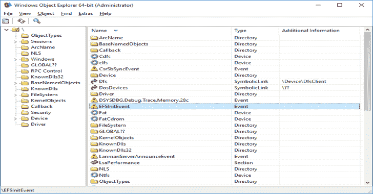
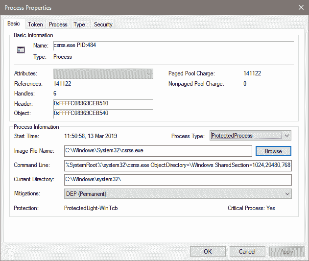
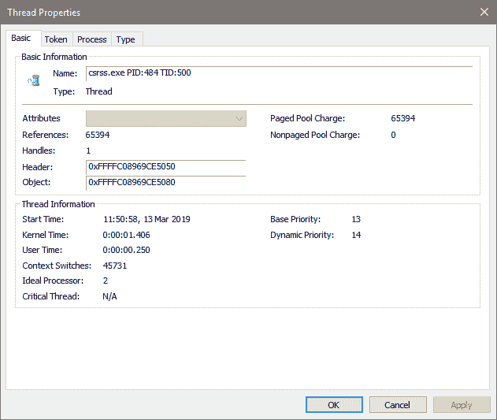
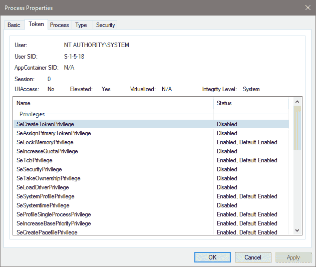

# winobjex 64:64 位 Windows 对象资源管理器

> 原文：<https://kalilinuxtutorials.com/winobjex64/>

**WinObjEx64** 是一个高级实用程序，让您探索 Windows 对象管理器命名空间。对于某些对象类型，您可以双击它或使用“属性…”工具栏按钮来获取更多信息，如描述、属性、资源使用等。

如果您具有所需的访问权限，WinObjEx64 允许您查看和编辑与对象相关的安全信息。

**系统要求**

WinObjEx64 不需要管理权限。但是，查看大部分名称空间和编辑与对象相关的安全信息需要管理权限。

WinObjEx64 仅适用于以下 x64 Windows: Windows 7、Windows 8、Windows 8.1 和 Windows 10，包括服务器变体。

WinObjEx64 还支持在 Wine 上运行，包括 Wine Staging。

为了使用所有程序功能，Windows 必须在调试模式下启动。

**也可阅读-[Dark scrape:OSINT 用于抓取黑暗网站的工具](https://kalilinuxtutorials.com/darkscrape/)**

**打造**

WinObjEx64 自带完整源代码。为了从源代码进行构建，您需要 Microsoft Visual Studio 2013 U4 或 Visual Studio 2015 及更高版本。

**指令**

*   首先为要生成的解决方案中的项目选择平台工具集(项目->属性->常规):
    *   用于 Visual Studio 2013 的 v120
    *   用于 Visual Studio 2015 的 v140
    *   用于 Visual Studio 2017 的 v141。
*   对于 v140 及以上版本，设置目标平台版本(项目->属性->常规):
    *   如果 v140 那么选择 8.1(注意必须安装 Windows 8.1 SDK
    *   如果是 v141，则选择 10.0.17134.0(注意，必须安装 Windows 10.0.17134 SDK)。

**1 . 7 . 3 中的新功能**

*   **进程列表对话框的线程视图**

选定进程线程的列表。要查看大量信息，需要管理权限和提升权限。显示系统线程的驱动文件。

*   **过程属性**

显示有关选定流程对象的基本信息，包括应用的缓解策略(如果有)和安全性。要查看所有进程信息，程序必须以提升的权限运行。

*   **线程属性**

显示所选线程对象的基本信息，包括对象安全性。要查看所有线程信息，程序必须以提升的权限运行。

*   **令牌属性**

显示有关访问令牌的基本信息(对于进程或线程对象，如果它模拟客户端)。

*   **其他**

即将发布的 Windows 10 19H1 版本的 UI 更改和改进数量，包括但不限于错误修复和兼容性改进。

[**Download**](https://github.com/hfiref0x/WinObjEx64)