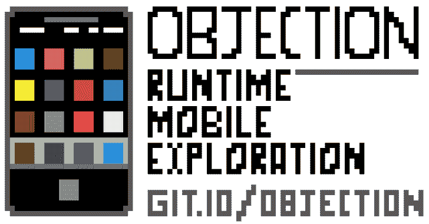
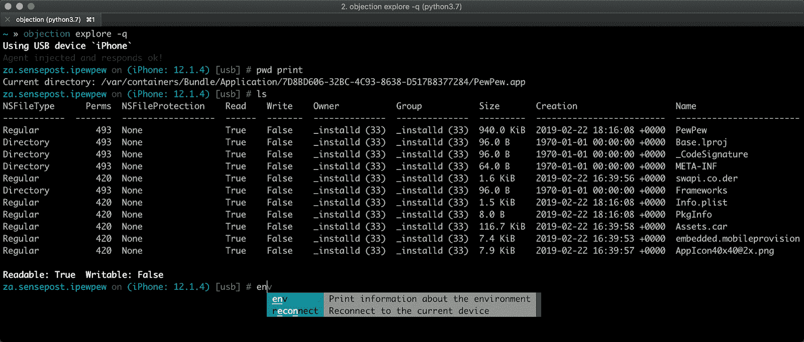
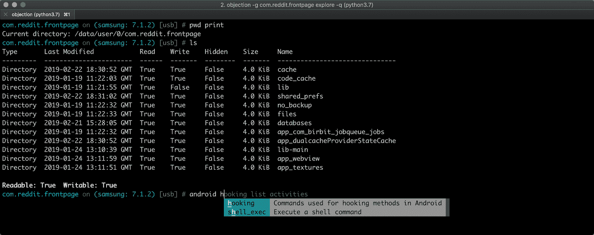
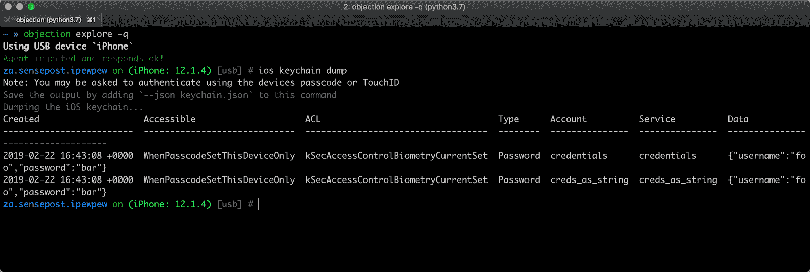
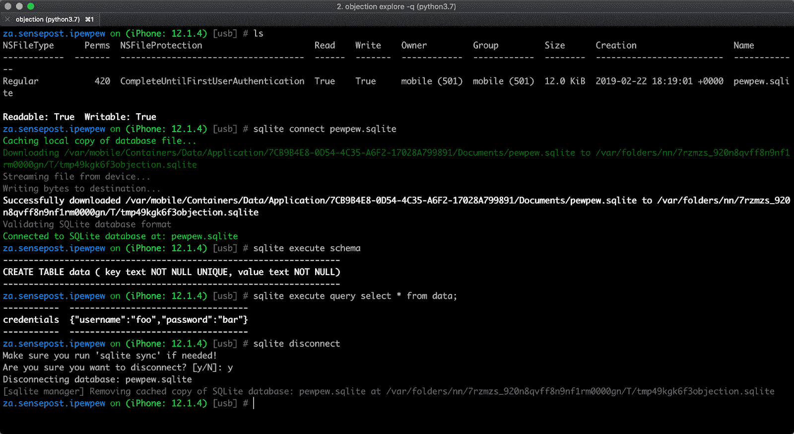
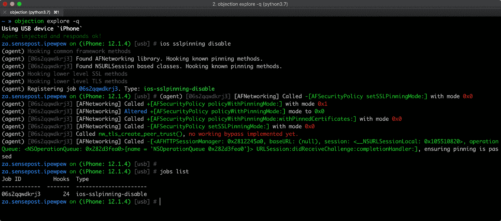
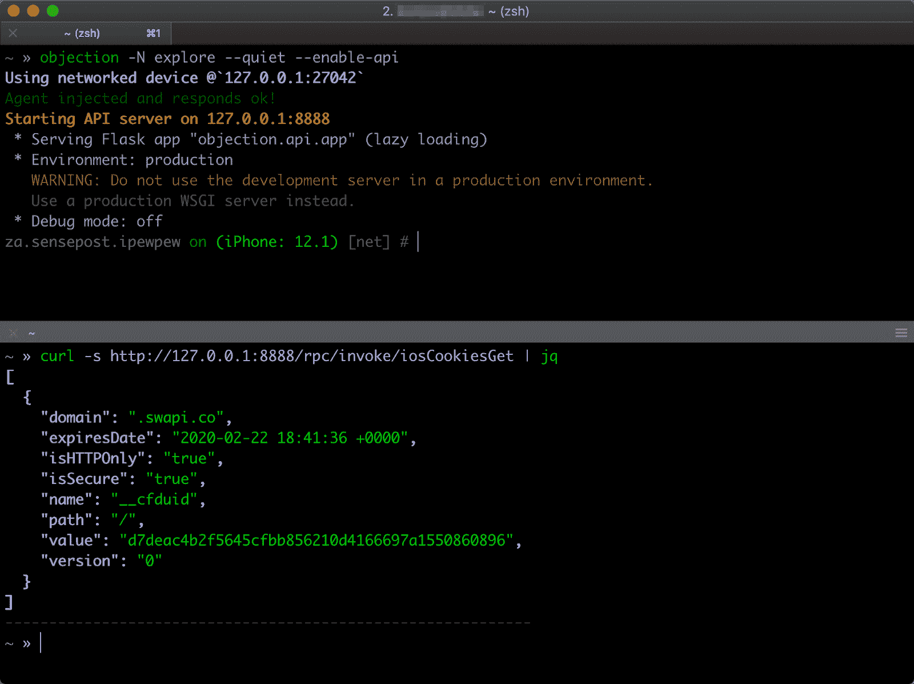

# 反对:运行时移动探索

> 原文：<https://kalilinuxtutorials.com/objection-mobile-exploration/>

**异议**是一个运行时移动探索工具包，由 Frida 提供支持。它旨在帮助评估移动应用程序及其安全状况，而不需要越狱或根植的移动设备。

注意:这不是某种形式的越狱/根绕过。通过使用异议，您仍然会受到您所面临的适用沙盒所施加的所有限制。

**特性**

支持 iOS 和 Android，并随着该工具在现实世界中的使用，定期添加新功能和改进，以下是几个关键功能的简短列表:

对于所有支持的平台，`objection`允许您:

*   修补 iOS 和 Android 应用程序，嵌入一个 Frida 小工具，可以与`objection`一起使用，或者只与 Frida 本身一起使用。
*   与文件系统交互，列出条目，并在允许的情况下上传和下载文件。
*   执行各种与内存相关的任务，例如列出加载的模块及其各自的导出。
*   尝试绕过并模拟越狱或根环境。
*   发现加载的类并列出它们各自的方法。
*   执行常见的 SSL 锁定旁路。
*   使用目标应用程序时，动态转储调用的方法的参数。
*   与 SQLite 数据库内联交互，无需下载目标数据库和使用外部工具。
*   执行自定义 Frida 脚本。

`objection`中 iOS 特有的功能包括:

*   转储 iOS 钥匙串，并将其导出到文件中。
*   从 NSUserDefaults 和共享的 NSHTTPCookieStorage 等公共存储中转储数据。
*   以人类可读的形式转储各种格式的信息。
*   绕过某些形式的 TouchID 限制。
*   通过定位一个类中的所有方法或仅仅一个方法来监视方法的执行。
*   监控 iOS 粘贴板。
*   以人类可读的格式转储编码的`.plist`文件，而不依赖于外部解析器。

`objection`中的 Android 特定功能包括:

*   列出应用活动、服务和广播接收器。
*   启动目标应用程序中可用的任意活动。
*   观察一个类方法，当它发生时报告执行情况。

**也读作-[ri fiuti 2:Windows 回收站分析器](https://kalilinuxtutorials.com/rifiuti2/)**

**截图**

下面的截图显示了主`objection` repl，连接到运行 iOS 10.2.1 的 iPad 和运行 Android 6 的三星 Galaxy S5 上的测试应用程序。

**iOS 应用主捆绑包的文件系统列表**

**Android 应用捆绑包的文件系统列表**

**iOS Keychain 转储为当前应用程序，后来写入一个名为 keychain.json 的文件**

**内联 SQLite 查询工具**

**为 iOS 应用运行 SSL 锁定旁路**

**为 Android 应用运行 SSL Pinning bypass**

**API 使用列出当前存储的 iOS sharedHTTPCookieStorage**

**样品用途**

示例会话，其中异议版本 0.1 用于探索应用程序环境。较新版本将 REPL 提示符设置为当前应用程序名称，但用法保持不变:

**先决条件**

要运行 objection，您只需要 python3 解释器可用。通过 pip 安装应该考虑所有需要的依赖项。有关更多细节，请参见项目 wiki 上的先决条件部分。

至于目标移动应用，iOS 需要一个未加密的 IPA，而 Android 只需普通的 APK 就可以了。如果您有想要研究的 iOS 应用程序的源代码，那么您可以简单地从 Xcode 项目中嵌入并加载 FridaGadget.dylib。

**安装**

安装只是 pip3 安装异议的问题。这将为您提供异议命令。

[**Download**](https://github.com/sensepost/objection)