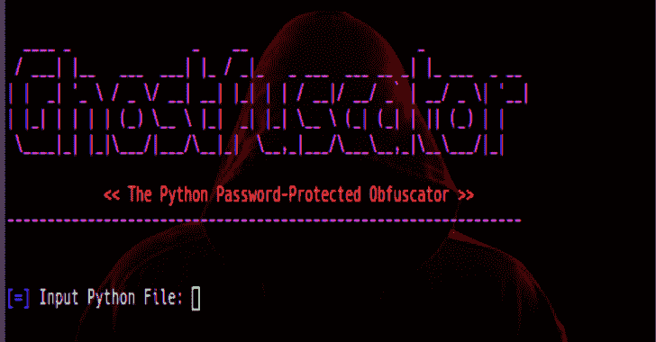

# ghost fuscator:Python 密码保护的混淆器

> 原文：<https://kalilinuxtutorials.com/ghostfuscator/>

Ghostfuscator 是一个混淆的 python 脚本，使用 AES 加密对其进行密码保护。

**用途**

只需执行脚本，并遵循菜单。

**也读作-[winobjex 64:Windows 对象资源管理器 64 位](https://kalilinuxtutorials.com/winobjex64/)**

**信息**

一旦一个脚本被混淆，当运行它时会出现一个密码询问提示，提交正确的密码后，脚本将执行解密其在内存中的解密内容。

[**Download**](https://github.com/alberties/Ghostfuscator)