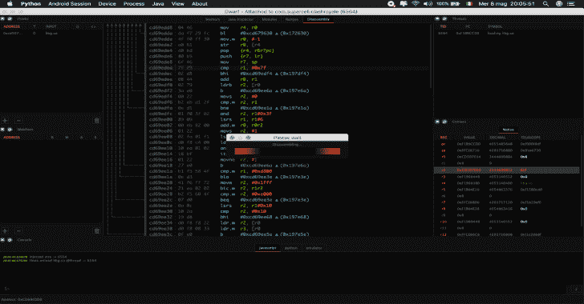

# Dwarf:基于 PyQt5 和 Frida 构建的全功能 Multi Arch/OS 调试器

> 原文：<https://kalilinuxtutorials.com/dwarf-arch-os-debugger-pyqt5-frida/>

Dwarf 是一款面向逆向工程师、黑客和安全分析师的调试器。或者你可以叫它该死，为什么覆盆子这么蓬松，或者，鸭子战士像他妈的一样富有。随便你喜欢！构建在 pyqt5、frida 和一些可怕的代码之上。

**特性**

*   断点
*   没有硬件支持的观察点
*   从目标自动映射的可视化仿真，报告内存访问
*   打破模块加载循环，java 类
*   设置中断条件和自定义逻辑
*   在每个 breakpointer 线程上注入代码
*   与你的目标交换数据并显示在用户界面上
*   挖掘内存、反汇编和 jvm 字段/函数
*   回溯本地和 java
*   采取你的整个弗里达代理在脚本编辑器，转换挂钩断点等
*   更多…
*   所有这些都可以通过脚本来构建定制的调试逻辑

**也可阅读-[Regipy:一个独立于操作系统的 Python 库，用于解析离线注册表配置单元](https://kalilinuxtutorials.com/regipy-python-library-registry-hives/)**

**先决条件**

在任何地方运行的 frida 服务器。

**安卓会话**

*   确保您可以在控制台中使用“adb”命令或[阅读此处](https://www.xda-developers.com/adb-fastboot-any-directory-windows-linux/)
*   需要设备/模拟器上的 root 用户！
*   确保 frida 在/system/bin|xbin 中有+x 权限，或者最终使用 Dwarf 自动安装最新的 frida 服务器

**设置&运行**

**git 克隆 https://github.com/iGio90/Dwarf
CD 矮人
pip 3 install-r requirements . txt
python 3 Dwarf . py**

**可选地**

您可以安装 keystone-engine 来启用汇编程序:

**Windows** x86:https://github . com/keystone-engine/keystone/releases/download/0 . 9 . 1/keystone-0 . 9 . 1-python-win32 . MSI
x64:https://github . com/keystone-engine/keystone/releases/download/0 . 9 . 1/keystone-0 . 9 . 1-python-win64 . MSI

**OSX/Unix** pip 3 安装 keystone-engine

dex2jar 工具(baks Mali/反编译需要)

**导读:https://sourceforge.net/p/dex2jar/wiki/UserGuide/
文件:Windows 上的 https://github.com/pxb1988/dex2jar/releases
将 d2j 文件夹添加到%PATH%并更改:
将 d2j_invoke.bat 中的【Java-xms 512m-xmx 1024m-CP " % CP % "*****'改为【Java-xms 512m-xmx 4096m-CP " % CP % "*****'**

**设置**

你可以换衣服。侏儒

" dwarf_ui_hexedit_bpl": 32(默认:16)–hexview 中每行的字节数
"dwarf_ui_hexstyle": "upper "，" lower "(默认:" upper ")–整体 hexstyle 0xabcdef 或 0xabcdef(注:点击 hex view 中的" Offset (X)"进行更改)
"dwarf_ui_font_size": 12(默认:12)–(注:hexview/disasm 使用其他字体等待 settingsdlg 或更改 lib/utils.py get_os_monospace

[**Download**](https://github.com/iGio90/Dwarf)