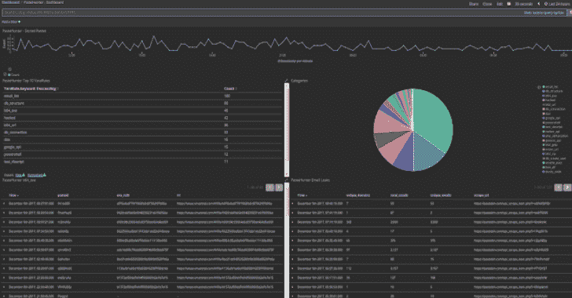

# PasteHunter:使用 Yara 规则扫描 Pastebin

> 原文：<https://kalilinuxtutorials.com/pastehunter-scanning-pastebin/>

PasteHunter 是一个 python3 应用程序，用于查询一组公开粘贴数据的站点。对于找到的所有粘贴，它会根据一系列 Yara 规则扫描原始内容，寻找可以被组织或研究人员使用的信息。

**安装**

有几种安装方法

**本地安装**

**Pastehunter**

如果你想运行最新的稳定版本，请从 https://github.com/kevthehermit/PasteHunter/releases 获得最新版本。如果您想要运行开发版本，请克隆存储库或下载最新的归档文件。

Pastehunter 的依赖项很少，你可以使用 requirements.txt 文件和**sudo pip 3 install-r requirements . txt**安装所有的 python 库

**伤口**

Yara 是扫描每个粘贴的扫描引擎。使用官方文档安装 yara 和 python3 库。[https://yara . readthe docs . io/en/latest/getting started . html #编译-安装-yara](https://yara.readthedocs.io/en/latest/gettingstarted.html#compiling-and-installing-yara)

所有 yara 规则都存储在 yara rules 目录中。index.yar 文件是在运行时创建的，它包含这个目录中所有附加的 yar 文件。要添加或删除 yara 规则，只需在这个目录中添加或删除规则文件。

**弹性搜索**

如果您想使用弹性搜索输出模块，您需要安装弹性搜索。Pastehunter 已经过 Elasticsearch 版本的测试。

要进行安装，请遵循 https://www . elastic . co/guide/en/elastic search/reference/current/deb . html 上的官方说明。

您还需要 elasticsearch python 库，可以使用**sudo pip 3 install elastic search**安装。

**Kibana**

Kibana 是 Elasticsearch 的前端搜索。如果你已经启用了 Elasticsearch 模块，你可能需要这个。按照[https://www.elastic.co/guide/en/kibana/current/deb.html.](https://www.elastic.co/guide/en/kibana/current/deb.html.)的官方指示进行安装

**也可阅读-[云安全审计:亚马逊网络服务的命令行安全审计工具](https://kalilinuxtutorials.com/cloud-security-audit-aws/)**

**码头工人安装**

您将找到一个 Dockerfile 文件，它将构建 PasteHunter 的最新稳定版本。

这可以与附带的 docker-compose.yml 文件一起使用。kubernets 的样本 podspec 即将推出。

**配置**

在开始运行之前，您需要设置基本配置。将 settings.json.sample 复制到 settings.json，并使用您选择的编辑器进行编辑。

**伤口**

*   **rule_path** :默认为 PasteHunter 根目录下的 YaraRules 目录。
*   **黑名单**:如果设置为 true，任何符合此规则的粘贴都将被忽略。
*   偶尔我会发布一些早期的测试规则。将此项设置为`true`以使用它们。

**日志**

此处配置应用程序的日志记录。

*   **log_to_file** :真或假，默认为 stdout。
*   **log_file** :注销的文件名。
*   **logging_level** :日志级别的数值，见下表。
*   **log_path** :磁盘上要写入 log_file 的路径。
*   **格式** : python 日志格式字符串——[https://docs . python . org/3/library/logging . html # formatter-objects](https://docs.python.org/3/library/logging.html#formatter-objects)

| 水平 | 数字的 |
| --- | --- |
| 批评的 | Fifty |
| 错误 | Forty |
| 警告 | Thirty |
| 信息 | Twenty |
| 调试 | Ten |
| 网上 | Zero |

**通用**

此处为常规配置选项。

*   **run_frequency** :读取输入列表到下载之间的睡眠延迟。这有助于限制利率。

关于输入、输出和后处理设置，请参考文档的相关章节。

**开始**

您可以通过按名称调用脚本来运行 pastehunter。

**python3 pastehunter.py**

**服务**

如果您计划长时间运行，您可以将 pastehunter 作为服务安装。下面显示了一个示例 systemd 服务文件

创建一个新的服务文件**/etc/systemd/system/paste hunter . service**

根据您的设置添加以下文本更新，注意文件路径和用户名。：

**【Unit】
Description = PasteHunter

【服务】
working directory =/opt/PasteHunter
ExecStart =/usr/bin/python 3/opt/PasteHunter/PasteHunter . py
User = local User
Group = local User
Restart = always

【Install】
wanted by = multi-User . target**

在启动该服务之前，请确保您已经在命令行上测试了 pastehunter 应用程序，并找出任何错误。一旦你准备好，然后更新系统 ctl **系统 ctl 守护进程-重新加载**启用新服务**系统 ctl 启用 pastehunter.service** 并启动服务**系统 ctl 启动 pastehunter**

**支持的输入**

Pastehunter 目前支持以下网站:

*   pastebin.com
*   gist.github.com
*   slexy.org
*   stackexchange #大概有 176 个！

**支持的输出**

Pastehunter 支持几个输出模块:

*   转储到 ElasticSearch 数据库(默认)。
*   电子邮件提醒(SMTP)。
*   松弛通道通知。
*   转储到 JSON 文件。
*   转储到 CSV 文件。
*   发送到系统日志。

[**Download**](https://github.com/kevthehermit/PasteHunter)