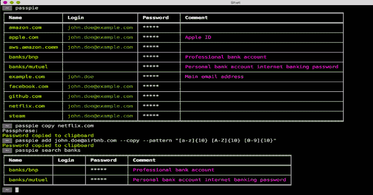

# Passpie:多平台命令行密码管理器

> 原文：<https://kalilinuxtutorials.com/passpie-command-line-password-manager/>

Passpie 是一个命令行工具，通过丰富多彩的可配置界面从终端管理密码。使用主密码解密登录凭证，将密码复制到剪贴板，与 git 存储库同步，检查您的密码状态，等等。

密码文件使用 [GnuPG](https://www.gnupg.org/) 加密并保存到 yaml 文本文件中。Passpie 支持 **Linux** 、 **OSX** 和 **Windows** 。

它看起来像什么？下面是一个简单的 Passpie 用法示例:

**passpie init
passpie add foo@example.com-random
passpie add bar@example.com-pattern "[0-9]{ 5 }[a-z]{ 5 } "
passpie update foo @ example-comment " Hello "
passpie
passpie copy foo@example.com**

**又读-[鼹鼠:以太坊 Fuzz 测试框架](https://kalilinuxtutorials.com/echidna-fuzz-testing-framework/)**

**安装**

**pip 安装通行证**

或者，如果你用的是 mac，通过[自制软件](http://brew.sh/)安装:

**brew 安装通行证**

**依赖关系**

被动依赖于

**命令**

**用法:passpie[选项]命令[ARGS]…**

选项:
-D，–数据库文本数据库路径或远程存储库的 URL
–自动推送文本从远程存储库自动推送更改
–自动推送文本自动推送更改到远程存储库
–配置路径配置文件的路径
-v，–详细激活详细输出
–版本显示版本并退出。
–帮助显示此消息并退出。

命令:
add 向数据库添加新凭证
complete 生成 shell 的完成脚本
config 显示 shell 的当前配置
copy 将凭证密码复制到剪贴板/stdout
以纯文本格式导出导出凭证
从路径导入导入凭证
init 初始化新密码数据库
以表格形式列出打印凭证
日志显示密码数据库更改历史记录
清除从数据库中删除所有凭证
删除删除凭证
重置更新密码数据库并重新加密……
搜索搜索凭证

[**Download**](https://github.com/marcwebbie/passpie)