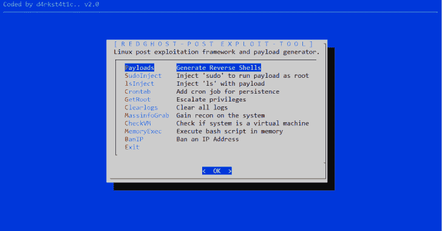

# RedGhost : Linux 后期开发框架，旨在帮助红队获得持久性、侦察和不留痕迹

> 原文：<https://kalilinuxtutorials.com/redghost-linux-post-exploitation-framework/>

RedGhost 是一个 Linux 后期开发框架，旨在帮助 red 团队进行持久性、侦察、权限提升和不留痕迹。

*   **有效载荷**

函数在 netcat、bash、python、php、ruby、perl 中生成各种编码的反向 shells

*   **SudoInject**

用于注入 sudo 命令和包装函数的函数，以在每次为权限提升运行“sudo”时运行反向根 shell

*   **胰岛素注射液**

函数在“ls”命令中注入一个包装函数，以便在每次为持久性运行“ls”时运行有效负载

*   **Crontab**

创建 cron 作业的函数，该作业从远程服务器下载有效负载，并每分钟运行有效负载以实现持久性

*   **GetRoot**

函数尝试各种方法来提升权限

*   **清除日志**

清除日志并使取证调查变得困难的功能

*   **MassInfoGrab**

获取系统上的大量识别/信息的功能

*   **检查虚拟机**

函数来检查系统是否是虚拟机

*   **记忆执行部**

函数在内存中执行远程 bash 脚本

*   **BanIp**

使用 iptables 的 BanIp 函数

**也可阅读-[ghost fuscator:Python 密码保护的混淆器](https://kalilinuxtutorials.com/ghostfuscator/)**

**安装**

一个安装 RedGhost 的衬垫:

**wget https://raw . githubusercontent . com/d4rk 007/red ghost/master/red ghost . sh；chmod+x red ghost . sh；。/redghost.sh**

一个安装先决条件和 RedGhost 的衬里:

**wget https://raw . githubusercontent . com/d4rk 007/red ghost/master/red ghost . sh；chmod+x red ghost . sh；apt-get 安装对话框；apt-get 安装 gccapt-get 安装 iptables。/redghost.sh**

**先决条件**

*   对话
*   （同 groundcontrolcenter）地面控制中心
*   IPtables

[**Download**](https://github.com/d4rk007/RedGhost)